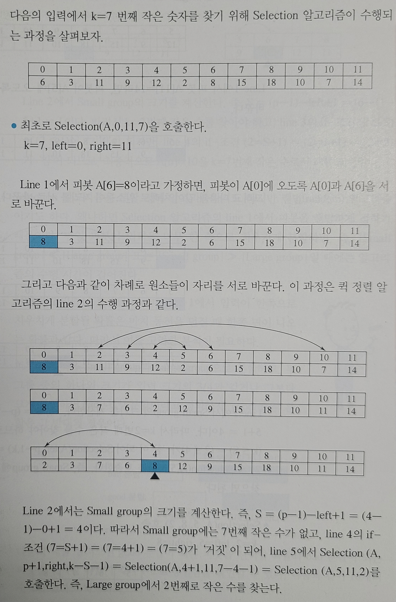
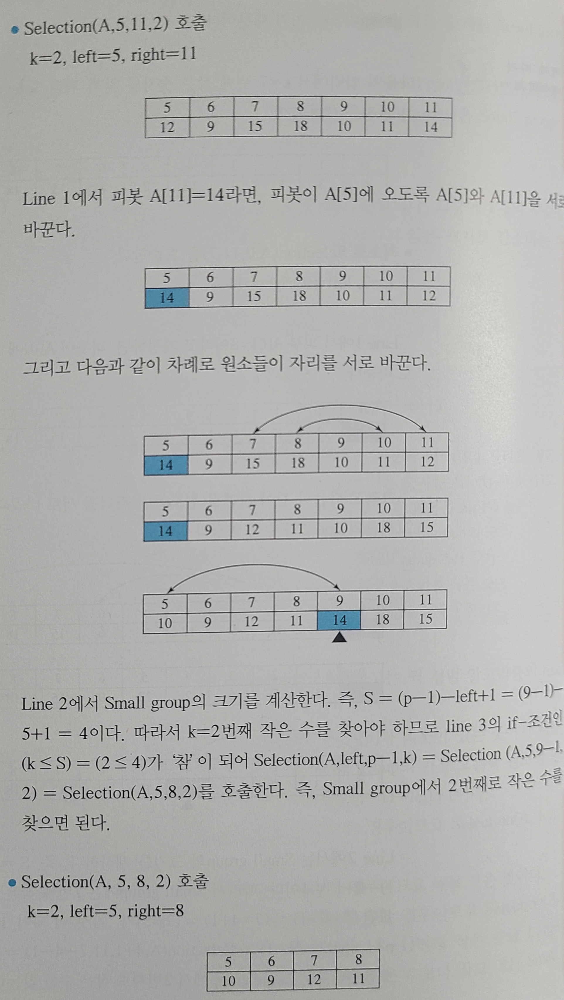
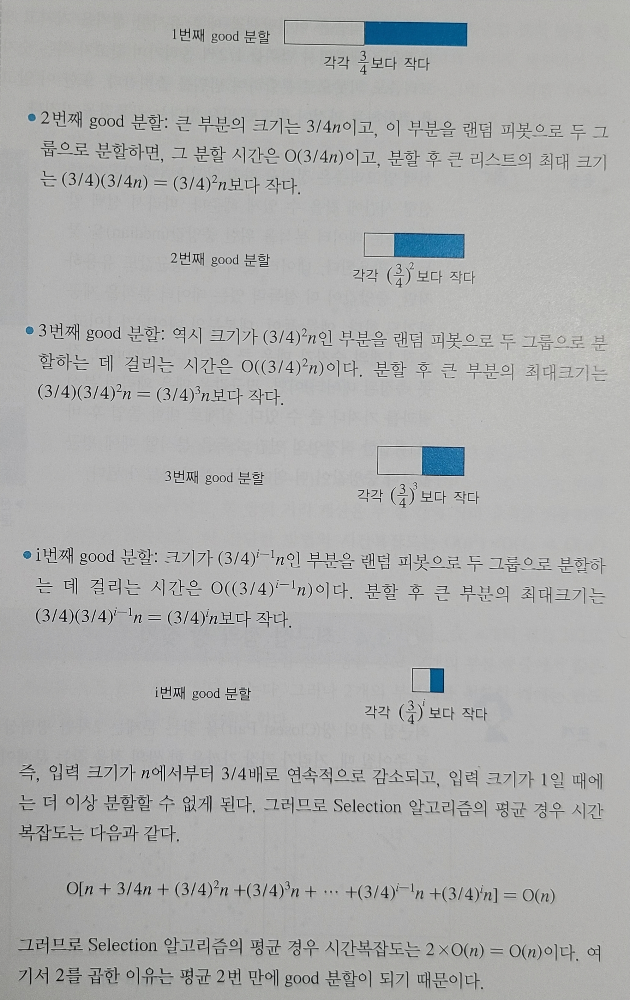
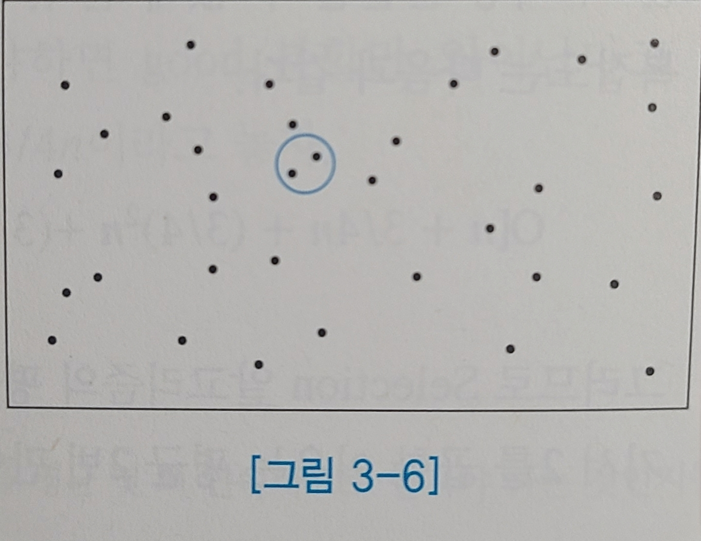
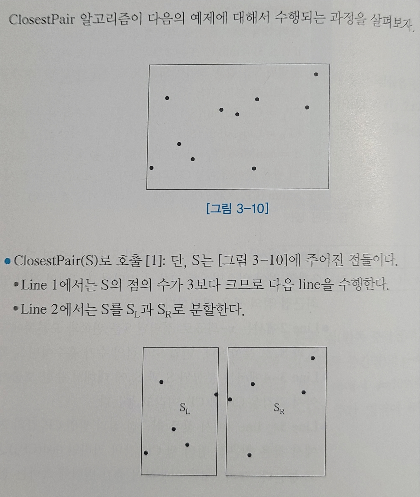
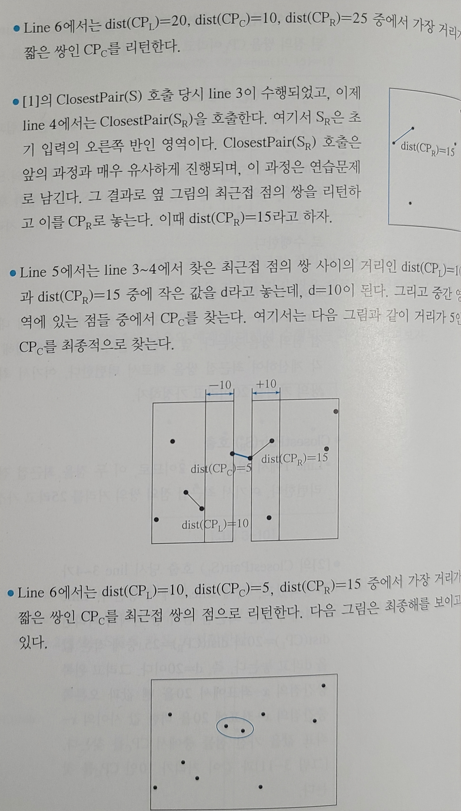
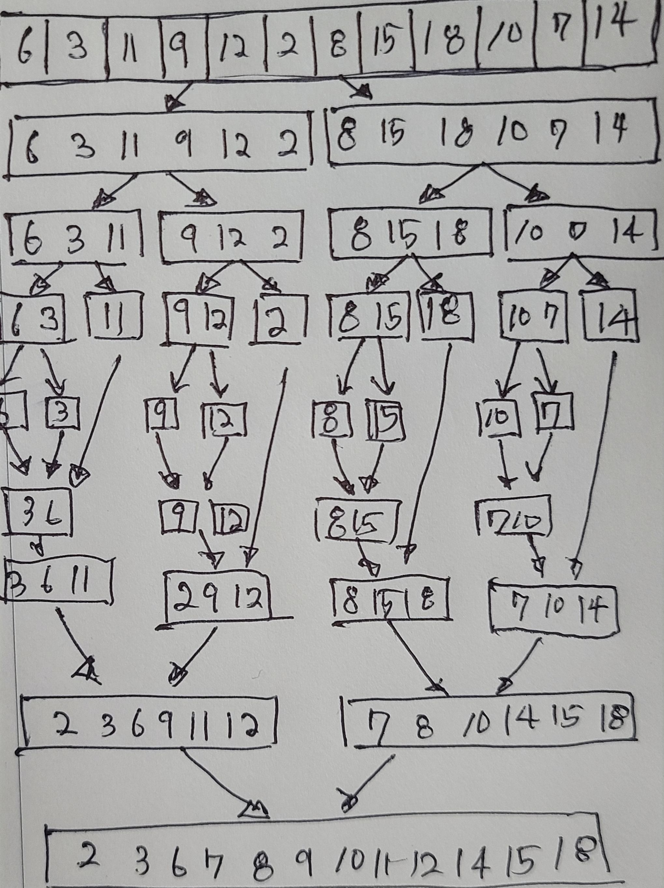

# 03 분할 정복 알고리즘

---

<aside>
💡

분할 정복(Divide-and-Conquer) 알고리즘은 입력을 분할하여 문제를 정복하는 알고리즘이다.

</aside>

- 분할된 입력에 대해 동일한 알고리즘을 적용해 해를 계산한다.
    - 이때 분할된 입력에 대한 문제를 부분문제(subproblem)라 한다.
    - 부분문제에 대한 해를 부분해라고 한다.
    - 부분문제는 더 이상 분할할 수 없을 때까지 계속 분할한다.
- 일반적으로 부분문제들의 해를 취합하여 보다 큰 부분의 해를 구한다.
- **분할 정복 알고리즘은 분할되는 부분문제의 수와 크기에 따라 다음과 같이 분류된다:**
    - 문제가 a개로 분할되고, 부분문제의 크기가 1/b로 감소하는 알고리즘.
    - 문제가 2개로 분할되고, 부분문제의 크기가 일정하지 않은 크기로 감소하는 알고리즘. 퀵 정렬.
    - 문제가 2개로 분할되나, 그중 1개는 고려할 필요 없고, 크기가 1/2로 감소하는 알고리즘. 이진탐색.
    - 문제가 2개로 분할되나, 그중 1개는 고려할 필요 없고, 크기가 일정하지 않게 감소. 선택 문제.
    - 부분문제의 크기가 1, 2개씩 감소하는 알고리즘. 삽입 정렬, 피보나치 수의 계산.

# 3.1 합병 정렬

<aside>
💡

입력이 2개의 부분문제로 분할되고, 부분문제의 크기가 1/2로 감소하는 분할 정복 알고리즘이다.

</aside>

```c
MergeSort(A, p, q)
입력: A[p]~A[q]
출력: 정렬된 A[p]~A[q]
if (p < q) { // 배열의 원소가 2개 이상이라면
	k = (p+q)/2
	MergeSort(A, p, k) // 앞부분 순환 호출
	MergeSort(A, k+1, q) // 뒷부분 순환 호출
	A[p]~A[k]와 A[k+1]~A[q]를 합병한다.
}
```


- 정렬의 시간복잡도는 일반적으로 숫자의 비교 횟수로 표현되므로, 분할에서는 O(1) 시간이 소요된다.
    - 분할하는 부분은 배열의 중간 인덱스 계산과 2번의 순환 호출로 구성되어 있기 때문이다.
- 합병의 수행 시간은 입력 크기에 비례한다.
    - 2개의 정렬된 배열 A와 B의 크기가 각각 n과 m일 때, 최대 비교 횟수는 (n+m-1)이다.
    - 합병의 시간 복잡도는 O(m+n)이다.


- 합병 정렬에서 수행되는 총 비교 횟수는 각각의 합병에 대해 몇 번의 비교가 수행되었는지의 총합.
- 다만 아래와 같이 층별로 살펴보아 수행되는 총 비교 횟수를 얻을 수 있다.


| 입력 크기 | 예 | 층 |
| --- | --- | --- |
| n | 8 |  |
| n/2 | 4 | 1층 |
| n/4 | 2 | 2층 |
| n/8 | 1 | 3층 |

$$
합병\ 정렬의\ 시간복잡도=(층수)*O(n)=\log_{2}{n}*O(n)=O(n\log{n})
$$

- 대부분의 정렬 알고리즘은 입력을 위한 메모리 공간과 O(1) 크기의 메모리 공간만을 사용하며 정렬한다.
    - O(1) 크기의 메모리 공간이란 입력 크기 n과 상관 없는 크기의 공간을 의미한다. 변수, 인덱스 등.
- 합병 정렬은 합병된 결과를 저장할 곳이 필요해, 합병 정렬의 공간복잡도는 O(n)이다.
- 합병 정렬은 외부정렬의 기본이 되는 정렬이다.
    - 연결 리스트에 있는 데이터를 정렬할 때에도 퀵 정렬이나 힙 정렬보다 훨씬 효율적이다.
    - 멀티코어 CPU와 그래픽 처리 장치의 등장을로 정렬 알고리즘을 병렬화하는 데 사용된다.

# 3.2 퀵 정렬

<aside>
💡

퀵 정렬(Quick Sort)는 정복 후 분할하는 알고리즘이다.

</aside>

<aside>
💡

피봇(pivot)이라 일컫는 배열의 원소를 기준으로 분할하고, 피봇을 그 사이에 놓는 것이다.

</aside>

- 단, 피봇은 분할된 왼편이나 오른편에 포함되지 않는다.


```c
QuickSort(A, left, right)
입력: 배열 A[left]~A[right]
출력: 정렬된 배열 A[left]~A[right]
if (left < right) {
	피봇을 A[left]~A[right] 중에서 선택하고, 피봇을 A[left]와 자리를 바꾼 후,
	피봇과 배열의 각 원소를 비교하여 피봇보다 작은 숫자들은 A[left]~A[p-1]로 옮기고,
	피봇보다 큰 순자들은 A[p+1]~A[right]로 옮기며, 피봇은 A[p]에 놓는다.
	QuickSort(A, left, p-1) // 피봇보다 작은 그룹.
	QuickSort(A, p+1, right) // 피봇보다 큰 그룹.
}
```


- 퀵 정렬의 성능은 피봇 선택이 좌우한다.
    - 피봇 선택이 항상 최악인 경우, 시간복잡도는 O(n^2)이 된다.
    - 피봇 선택이 항상 최선인 경우, 항상 1/2씩 분할하게 되며, 시간복잡도는 O(nlog_2{n})이 된다.
    - 피봇 선택이 무작위인 경우에도 시간복잡도는 O(nlog_2{n})이 된다.
- 피봇 선정 방법은 다음과 같다:
    - 무작위로 선정하는 방법.
    - 3 숫자의 중앙값으로 선정하는 방법(Median of Three).
        - 가장 왼쪽 숫자, 중간 숫자, 가장 오른쪽 숫자 중 중앙값으로 피봇을 정한다.
        
        
        
    - 중앙값들 중의 중앙값(Median of Medians).
        - 입력을 3등분하여 각 부분에서의 중앙값을 찾아서 3개 중앙값에서 중앙값을 피봇으로 삼는다.
        
        
        
- 입력의 크기가 매우 클 때, 퀵 정렬의 성능 향상을 위해 삽입 정렬이 동시에 사용되기도 한다.
    - 입력의 크기가 작을 때에는 삽입 정렬이 퀵 정렬보다 빠를 수 있다. 퀵 정렬은 순환 호출로 수행.
    - 따라서 부분문제의 크기가 작아지면 더 이상의 분할(순환호출)을 중단하고 삽입 정렬을 사용.
- 퀵 정렬은 커다란 크기의 입력에 대해 가장 좋은 성능을 보이는 정렬 알고리즘이다.

# 3.3 선택 문제

<aside>
💡

선택(Selection) 문제는 n개의 숫자들 중 k번째로 작은 숫자를 찾는 문제이다.

</aside>

- 선택 문제 해결을 위한 간단한 방법은 다음과 같다:
    - 최소 숫자를 k번 찾는다. 단, 최소 숫자를 찾은 뒤에는 입력에서 그 숫자를 제거한다.
    - 숫자들을 오름차순으로 정렬한 수, k번째 숫자를 찾는다.
- 그러나 위 알고리즘들은 각각 최악의 경우 O(kn)과 O(nlog n)의 수행 시간이 걸린다.
    - 이때 O(nlog n)은 정렬의 시간복잡도이다.
- 선택 문제는 입력이 정렬되어 있지 않으므로, 입력 숫자들 중에서 피봇을 선택해 분할한다.


- 각 그룹의 크기를 알면, k번째 작은 숫자가 어느 그룹에 있는지 알 수 있게 된다.
    - Small group에 k번째 작은 숫자가 속한 경우: k번째 작은 숫자를 Small group에서 찾는다.
    - Large group에 k번째 작은 숫자가 속한 경우: (k-|Small group|-1)번째 작은 숫자를 Large group.
        - Small group의 숫자 개수와 피봇을 고려한 수이다.
- 선택 문제 알고리즘은 문제가 2개의 부분문제로 분할되나, 그중 1개 부분문제는 고려할 필요 없다.
- 또한 부분문제의 크기가 일정하지 않은 크기로 감소하는 형태의 분할 정복 알고리즘이다.

```c
Selection(A, left, right, k)
입력: A[left]~A[right]와 k, 단, 1<=k<=|A|, |A|=right-left+1
출력: A[left]~A[right]에서 k번째 작은 원소
피봇을 A[left]~A[right]에서 랜덤하게 선택하고, 피봇과 A[left]의 자리를 바꾼 후,
피봇과 배열의 각 원소를 비교하여 피봇보다 작은 숫자는 A[left]~A[p-1]로 옮기고,
피봇보다 큰 숫자는 A[p+1]~A[right]로 옮기며, 피봇은 A[p]에 놓는다.
S = (p-1)-left+1 // S = Small group의 크기
if (k <= S+1) Selection(A, left, p-1, k) // Small group에서 찾기
else if (k == S+1) return A[p] // 피봇 = k번째 작은 숫자
else Selection(A, p+1, right, k-S-1) // large group에서 찾기
```






- Selection 알고리즘은 분할 정복 알고리즘이기도 하지만 랜덤(random) 알고리즘이기도 하다.
    - 피봇을 랜덤하기 정하기 때문이다.
- 선택 알고리즘이 호출될 때마다 입력이 한쪽으로 치우치게 분할될 확률을 고려한 분석이 필요하다.
    - 피봇이 입력을 Small group과 Large group을 분할, 하나의 크기가 3/4 이상이면 bad(나쁜) 분할.
    - 반대의 경우 good(좋은) 분할.
    - 따라서 good 분할이 되는 피봇을 선택할 확률과 bad 분할이 되는 피봇을 선택할 확률은 같다.


- good 분할을 할 확률이 1/2이므로, 2번 분할하면 1번은 good 분할이 가능하다.
    - good 분할만 연속해 이루어졌을 때만의 시간복잡도를 구해, 2를 곱하면 평균 시간복잡도를 얻는다.




- 선택 알고리즘은 이진탐색과 유사한 성격을 가진다.
    - 이진탐색은 분할 과정을 진행하며 범위를 1/2로 좁혀가며 찾고자 하는 수를 탐색한다.
    - 선택 알고리즘은 피봇으로 분할하여 범위를 좁혀간다.
    - 이 알고리즘들은 부분문제들을 취합하는 과정이 별도로 필요 없다는 공통점을 지닌다.
- 선택 알고리즘은 정렬을 하지 않고 k번째 작은 수를 선형 시간에 찾을 수 있게 해준다.
    - 데이터 분석을 위한 중앙값을 찾는데 활용된다.

# 3.4 최근접 점의 쌍 찾기

<aside>
💡

최근접 점의 쌍(Closest Pair)을 찾는 문제는 2차원 평면상의 n개의 점이 입력으로 주어질 때,

거리가 가장 가까운 한 쌍이 점을 찾는 문제이다.

</aside>



- 최근접 점의 쌍을 찾는 간단한 방법은 모든 점에 대해 두 점 사이의 거리를 계산하는 것이다.
- 이 방식의 시간복잡도는 O(n^2)이다.
- 이보다 더 효율적인 방법은 분할 정복을 이용하는 것이다.
    1. n개의 점을 1/2로 분할하여 각각의 부분문제에서 최근접 점의 쌍을 찾는다.
    2. 2개의 부분해 중에서 짧은 거리를 가진 점의 쌍을 찾는다.


- 그러나 2개의 부분해를 취합할 때 반드시 다음과 같은 경우를 고려해야 한다:
    - 구역을 두 개로 분할했을 때, 10이 최소 거리가 아닌 경우가 있다.
    - 이때 가른 영역에서 10 이내의 거리를 가지는 쌍이 있는지 확인해야 한다.


- 배열에는 점들이 x-좌표의 오름차순으로 정렬되어 있고, 각 점의 y-좌표는 생략되었다.


- 다음 알고리즘은 문제가 2개의 부분문제로 분할되고, 부분문제의 크기가 1/2로 감소하는 분할 정복형.
- 단, 입력 점들은 x-좌표를 기준으로 정렬되어 있다고 가정한다.

```c
입력: x-좌표의 오름차순으로 정렬된 배열 S에는 i개의 점(단, 각 점은 (x, y)로 표현)이 주어진다.
출력: S에 있는 점들 중 최근접 점의 쌍의 거리
if (i <= 3) return (2개 또는 3개의 점들 사이의 최근접 쌍)
정렬된 S를 같은 크기의 SL과 SR로 분할한다. 단, |S|가 홀수이면, |SL|=|SR|+1이 되도록 분할.
CPL = ClosestPair(SL) // CPL은 SL에서의 최근접 점의 쌍이다.
CPR = ClosestPair(SR) // CPR의 SR에서의 최근접 점의 쌍이다.
d = min{dist(CPL), dist(CPR)}일 때, 중간 영역에 속하는 점들 중에서 최근접 점의 쌍을 찾아서
이를 CPC라고 하자. 단, dist()는 두 점 사이의 거리이다.
return (CPL, CPC, CPR 중에서 거리가 가장 짧은 쌍)
```






- ClosestPair 알고리즘의 시간복잡도 구하기는 입력 S에 n개의 점이 있다고 가정한다.
- 알고리즘의 전처리(preprocessing) 과정으로 S의 점을 x-좌표로 정렬하는데, O(n log n)의 시간이 소요.


# 3.5 분할 정복을 적용하는 데 있어서 주의할 점

- 입력이 분할될 때마다 부분문제의 입력 크기가 분할 전 입력 크기보다 매우 커지는 경우 부적적하다.
- 피보나치 수를 구하는 식은 순환 호출로 보이나, 분할 후 입력 크기가 2배 가까이 증가한다.
    - 이 경우 분할 정복 알고리즘을 사용하는 것은 매우 부적절하다.

```c
FibNumber(n)
F[0] = 0
F[1] = 1
for i=2 to n
	F[i] = F[i-1] + F[i-2]
```

- 기하 문제들의 특성상 취합 과정이 문제 해결에 잘 부합된다:
    - 큰 정수의 곱셈.
    - 스트라센의 행렬 곱셈 알고리즘.
    - 결정적(deterministic) 선택 알고리즘.
    - 점의 쌍 찾기 문제.
    - 공제선 문제.

# 연습문제

1. 다음의 괄호 안에 알맞은 단어를 채워 넣어라.
    1. 분할 정복 알고리즘이란 주어진 문제의 입력을 분할한 (부분문제)들을 해결하여 그 해를 취합하는 방식의 알고리즘이다.
    2. 분할 정복이 부적절한 경우는 입력이 분할될 때마다 부분문제들의 크기의 합이 분할되기 전의 크기보다 큰 경우이다.
    3. 합병 정렬에서 2개의 정렬된 부분을 (합병)하는 것은 분할 정복 알고리즘의 (정복)하는 과정이다.
    4. 퀵 정렬에서는 피봇으로 (분할)하여 부분문제가 만들어지며, 별도의 (정복) 과정이 없다.
    5. 선택 문제를 해결하는 분할 정복 알고리즘은 (퀵 정렬) 알고리즘과 같이 피봇을 사용하여 (부분문제)를 만들며, 이진탐색과 같이 별도의 (정복) 과정이 필요 없다.
    6. 최근접 점의 쌍 문제를 해결하는 분할 정복 알고리즘의 (분할) 과정은 좌측, 중간, 우측 부분에서 (최근접) 점의 쌍을 찾는 것이다.
2. 다음 중 합병 정렬에 대해 맞는 것은? 단 입력 크기는 n이다.
    - 입력과 같은 크기의 보조 배열 없이 구현할 수 없다.
        - 부분문제를 정렬하고 합병하는 알고리즘인데, 이 과정에서 임시 배열을 저장할 보조 배열이 필요.
3. 다음 중 퀵 정렬을 맞게 서술한 것은?
    - 입력을 크기가 서로 다를 수 있는 두 부분으로 나누어 보조 배열 없이 정렬한다.
        - 피봇으로 분할하여 부분문제를 해결하는 것이 퀵 정렬이다.
4. 다음 중 퀵 정렬을 맞게 서술한 것은?
    - 평균 시간복잡도는 O(n log n)이고, 최선 경우도 O(n log n)이다.
        - 피봇을 기준으로 분할이 이루어지고, 다시 층별로 합병하는 과정 떄문에 일관된 시간복잡도.
5. 다음의 입력에 대해 선택 문제를 위한 분할 정복 알고리즘으로 7번째 작은 수를 찾으려고 한다. 피봇이 8일 때 오른쪽 부분에서 몇 번째 작은 수를 찾아야 하는가?
    
    
    | 8 | 1 | 15 | 9 | 13 | 16 | 3 | 14 | 6 | 4 |
    | --- | --- | --- | --- | --- | --- | --- | --- | --- | --- |
    - 피봇을 기준으로 정렬한 값은 아래와 같을 것이다:
        - 1, 3, 6, 4, 8, 15, 9, 13, 16, 14
    - 이때 7번째 수를 찾기 위해서는 오른쪽 부분에서 2번째 작은 수를 찾아야 한다.
6. 크기가 n인 입력을 2개로 분할하고, 각각 분할된 부분문제의 크기가 n/2이라고 가정하자. 분할 정복 알고리즘의 분할 방식으로 더 이상 분할할 수 없는 (즉, 입력 크기가 1인) 부분문제의 수를 계산하라.
    - n개. 1*n = n.
7. 크기가 n인 입력을 3개로 분할하고, 각각 분할된 부분문제의 크기가 n/2이라 가정하자. 분할 정복 알고리즘의 분할 방식으로 최대 몇 회 분할할 수 있는가? 또, 입력 크기가 1인 부분문제의 수를 계산하라.
    - 입력 크기가 1이 되는 경우 분할이 멈춘다. 따라서 아래와 같은 횟수가 최대 분할 횟수이다.
    
    $$
    \log_2{n}
    $$
    
    - 3의 제곱으로 부분문제의 수가 증가한다.
    
    $$
    3^{\log_2{n}}
    $$
    
8. 크기가 n인 입력을 a개로 분할하고, 각각 분할된 부분문제의 크기가 n/b이라고 가정하자. 분할 정복 알고리즘의 분할 방식으로 i번 분할했을 때 부분문제의 수와 부분문제의 입력 크기를 각각 계산하라.
    - 답안은 아래와 같다.
    
    $$
    a^{i}\\(n/b)^i
    $$
    
9. 크기가 n인 입력을 a개로 분할하고, 각각 분할된 부분문제의 크기가 n/b이라고 가정하자. 분할 정복 알고리즘의 분할 방식으로 최대 몇 회 분할할 수 있는가? 또, 입력 크기가 1인 부분문제의 수를 계산하라.
    - 답안은 아래와 같다.
    
    $$
    \log_b{n}\\a^{\log_b{n}}
    $$
    
10. 다음의 배열에 있는 숫자들에 대해서 합병 정렬이 수행되는 과정을 보이라.
    
    
    
    
    
11. 반복적 합병(Iterative Merge) 방식으로 정렬하는 합병 정렬을 설명하고, 3.1절의 합병 정렬과의 장단점을 비교하라.
    - Iterative Merge 방식의 예제 코드는 아래와 같다.
    
    ```python
    def merge(left, right):
        """두 정렬된 리스트를 합치는 함수"""
        merged = []
        i = j = 0
    
        while i < len(left) and j < len(right):
            if left[i] <= right[j]:
                merged.append(left[i])
                i += 1
            else:
                merged.append(right[j])
                j += 1
    
        # 남은 원소 합치기
        merged.extend(left[i:])
        merged.extend(right[j:])
        return merged
    
    def iterative_merge_sort(arr):
        n = len(arr)
        size = 1  # 병합할 부분 배열 크기
    
        # 병합 단위가 배열 길이보다 커질 때까지 반복
        while size < n:
            # 병합 단위 크기만큼 배열을 나누어 병합
            for start in range(0, n, 2*size):
                mid = min(start + size, n)  # 두 번째 부분 배열 시작 인덱스
                end = min(start + 2*size, n)  # 두 번째 부분 배열 끝 인덱스
    
                # 두 부분 배열 병합
                left = arr[start:mid]
                right = arr[mid:end]
                merged = merge(left, right)
    
                # 병합된 결과를 원래 배열에 덮어쓰기
                arr[start:start+len(merged)] = merged
    
            size *= 2  # 병합 단위 2배 증가
    
        return arr
    
    # 사용 예
    arr = [38, 27, 43, 3, 9, 82, 10]
    sorted_arr = iterative_merge_sort(arr)
    print(sorted_arr)
    ```
    
    - Iterative Merge 방식은 반복문으로 병합 단위를 키워가며 배열을 정렬한다.
    - 재귀 호출을 하지 않으므로 오버헤드가 없고, 스택 제한이 있는 상황에서 사용이 자유롭다.
    - 다만 코드가 더욱 복잡하다.
12. 3.2절의 QuickSort 알고리즘의 line 2에서는 피봇을 A[left]~A[right] 중에서 선택하고, 피봇과 배열의 각 원소를 비교하여 피봇보다 작은 숫자들은 A[left]~A[p-1]로 옮기고, 피봇보다 큰 숫자들은 A[p+1]~A[right]로 옮기며, 피봇은 A[p]에 놓는다. 이러한 분할을 위해 선택한 피봇을 A[left]와 교환한 다음에 A[left]에 위치한 피봇을 이용하여 A[left+1]~A[right]를 분할(partition)하는 알고리즘을 작성하라.
    
    ```python
    def partition(A, left, right):
        pivotIndex = left  # 여기선 첫 번째 원소를 피봇으로 선택
        pivotValue = A[pivotIndex]
    
        # 피봇을 A[left]로 옮기므로 이미 제자리에 있음
        i = left + 1
    
        for j in range(left + 1, right + 1):
            if A[j] < pivotValue:
                A[i], A[j] = A[j], A[i]
                i += 1
    
        # 피봇을 자기 자리로 이동
        A[left], A[i - 1] = A[i - 1], A[left]
    
        return i - 1  # 피봇의 최종 위치 반환
    
    # 예제
    arr = [9, 3, 7, 6, 2, 8]
    pivot_position = partition(arr, 0, len(arr) - 1)
    print("Pivot position:", pivot_position)
    print("Partitioned array:", arr)
    ```
    
13. 문제 12에서 작성한 퀵 정렬을 위한 분할 알고리즘이 다음 입력에 대하여 수행되는 과정을 보이라. 단, 가장 왼쪽 원소인 A[0]에 있는 8이 피봇이다.
    
    
    
    ```python
    피봇인덱스 = 0
    피봇값 = arr[피봇인덱스]
    i = left + 1
    for j in range(left+1, right+1):
    	if arr[j] < 피봇값:
    		arr[i], arr[j] = arr[j], arr[i]
    		i += 1
    arr[left], arr[i-1] = arr[i-1], arr[left]
    return i-1
    ```
    
14. 퀵 정렬 알고리즘의 피봇이 랜덤하게 정해진다는 가정하에 퀵 정렬 알고리즘의 평균 경우 시간복잡도가 O(nlogn)임을 보이라.
    - 시간복잡도는 알고리즘의 연산 횟수로 정해진다.
    - 피봇이 배열을 평균적으로 절반에 가깝게 분할하게 된다.
    - 각 층에서 O(n) 연산이 필요하나 층 개수는 log n이 된다.
    - 따라서 전체의 시간복잡도는 O(n logn )이다.
15. 다음 배열의 A[5]~A[11]에 대해 QuickSort 알고리즘이 단계별로 수행된 결과를 보이라. 단 피봇을 A[11]에 있는 14이다.
    
    
    
    - 답안은 다음과 같다.
    
    
    
16. Selection 알고리즘의 line 1에서 피봇을 입력에서 랜덤하게 정하기 때문에 피봇이 입력 배열을 너무 한쪽으로 치우치게 분할할 수도 있다. 즉, |Small group| << |Large group| 또는 |Small group| >> |Large group|인 경우, 알고리즘의 수행 시간이 길어지는 이유를 예를 들어 설명하라.
    - 피봇을 통한 정렬이 이루어질 때, 치우치게 분할하는 경우 병렬적 정렬에서 낭비되는 시간이 존재.
17. Selection 알고리즘의 평균 경우 시간복잡도를 위한 다음의 식을 간단히 만들어서 O(n)이 됨을 보이라.
    
    
    
    - 풀이 및 답안은 아래와 같다.
    
    $$
    
    T(n) = O \left( n \left[ 1 + \frac{3}{4} + \left( \frac{3}{4} \right)^2 + \left( \frac{3}{4} \right)^3 + \cdots \right] \right)
    \\S = \frac{a}{1 - r} = \frac{1}{1 - \frac{3}{4}} = \frac{1}{\frac{1}{4}} = 4\\T(n) = O(n \times 4) = O(n)
    
    $$
    
18. Selection 알고리즘의 평균 경우 시간복잡도를 [부록]에 있는 연속 대치법과 마스터 정리를 사용하여 각각 O(n)임을 보이라.
    
    연속 대치법
    
    - Selection 알고리즘의 평균 경우 시간복잡도 점화식은 아래와 같다.
    
    $$
    T(n)=T(\frac{3}{4}n)+cn
    $$
    
    - 3/4을 대입해 추가 식을 얻어낸다.
    
    $$
    T(\frac{3}{4}n)=T(\frac{3}{4}*\frac{3}{4}n)+\frac{3}{4}cn\\T(n)=T(\frac{3}{4}*\frac{3}{4}n)+\frac{3}{4}cn+cn\\T((\frac{3}{4})^kn)+cn\Sigma^{\log_{4/3}{n-1}}_{i=0}(\frac{3}{4})^i
    $$
    
    - 이 합은 등비수열의 합으로 유도할 수 있다.
    
    $$
    cn(1+\frac{3}{4}+……+(\frac{3}{4})^{\infty})=4cn
    $$
    
    - 따라서 O(n)이다.
    
    마스터 정리
    
    - Selection 알고리즘의 평균 경우 시간복잡도 점화식은 아래와 같다.
    
    $$
    T(n)=T(\frac{3}{4}n)+cn
    $$
    
    - 계수를 비교한다.
    
    $$
    a=1,\ b=\frac{3}{4},\ f(n)=cn\\n^{\log_ba}=n^0=1
    $$
    
    - Case 3에 해당함을 확인할 수 있다.
    
    $$
    T(n)=\Theta(f(n))=\Theta(n)
    $$
    
19. 다음의 입력에서 9번째 작은 수를 3.3절의 Selection 알고리즘으로 수행되는 과정을 보이라.
    
    
    
    
    
    - 9 이후로 피봇이 이동하는 단계가 누락되었으나 12가 맞다.
20. 다음 입력의 SR 영역에서 최근접 점의 쌍을 찾기 위해 ClosestPair 알고리즘이 수행되는 과정을 3.4절의 예제와 같이 상세히 보이라.
    
    
    
    
    
21. 다음의 입력에서 최근접 점의 쌍을 찾으라. 단, ClosestPair 알고리즘이 되는 과정을 상세히 보이라.
    
    
    
    
    
22. 최근점 접의 쌍을 위한 ClosestPair 알고리즘의 시간복잡도를 분석하는데 line 5에서 점 하나당 최대 6개의 거리만을 계산하면 된다. 그 이유를 설명하라.
    - 이게 무슨 개소린지.
23. 다음의 그림에서 점 1과 점 2, 3, 4가 분할선 왼쪽에 위치하여 서로의 거리를 계산할 필요가 없으며, 점 5와 6, 7, 8도 서로의 거리를 계산할 필요가 없다. 이러한 중복 계산을 피하는 방법을 설명하라.
    
    
    
    - 왼쪽, 오른쪽 영역에 대해 최근접 점 쌍을 찾았으므로, 서로의 거리를 계산할 필요가 없다.
    - 중복 계산을 피하기 위해, 거리 계산은 왼쪽 및 오른쪽에서 점 하나씩만 뽑아 계산한다.
24. ClosestPair 알고리즘의 시간복잡도는 O(n log^2n)이다. 이는 매번 순환 호출되어 line 5를 수행할 때마다 y-좌표를 기준으로 중간 영역의 점들을 정렬하기 때문이다. 시간복잡도를 O(nlogn)으로 줄이려면 입력의 점들을 y-좌표를 기준으로 전처리 과정에서 미리 정렬하면 된다. 이를 위해 알고리즘의 line 5에는 약간의 수정이 필요하다. 어떻게 수정해야 하는지 서술하라.
    
    ```c
    입력: x-좌표의 오름차순으로 정렬된 배열 S에는 i개의 점(단, 각 점은 (x, y)로 표현)이 
    주어진다.
    출력: S에 있는 점들 중 최근접 점의 쌍의 거리
    if (i <= 3) return (2개 또는 3개의 점들 사이의 최근접 쌍)
    정렬된 S를 같은 크기의 SL과 SR로 분할한다. 단, |S|가 홀수이면, 
    |SL|=|SR|+1이 되도록 분할.
    CPL = ClosestPair(SL) // CPL은 SL에서의 최근접 점의 쌍이다.
    CPR = ClosestPair(SR) // CPR의 SR에서의 최근접 점의 쌍이다.
    
    d = min{dist(CPL), dist(CPR)}일 때, 중간 영역에 속하는 점들 
    중에서 최근접 점의 쌍을 찾아서
    이를 CPC라고 하자. 단, dist()는 두 점 사이의 거리이다.
    
    return (CPL, CPC, CPR 중에서 거리가 가장 짧은 쌍)
    ```
    
    - line 5에서 y-좌표 기준으로 중간 영역의 점을 새로 정렬하는데, 이 과정이 재귀 호출마다 발생하므로 시간복잡도가 O(n log^n)이다.
        - 재귀 호출의 깊이는 logn.
        - 왼쪽, 오른쪽 영역에서 재귀 호출이 이루어진다. 2T(n/2).
        - y-좌표 기준으로 정렬하는데 nlogn이 걸리는데, 모든 재귀 호출에서 이를 반복한다.
    - 전처리 과정에서 점들을 x-좌표 기준으로 정렬하고, y-좌표 기준으로 정렬한다.
    - 정렬한 y-좌표 점들을 x-좌표 기준 왼쪽, 오른쪽 점들만 추출해 사용한다.
        - O(n).
    - 따라서 O(nlogn)이 된다.
25. 2개의 n-bit 정수의 곱을 분할 정복으로 계산하는 O(n^2) 알고리즘을 제시하고, 시간복잡도가 O(n^2)임을 보이라.
    - 각 자릿수별로 곱하여 각 값을 합산한다.
        - n-bit 정수는 각각 n개 자릿수로 구성되므로, 둘을 곱하면 n*n이 되어 시간복잡도는 O(n^2).
26. 2개의 n-bit 정수의 곱을 분할 정복으로 계산하기 위한 개선된 O(n^{log_2{3}}) 알고리즘을 제시하라.
    - Karatsuba 알고리즘을 제시하라는 문제이다.
    
    ```python
    함수 Karatsuba(A, B)
        입력: n-bit 정수 A, B
        출력: A * B
    
        만약 n이 충분히 작으면
            → 일반 곱셈으로 계산하여 반환 (기저 조건)
    
        A1, A0 ← A의 상위/하위 절반 비트
        B1, B0 ← B의 상위/하위 절반 비트
    
        P1 ← Karatsuba(A1, B1)
        P2 ← Karatsuba(A0, B0)
        P3 ← Karatsuba(A1 + A0, B1 + B0)
    
        Middle ← P3 - P1 - P2
    
        결과 ← P1 * 2^n + Middle * 2^{n/2} + P2
    
        반환: 결과
    ```
    
    - 10의 거듭제곱을 곱하는 연산은 시프트 연산으로 구현되어, 곱셉으로 가정되지 않는다.
    
    $$
    a = a_1 \times 10^{128} + a_0\\b = b_1 \times 10^{128} + b_0\\a \times b = (a_1 \times 10^{128} + a_0) \times (b_1 \times 10^{128} + b_0)\\= a_1 b_1 \times 10^{256} + (a_1 b_0 + a_0 b_1) \times 10^{128} + a_0 b_0
    $$
    
    $$
    a \times b = z_2 \times 10^{256} + z_1 \times 10^{128} + z_0\\z_2 = a_1 \times b_1\\z_0 = a_0 \times b_0\\z_1 = (a_0 + a_1)(b_0 + b_1) - z_0 - z_2
    $$
    
    $$
    (a_0 + a_1)(b_0 + b_1) = a_0 b_0 + a_1 b_0 + a_0 b_1 + a_1 b_1 = z_0 + z_1 + z_2
    $$
    
    - 전체 곱이 3번으로 간소화되었다.
27. 2개의 n*n 행렬을 곱하는 데에는 일반적으로 O(n^3)의 간단한 알고리즘을 사용한다. 이의 시간복잡도를 O(n^{2.81})로 향상시킨 Strassen의 분할 정복 알고리즘을 알아보고, 시간복잡도를 구하라.
    - Strassen은 행렬을 4개의 부분 행렬로 분할하여 연산한다.
    
    $$
    A = \begin{bmatrix} A_{11} & A_{12} \\ A_{21} & A_{22} \end{bmatrix}, \quad B = \begin{bmatrix} B_{11} & B_{12} \\ B_{21} & B_{22} \end{bmatrix}
    $$
    
    $$
    \begin{align*}M_1 &= (A_{11} + A_{22})(B_{11} + B_{22}) \\M_2 &= (A_{21} + A_{22})B_{11} \\M_3 &= A_{11}(B_{12} - B_{22}) \\M_4 &= A_{22}(B_{21} - B_{11}) \\M_5 &= (A_{11} + A_{12})B_{22} \\M_6 &= (A_{21} - A_{11})(B_{11} + B_{12}) \\M_7 &= (A_{12} - A_{22})(B_{21} + B_{22})\end{align*}
    $$
    
    - Strassen 알고리즘은 결과 행렬을 다음과 같이 계산한다.
    
    $$
    \begin{align*}C_{11} &= M_1 + M_4 - M_5 + M_7 \\C_{12} &= M_3 + M_5 \\C_{21} &= M_2 + M_4 \\C_{22} &= M_1 - M_2 + M_3 + M_6\end{align*}
    $$
    
    - 알고리즘의 재귀식은 다음과 같다.
    
    $$
    T(n) = 7T\left(\frac{n}{2}\right) + O(n^2)
    $$
    
    - 마스터 정리를 이용한다.
    
    $$
    시간복잡도 \& O(n^3) \& O(n^{2.81})
    $$
    
28. 선택 문제를 위한 랜덤 알고리즘이 아닌 결정적(deterministic) 선택 알고리즘을 알아보고, 그 알고리즘의 시간복잡도도 O(n)임을 보이라.
    - Median of Medians Algorithm이 결정적 선택 알고리즘에 해당된다. (BRPRT 알고리즘).
        1. 입력 배열을 5씩 묶는다.
        2. 각 그룹의 중앙값을 구한다.
        3. 이 중앙값들로 새로운 배열을 만든다.
        4. 이 배열에서 중앙값의 중앙값을 재귀적으로 구하고, 피봇으로 선택한다.
        5. 피봇을 기준으로 배열을 세 부분으로 분할한다.
        6. 찾고자 하는 k번째 원소가 속한 부분에서 다시 선택 문제를 재귀적으로 수행한다.
    - 시간복잡도는 다음 점화식으로 표현된다.
        
        $$
        T(n)\leq T(\frac{n}{5})+T(\frac{7n}{10})+O(n)
        $$
        
    - 그룹당 5개씩 묶으면, 적어도 n/10개 이상의 원소를 제거할 수 있다.
    - 이로 인해 재귀 깊이가 빠르게 줄어드므로, 최악의 경우에도 O(n) 시간이 소모된다.
29. n개의 서로 다른 정수가 저장된 배열 a에서 가장 큰 k개의 숫자를 다음과 같이 3가지 방법으로 찾고자 한다. 각 방법의 시간복잡도를 계산하라. 단, 배열 a의 인덱스는 1, 2, …, n이고, k는 n보다 작은 양의 정수이다.
    1. 배열을 정렬한 수에 가장 큰 k개의 숫자를 찾는다.
    2. 최대 힙을 만든 후에 k번의 delete_max(루트 삭제)를 수행한다.
    3. 선택 문제를 위한 분할 정복 알고리즘으로 (n-k)번째 작은 숫자를 찾았을 때 분할된 오른쪽 부분의 숫자들을 정렬한다.
    - a의 경우 정렬 및 추출 알고리즘이다. 따라서 O(n logn)의 시간이 소요된다.
    - b의 경우 정렬되지 않은 배열에서 힙을 만든다. O(n) 또한 delete_max를 수행한다. O(logn)
        - 이떄 k번 delete_max를 수행하고, k가 커질수록 O(n)과 비슷해지므로 O(n + klogn).
    - c의 경우 O(n + klogk).
30. n개의 서로 다른 정수가 저장된 배열에서 중앙값에 가장 가까운 k개의 숫자를 찾는 O(n)시간 알고리즘을 작성하라.
    - 선택 알고리즘을 통해 O(n) 시간에 중앙값을 찾을 수 있다.
        - 이때 중앙값과의 거리 배열을 만들어, 서택 알고리즘으로 거리 기준 k번째 작은 값을 찾는다.
        - 그 이하의 원소들을 출력한다.
31. n개의 점들이 일직선상에 있을 때 최근접 쌍의 점을 찾는 O(nlogn) 시간 분할 정복 알고리즘을 작성하라.
    - x-좌표만을 고려하면 되고, 정렬 후 인접한 두 거리 비교만으로 충분해진다.
        - 정렬에 소요되는 시간은 nlogn.
        1. 점들을 오름차순으로 정렬한다.
        2. 배열을 절반으로 나눈다.
        3. 각 부분에서 최근접 쌍을 재귀적으로 찾는다.
        4. 두 부분의 경계선에서 인접 점의 거리만 비교한다.
        5. 최소 거리를 반환한다.
32. 크기가 n인 배열 a에 두 종류의 정수가 저장되어 있는데 같은 정수들이 연속하여 저장되어 있다. 단, n>1이고, 배열의 첫 원소와 마지막 원소는 다르다. 즉 a[0] ≠ a[n-1]이다. 이러한 배열 a에서 두 개의 인접한 원소가 서로 다른 곳을 찾아서, 앞 원소의 인덱스를 찾으려고 한다. 즉, a[i] ≠ a[i+1]일 때의 i를 찾는 O(logn) 시간 알고리즘을 작성하라. 아래의 예제에 대해 i는 3이다.
    
    
    
    - 답안은 아래와 같다:
        1. 주어진 배열의 첫 원소와 마지막 원소를 비교해 다른 경우 절반으로 분할한다.
        2. 절반으로 분할한 배열에서, 첫 원소와 마지막 원소를 비교해 다른 경우의 배열에 대해 1~2 반복.
        3. 배열 원소가 하나 남은 경우 그 인덱스가 답이고, 두 개 남은 경우 마지막 원소의 인덱스가 답이다.
33. n개의 정수가 저장된 배열 a가 주어지고 어떤 정수 k가 주어질 때, 합이 k가 되는 서로 다른 2개의 원소를 배열 a에서 찾는 O(nlogn) 시간 알고리즘을 작성하라.
    - 투 포인터 알고리즘을 사용하면 O(n) 시간에 풀 수 있다:
        1. 배열을 정렬한다.
        2. 왼쪽 포인터를 배열의 시작에, 오른쪽 포인터를 배열에 끝에 둔다.
        3. 두 포인터가 가리키는 원소의 합을 계산한다.
        4. 합이 k가면 종료한다.
        5. 합이 k보다 작다면 왼쪽 포인터를 오른쪽으로 이동한다.
        6. 합이 k보다 크다면 오른쪽 포인터를 왼쪽으로 이동한다.
        7. 두 포인터가 교차하는 경우 찾는 쌍이 없다.
    - 이진 탐색 기반의 풀이의 경우 O(nlogn) 시간에 풀 수 있다:
        1. 배열을 정렬한다.
        2. 배열의 각 원소에 대해 k - a[i]를 배열의 나머지 부분에서 이진 탐색으로 찾는다.
        3. 서로 다른 두 원소의 합이 k가 되는 경우를 찾으면 종료한다.
34. 총 n개의 정수가 배열 a와 배열 b에 저장되어 있고 어떤 정수 k가 주어질 때, 합이 k가 되는 a의 원소 1개와 b의 원소 1개를 찾으려고 한다. 이 문제를 해결하기 위한 O(nlogn) 시간 알고리즘을 작성하라.
    - 답안은 다음과 같다:
        1. 배열을 정렬한다.
        2. 배열의 각 원소에 대해 k - a[i]를 배열의 나머지 부분에서 이진 탐색으로 찾는다.
        3. 서로 다른 두 원소의 합이 k가 되는 경우를 찾으면 종료한다.
35. 크기가 n인 배열에 0부터 n까지의 정수들 중에서 1개만 빠진 채 정렬되어 있다. 빠진 숫자를 찾는 O(logn) 시간 알고리즘을 작성하라. 예를 들어 다음의 배열에서 빠진 숫자는 3이다.
    
    
    
    - 정상 배열의 경우 인덱스와 원소의 값이 같아야 한다.
        1. 배열을 절반으로 잘라, arr[mid]가 mid보다 작은 경우 오른쪽에서 마찬가지의 탐색을 진행한다.
        2. 배열을 절반으로 잘라, arr[mid]가 mid보다 큰 경우 왼쪽에서 마찬가지의 탐색을 진행한다.
36. 서로 다른 n개의 정수가 배열 a에 저장되어 있다. 배열의 앞부분에 있는 정수들은 증가 순으로 저장되어 있고, 그 이후에는 감소 순으로 저장되어 있다. 이 배열에서 최댓값에서 찾는 O(logn) 알고리즘을 작성하라.
    - 피크 찾기 문제.
        1. left = 0, right = n-1로 시작.
        2. mid = (left+right)//2
        3. a[mid]<a[mid+1]인 경우 left = mid+1
        4. a[mid]>a[mid+1]인 경우 right = mid
        5. left == right인 경우 최댓값의 인덱스를 반환한다.
37. 서로 다른 n개의 정수가 배열 a에 정렬되어 있다. 이 배열에서 a[i] = i인 원소를 찾는 O(logn) 시간 알고리즘을 작성하라.
    - 답안은 다음과 같다:
        1. left = 0, right = n-1로 시작.
        2. mid = (left+right)//2
        3. a[mid] == mid 인 경우 답
        4. a[mid]>mid인 경우 right=mid-1
        5. a[mid]<mid인 경우 left=mid+1
        6. 반복.
38. 배열 a와 b에 서로 다른 n 개의 정수가 각각 정렬되어 있다. 두 배열에 있는 2n개의 숫자들의 중앙값을 찾는 O(logn) 시간 알고리즘을 작성하라. 예를 들어 a = [1, 3, 7, 10, 11, 14, 18, 23]이고, b = [2,5, 6, 8, 15, 20, 25, 30]이라면 10이 중앙값이다.
    - 답안은 다음과 같다:
        1. 찾으려는 중앙값의 순서는 k = n.
        2. a에서 i번째 (최대 k/2번째) 원소를 선택.
        3. b에서 j번째 (k - i번째) 원소를 선택.
        4. a[i-1]<b[j-1]이면 a 앞 i개는 k번째 수가 될 수 없다. a의 앞 i개를 버리고 k를 k-i로 줄인다.
            - 반대인 경우 b의 앞 j개를 버리고 k르 ㄹk-j로 줄인다.
        5. 위 과정을 반복하며 k를 줄여나간다.
        6. 하나의 배열이 비면, 남은 배열에서 k번째 수를 바로 반환한다.
            - k==1이면 남은 두 배열의 첫 번째 원소 중 작은 값을 반환한다.
39. 크기가 m과 n인 배열 a와 b에 정수들이 정렬되어 있다. 배열 a와 b에서 k 번째 작은 수를 찾는 O(logm+logn) 시간 알고리즘을 작성하라. 단, k=1, 2, …, m+n이다.
    - 답안은 다음과 같다:
        1. 두 배열 중 짭은 배열을 기준으로 탐색한다.
        2. 한 배열이 빈 경우 남은 배열의 k번째 원소, k==1이면 첫 번째 원소 중 더 작은 것이 답.
        3. 배열 a에서 i번째 원소를 선택.(i = min(배열 a의 크기, k//2)). 배열 b에서 j번째 원소를 선택(j=k-i)
        4. 만약 `a[i - 1] < b[j - 1]`이면:
            - 배열 a의 앞 i개는 **절대 답이 될 수 없다.**
            - 배열 a의 앞 i개를 버리고:
                - 새로운 배열: a[i:], b
                - 새로운 k: k - i (찾으려는 순서 감소)
            - 반대로 `a[i - 1] > b[j - 1]`이면:
                - 배열 b의 앞 j개를 버리고:
                    - 새로운 배열: a, b[j:]
                    - 새로운 k: k - j
        5. 배열을 줄여가며 이진 탐색을 재귀적으로 반복. k가 1이 되거나, 한 배열이 비게 되면 종료.
40. n개의 정수가 저장된 배열 a에서 원소의 합의 절댓값이 최소인 2개의 원소를 찾으려고 한다. 즉, 배열의 원소 x와 y에 대해 |x+y|의 값이 최소인 x와 y를 찾으려고 한다.
    1. O(n^2) 알고리즘을 작성하라.
    2. O(nlogn) 알고리즘을 작성하라.
41. n개의 서로 다른 정수가 증가 순으로 저장되다가 감소 순으로 저장된 배열 a에서 k번째 작은 수를 찾는 O(logk) 시간 알고리즘을 작성하라. 다음 예제에서 5번째 작은 수는 8이다.
42. n개의 흑점과 n개의 백점이 2차원 평면상에 주어진다. 단, 어느 3개의 점도, 흑점이나 백점이나 막론하고, 일직선상에 있지 않다. 이때 흑점과 백점을 하나의 쌍으로 간선을 그리되 어떤 간선도 교차하지 않도록 n개의 흑-백 점 쌍을 찾고자 한다. 이 문제를 해결하기 위한 분할 정복 알고리즘을 제시하고, 알고리즘의 시간복잡도를 구하라. 아래의 그림에서 왼쪽은 잘 짝이 지어졌으나, 오른쪽은 간선이 교차하여 잘못 짝이 지어진 경우이다.
43. 어느 도시의 빌딩들이 다음의 왼쪽 그림과 같이 사각형 모양으로 겹쳐서 보일 때 하늘과 빌딩들의 가장자리를 오른쪽 그림과 같이 찾고자 한다. 이 문제를 해결하기 위한 분할 정복 알고리즘을 제시하고, 시간복잡도를 구하라. 입력을 각 빌딩에 대해서 (왼쪽 x-좌표, y-좌표, 오른쪽 x-좌표)로 주어진다. 여기서 y-좌표는 빌딩의 높이이다. 예를 들어 앞 그림의 입력은 (0, 5, 9), (1, 3, 13), (11, 4, 18), (15, 7, 23), (27, 2, 35), (30, 3, 40), (38, 6, 48), (42, 10, 55), (43, 2, 53)dlek.