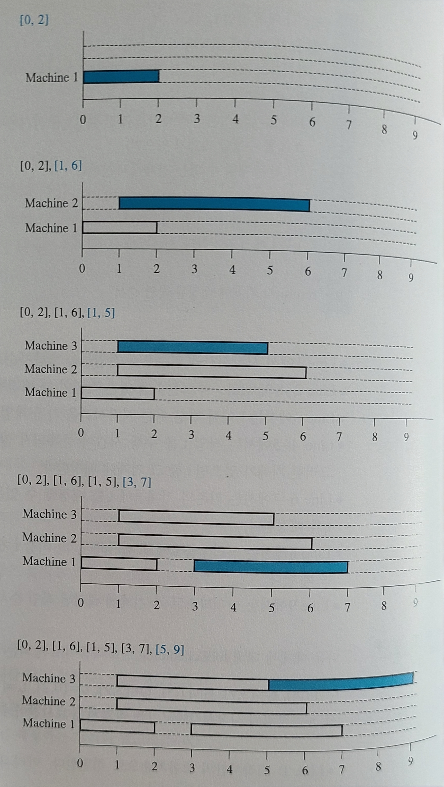
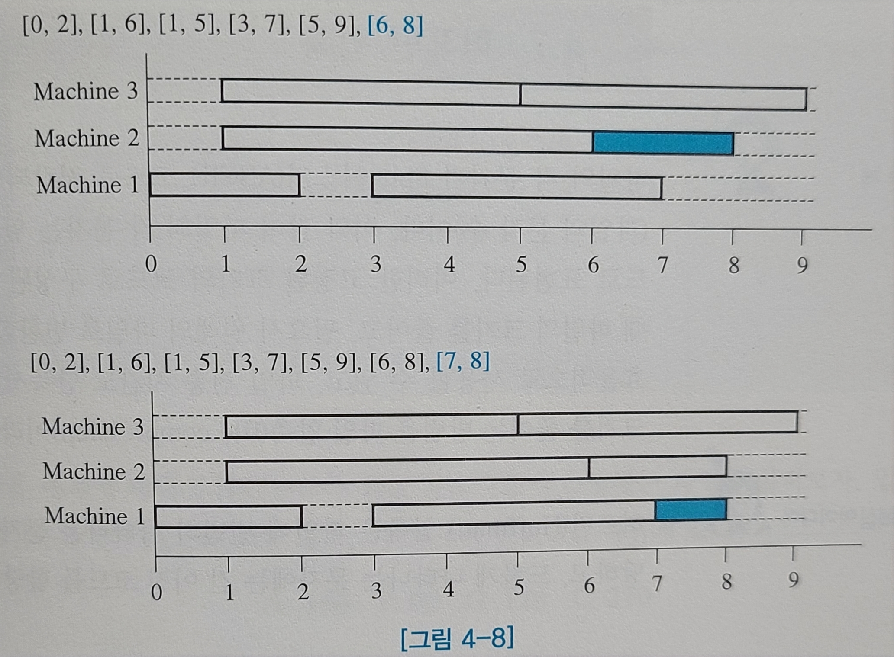

# 04 그리디 알고리즘

---

<aside>
💡

그리디 알고리즘은 최적화 문제를 해결하는 알고리즘이다.

</aside>

- 그리디 알고리즘은 입력 데이터 간의 관계를 고려하지 않고 최솟값 또는 최댓값을 가진 데이터를 선택.
- 그리디 알고리즘은 근시안적인 선택으로 최적해를 찾고, 이를 모아 문제의 최적해를 찾는다.
- 한 번 선택하면 이를 절대 번복하지 않는다.
    - 선택한 데이터를 버리고 다른 데이터를 취하지 않는다.
    - 대부분의 그리디 알고리즘이 단순하고, 제한적인 문제들이 그리디 알고리즘으로 해결된다.

# 4.1 동전 거스름돈

- 동전 거스름돈 문제를 해결하는 최적해는 남은 액수를 초과하지 않는다는 조건 하에, 큰 액면을 선택.

```c
입력: 거스름돈 액수 W
출력: 거스름돈 액수에 대한 최소 동전 수
change=W, n500=n100=n50=n10=n1=0
while (change >= 500)
	change = change - 500, n500++
while (change >= 100)
	change = change - 100, n100++
while (change >= 50)
	change = change - 50, n50++
while (change >= 10)
	change = change - 10, n10++
while (change >= 1)
	change = change - 1, n1++
return (n500+n100+n50+n10+n1)
```

- 위 알고리즘은 남아있는 동전은 change에 대해 가장 높은 액면가의 동전을 거스른다.
    - 그 이하 동전를 몇 개씩 거슬러 줄 것인지는 고려하지 않는다.
    - 이것이 그리디 알고리즘의 근시안적 특징이다.

# 4.2 최소 신장 트리

- 최소 신장 트리란 주어진 가중치 그래프에서 사이클 없이 모든 점을 연결시킨 트리들 중 간선들의 가중치 합이 최소인 트리이다.
- 크루스칼 알고리즘은 가중치가 가장 작은 간선이 사이클을 만들지 않을 때만 그 간선을 추가한다.

```c
입력: 가중치 그래프 G=(V, E), |V|=n(점의 수), |E|=m(간선의 수)
출력: 최소 신장 트리 T
가중치의 오름차순으로 간선들을 정렬한다. 정렬된 간선 리스트를 L이라고 하자.
T=null // 트리 T 초기화.
while (T의 간선 수 < n-1) {
	L에서 가장 작은 가중치를 가진 간선 e를 가져오고, e를 L에서 제거한다.
	if (간선 e가 T에 추가되어 사이클을 만들지 않으면)
		e를 T에 추가시킨다.
	else
		e를 버린다.
}
return 트리 T
```

- 크루스칼 알고리즘의 시간복잡도는 다음과 같다.

$$
O(m\log m)+O(m\log^*m)=O(m\log m)
$$

- 프림 알고리즘은 임의의 점을 하나 선택한 후, n-1개의 간선을 하나씩 추가시켜 트리를 만든다.

```c
입력: 가중치 그래프 G(V, E), |V|=n(점의 수), |E|=m(간선의 수)
출력: 최소 신장 트리 T
그래프 G에서 임의의 점 p를 시작점으로 선택하고, D[p]=0으로 놓는다.
for (점 p가 아닌 각 점 v에 대하여) {
	if (간선 (p, v)가 그래프에 있으면)
		D[v] = 간선 (p, v)의 가중치
	else
		D[v]=infinity
}
T={p}
while (T에 있는 점의 수 < n) {
	T에 속하지 않은 각 점 v에 대하여, D[v]가 최소인 점 vmin과 연결된 간선 (u, vmin)을
	T에 추가한다. 단, u는 T에 속한 점이고, 이때 점 vmin도 T에 추가된다.
	for (T에 속하지 않은 각 점 w에 대해서) {
		if (간선 (vmin, w)의 가중치 < D[w])
			D[w]=간선(vmin, w)의 가중치
	}
}
return T
```

- 프림 알고리즘의 시간복잡도는 다음과 같다.

$$
(n-1)*O(n)=O(n^2)
$$

- 두 알고리즘의 수행 과정 비교:
    - 크루스칼 알고리즘에서는 간선이 T에 하나씩 추가되는데, 이는 마치 n개의 점들이 각각의 트리인 상태에서 간선이 추가되면 2개의 트리가 1개의 트리로 합쳐지는 것과 같다. 크루스칼 알고리즘은 이를 반복하여 1개의 트리인 T를 만든다. 즉 n개의 트리들이 점차 합쳐져서 1개의 신장 트리가 만들어진다.
    - 프림 알고리즘에서는 T가 점 1개인 트리에서 시작되어 간선을 하나씩 추가시킨다. 즉, 1개의 트리가 자라나서 신장 트리가 된다.

# 4.3 최단 경로 찾기

- 최단 경로 문제는 주어진 가중치 그래프에서 어느 한 출발점에서 도착점까지의 최단 경로를 찾는 문제.
    - 대표적인 알고리즘은 다익스트라 알고리즘이다.
- 다익스트라 알고리즘은 프림의 최소 신장 트리 알고리즘과 흡사하게 진행된다:
    - 다익스트라 알고리즘은 주어진 출발점에서 시작한다.
    - 출발점으로부터 최단 거리가 확정되지 않은 점들 중 출발점에서 가장 가까운 점을 추가하고, 그 점의 최단 거리를 확정한다.

```c
입력: 가중치 그래프 G(V, E), |V|=n(점의 수), |E|=m(간선의 수)
출력: 출발점 s로부터 (n-1)개의 점까지 각각 최단 거리를 저장한 배열 D
배열 D를 infinity로 초기화시킨다. 단, D[s]=0으로 초기화한다.
while (s로부터의 최단 거리가 확정되지 않은 점이 있으면) {
	현재까지 s로부터 확정되지 않은 각 점 v에 대해서 최소의 D[v]의 값을 가진 점 vmin을 선택하고,
	출발점 s로부터 점 vmin까지의 최단 거리 D[vmin]을 확정시킨다.
	s로부터 현재보다 짧은 거리로 점 vmin을 통해 우회 가능한 각 점 w에 대해서 D[w]를 갱신한다.
}
return D
```

- 다익스트라 알고리즘의 시간복잡도는 아래와 같다.

$$
(n-1)*\{O(n)+O(n)\}=O(n)
$$

# 4.4 부분 배낭 문제

- 배낭 문제는 n개의 물건이 있고, 각 물건이 무게와 가치를 가지고 있을 때, 최대의 가치를 갖도록 한정된 용량의 배냥에 넣을 물건들을 정하는 문제이다.
- 원래 배낭 문제는 물건을 통째로 배낭에 넣어야 하지만, 부분 배낭 문제는 물건을 부분적으로 담는 것이 허용된다.
- 단위 무게당 가장 값나가는 물건을 배낭에 넣고, 계속해서 그 다음으로 값나가는 물건을 넣는다.
    - 그 다음으로 값나가는 물건을 ‘통째로’ 배낭에 넣을 수 없게 되면, 부분적으로 배낭에 담는다.

```c
입력: n개의 물건과 각 물건의 무게와 가치, 배낭의 용량 C
출력: 배낭에 담은 물건 리스트 L과 배낭에 담은 물건의 가치 합 v
각 물건의 단위 무게당 가치를 계산한다.
물건들을 단위 무게당 가치를 기준으로 내림차순으로 정렬하고, 정렬된 물건 리스트를 S라고 하자.
L=null, w=0, v=0
S에서 단위 무게당 가치가 가장 큰 물건 x를 가져온다.
while ((w+x의 무게)<=C) {
	x를 L에 추가시킨가.
	w=w+x의 무게
	v=v+x의 가치
	x를 S에서 제거한다.
	S에서 단위 무게당 가치가 가장 큰 물건 x를 가져온다.
}
if ((C-w)>0) {
	물건 x를 (C-w)만큼만 L에 추가한다.
	v=v+(C-w)만큼의 x의 가치
}
return L, v
```

- 부분 배낭 문제의 시간복잡도는 아래와 같다.

$$
O(n)+O(n\log n)*O(1)+O(1)=O(n\log n)
$$

# 4.5 집합 커버 문제

- n개의 원소를 가진 집합인 U가 있고, U의 부분 집합들을 원소로 하는 집합 F가 주어질 때, F의 원소들인 집합들 중에서 어떤 집합들을 선택하여 합집합하면 U와 같게 되는가?
    - 집합 커버 문제는 F에서 선택하는 집합들의 수를 최소화하는 문제이다.
- 원소 n이 커지면 최적해를 찾는 것은 실질적으로 불가능하다.
    - 이를 극복하기 위해 최적해에 근접한 근사해를 찾는다.

```c
입력: U, F={S1}, i=1, …, n
출력: 집합 커버 C
C = null
while (U != null) do {
	U의 원소들을 가장 많이 포함하고 있는 집합 S1을 F에서 선택한다.
	U = U-S1
	S1을 F에서 제거하고, S1을 C에 추가한다.
}
return C
```

- 집합 커버 문제의 시간복잡도는 다음과 같다.

$$
루프\ 1회의\ 시간복잡도는\ O(1)+O(n^2)+O(n)+O(1)=O(n^2)\\SetCover\ 알고리즘의\ 시간복잡도는\ O(n)*O(n^2)=O(n^3)
$$

# 4.6 작업 스케줄링

- 작업 스케줄링 문제에 주어진 문제 요소들은 작업의 수, 각 작업의 시작시간과 종료시간이다.
- 작업의 시작시간과 종료시간은 정해져 있으므로 작업의 길이도 주어진 셈이다.
- 다음과 같은 그리디 알고리즘들을 생각해볼 수 있다:
    - 빠른 시작시간 작업을 우선 배정.
    - 빠른 종료시간 작업을 우선 배정.
    - 짧은 작업을 우선 배정.
    - 긴 작업을 우선 배정.
- 이때 첫 번째 알고리즘을 제외하고 나머지는 항상 최적해를 찾지 못한다.

```c
입력: n개의 작업 t1, t2, …, tn
출력: 각 기계에 배정된 작업 순서
시작시간의 오름차순으로 정렬한 작업 리스트를 L이라고 하자.
while (L != null) {
	L에서 가장 이른 시작시간을 가진 작업 ti를 가져온다.
	if (ti를 수행할 기계가 있으면) 
		ti을 수행할 수 있는 기계에 배정한다.
	else
		새로운 기계에 ti을 배정한다.
	ti를 L에서 제거한다.
}
return 각 기계에 배정된 작업 순서
```





- 작업 스케줄링의 시간복잡도는 다음과 같다.

$$
O(n\log n)+O(mn)
$$

# 4.7 허프만 압축

<aside>
💡

허프만 압축은 파일에 빈번히 나타나는 문자에 짧은 이진 코드를 할당하고, 

드물게 나타나는 문자에는 긴 이진 코드를 할당한다.

</aside>

- 허프만 압축으로 변환시킨 문자 코드들 사이에는 접두부 특성이 존재한다.
    - 각 문자에 할당된 이진 코드는 어떤 다른 문자에 할당된 이진 코드의 접두부가 되지 않는다.
- 각 문자의 출현 빈도수에 기반을 둔 이진 트리를 만들어서, 각 문자에 이진 코드를 할당한다.
    - 위 이진 코드를 허프만 코드라고 한다.

```c
입력: 입력 파일의 n개의 문자에 대한 각각의 빈도수
출력: 허프만 트리
각 문자에 대해 노드를 만들고, 그 문자의 빈도수를 노드에 저장한다.
n개의 노드들의 빈도수에 대해 우선순위 큐 Q를 만든다.
while (Q에 있는 노드 수 >= 2) {
	빈도수가 가장 낮은 2개의 노드를 Q에서 제거한다.
	새 노드 N을 만들고, A와 B를 N의 자식 노드로 만든다.
	N의 빈도수 = A의 빈도수 + B의 빈도수
	노드 N을 Q에 삽입한다.
}
return Q
```

- 허프만 압축의 시간복잡도는 다음과 같다.

$$
O(n)+O(n)+O(n\log n)+O(1)=O(n\log n)
$$

# 연습문제

1. 다음의 괄호 안에 알맞은 단어를 채워 넣어라.
    1. 그리디 알고리즘은 데이터 간의 관계를 고려하지 않고 수행 과정에서 ‘(욕심내어)’ 최적값을 가진 데이터를 선택하며, 선택한 값들을 (모아서) 문제의 최적해를 찾는다.
    2. 그리디 알고리즘은 문제의 최적해 속에 (부분문제)의 최적해가 포함되어 있고, 부분문제의 해 속에 그보다 작은 (부분문제)의 해가 포함되어 있다. 이를 (최적 부분 구조) 또는 (최적성 원칙)이라고 한다.
    3. 동전 거스름돈 문제를 해결하는 가장 간단한 방법은 (큰 액면의) 동전을 취하는 것이다.
    4. 크러스컬 알고리즘은 가중치가 가장 작으면서 (사이클)을 만들지 않는 간선을 추가시켜 트리를 만든다.
    5. 프림 알고리즘은 현재까지 만들어진 트리에 (최소)의 가중치로 연결되는 간선을 트리에 추가시킨다.
    6. 다익스트라 알고리즘은 출발점으로부터 최단 거리가 확정되지 않은 점들 중에서 출발점으로부터 가장 (가까운) 점을 추가하고, 그 점의 최단 거리를 확정한다.
    7. 부분 배낭 문제에서는 단위 무게당 가장 (비싼) 물건을 계속해서 배낭에 담는다. 마지막에는 배낭에 넣을 수 있을 만큼만 물건을 배낭에 담는다.
    8. 집합 커버 문제는 (근사) 알고리즘을 이용하여 (근사)해를 찾는다.
    9. 작업 스케줄링 문제는 빠른 (시작)시간 작업을 먼저  배정하여 최적해를 찾는다.
    10. 허프만 압축은 파일에 빈번히 나타나는 문자에는 (짧은) 이진 코드를 할당하고, 드물게 나타나는 문자에는 (긴) 이진 코드를 할당한다.
2. 아래의 통화 시스템들에 대해 거스름 동전을 위한 그리디 알고리즘으로 최적해를 찾으려고 한다. 그리디 알고리즘으로 최적해를 찾을 수 있는 시스템만 모아 놓은 것은?
    
    
    
- 가, 다, 라.
1. 다음 그래프에서 크러스컬 알고리즘으로 최소 신장 트리를 찾으려고 한다. 알고리즘이 시작되어 4번째로 선택되는 간선은?
    
    
    
    - S-A.
2. 다음의 그래프에서 프림 알고리즘으로 S에서 시작하여 최소 신장 트리를 찾으려고 한다. S 이후에 4번째로 최소 신장 트리에 추가하는 점은?
    
    
    
    - G.
3. 간선의 가중치가 서로 다른 그래프 G에서 emin과 emax가 각각 최소, 최대 가중치를 가진 간선이라 할 때 다음 중 틀린 것은?
    1. G의 어떤 최소 신장 트리라도 emin을 포함한다.
    2. 만일 emax가 G의 최소 신장 트리에 포함되어 있으면 emax를 G에서 제거하면 G는 2개 이상의 연결성분이 된다.
    3. G의 어떤 최소 신장 트리도 emax를 포함하지 않는다.
    4. G는 유일한 최소 신장 트리를 갖는다.
    5. 답 없음.
    - c.
4. 각 간선의 가중치가 1보다 큰 그래프 G에서 각 간선의 가중치를 제곱하여 얻은 그래프를 G’라고 하고, T와 T’가 각각 G와 G’의 최소 신장 트리이며 각 트리의 총 가중치를 w와 w’라고 하자. 다음 중 맞는 것은?
    1. T와 T’는 같은 트리이고 w’=w^2이다.
    2. T와 T’는 같은 트리이고 w’<w^2이다.
    3. T와 T’는 서로 다른 트리이고 w’=w^2이다.
    4. T와 T’는 서로 다른 트리이고 w’<w^2이다.
    5. 답 없음.
    - b.
5. 간선의 가중치가 서로 다른 그래프 G가 두 부분으로 분할되어서 한 부분을 X, 다른 부분을 Y라 하자. 그리고 정점 s는 X에 속하고, t는 Y에 속하며, X에 있는 점과 Y에 있는 점을 연결하는 간선들 중에서 가장 작은 가중치를 가진 간선을 e라 할 때, 다음 중 맞는 것은?
    1. 간선 e는 최소 신장 트리에 속한다.
    2. 간선 e는 s로부터 t까지의 최단 경로에 포함된다.
    3. 간선 e는 s로부터 t까지의 모든 경로에 포함된다.
    4. 간선 e는 s로부터 t까지의 최장 경로에 포함된다.
    5. 답 없음.
    - a.
6. 크러스컬과 프림 알고리즘에 대한 설명 중 맞는 것은?
    1. 크러스컬 알고리즘은 힙 자료구조로 구현할 수 있으며, 프림 알고리즘은 서로소 집합 연산을 통해 구현한다.
    2. 크러스컬 알고리즘은 동적 계획 알고리즘이고, 프림 알고리즘은 그리디 알고리즘이다.
    3. 크러스컬 알고리즘은 여러 개의 트리들을 연결하여 최소 신장 트리를 만들고, 프림 알고리즘은 하나의 트리만을 유지하면서 최소 신장 트리를 만든다.
    4. 크러스컬 알고리즘의 시간복잡도는 O(nlog*n)이고 프림 알고리즘의 시간복잡도는 O(n^2)이다.
    5. 답 없음.
    - c.
7. 다익스트라 최단 경로 알고리즘에 대한 설명이 (가)~(마)에 주어져 있다. 다음 중 옳은 설명들을 모두 모아 놓은 것은?
    
    
    
8. 다음 그래프에서 S로부터 각각 다른 점까지 최단 거리를 다익스트라 알고리즘으로 찾을 때 최단 거리가 확정되는 점들의 순서를 옳게 나열한 것은?
    
    
    
    - S-A-B-C-D-E
9. 다음 그래프에서 S로부터 각각 다른 점까지 최단 거리를 다익스트라 알고리즘으로 찾았다. 그러나 음수 가중치를 가진 간선 때문에 다익스트라 알고리즘이 잘못된 최단 거리를 찾은 것이 있다. 다은 중 최단 거리가 잘못된 점들만을 모아 놓은 것은?
    
    
    
    - B, C
        - A→C에 영향을 받아 잘못될 수 있는 점들이다.
10. 다음 그래프에서 다익스트라 알고리즘으로 S에서부터 각각 다른 점까지 최단 거리를 찾으려고 한다. 다익스트라 알고리즘이 맨 처음에 S의 최단 거리를 0으로 확정시킨 후 4번째로 최단 거리를 확정시킨 점은?
    
    
    
    - E.
11. 다음은 부분 배낭 문제에 관한 설명이다. 옳은 것은? 단, 적어도 몇 개의 물건을 배낭에 담을 수 있다고 가정하라.
    1. 분할 정복 알고리즈믕로 최적해를 찾는다.
    2. 시간복잡도는 선형 시간이다.
    3. 부분 배낭 문제의 최적해에는 부분문제의 최적해가 포함되지 않는다.
    4. 부분 배낭 문제의 최적해에는 단위 무게당 가치가 가장 큰 항목이 반드시 포함된다.
    5. 답 없음.
    - d.
12. 다음 중 허프만 압축에 대해 옳은 것은?
    1. 손실 있는 압축 방법이다.
    2. 코드 사이를 구분 짓기 위한 특수 분리 기호가 필요하다.
    3. 문자의 빈도수에 따라 코드의 길이가 달라진다.
    4. 허프만 코드는 어떤 다른 코드의 접두부가 될 수도 있다.
    5. 답 없음.
    - c.
13. 다음의 입력에 대해 허프만 압축을 수행하면 총 bit 수는?
    
    
    | A T T A C K A T D A W N |
    | --- |
    - 문자의 빈도수는 다음과 같다:
        - A: 4
        - T: 3
        - C: 1
        - K: 1
        - D: 1
        - W: 1
        - N: 1
    - 우선순위 큐를 활용해 다음과 같은 힙 구조를 만든다.
        
        
        
    - 31.
14. 다음의 입력에 대해 허프만 압축을 수행하면 총 bit 수는?
    
    
    | M I S S I S S I P P I |
    | --- |
    - 문자의 빈도수는 다음과 같다:
        - M: 1
        - I: 4
        - S: 4
        - P: 2
    - 우선순위 큐를 활용해 다음과 같은 힙 구조를 만든다.
        
        
        
    - 21.
15. 어떤 입력에 대해 문자의 빈도수를 조사해보니 다음과 같았다.
    
    
    | A: 1, B: 1, C: 2, D: 3, E: 5, F: 8, G: 13, H: 21 |
    | --- |
    
    이에 대해 허프만 압축을 하였을 때 110111100111010을 맞게 decode한 것은?
    
    - 우선순위 큐를 활용해 다음과 같은 힙 구조를 만든다.
        
        
        
    - FDHEG.
16. 허프만 압축 방법은 어떤 종류의 알고리즘인가?
    - 그리디 알고리즘.
17. 문자는 허프만 트리의 어디에 위치하는가?
    - 이파리.
18. 다음의 허프만 트리에서 A에 해당되는 허프만 코드는?
    
    
    
    - 011.
19. 다음의 허프만 트리에서 A에 해당되는 허프만 코드는?
    
    
    
    - 010.
20. 허프만 압축 알고리즘의 시간복잡도를 가장 정확히 표현한 것은?
    - O(nlogn).
21. 어떤 문자의 코드도 다른 문자의 코드이 접두부가 되지 않는 특성은?
    - prefix property.
22. 970원에 대해 4.1절의 CoinChange 알고리즘이 수행되는 과정을 보이라.
    
    
    
23. 4.1 절에서 CoinChange 알고리즘이 적용이 안 되는 경우를 살펴보았다. 현재 우리나라의 동전 시스템에 대해 CoinChange 알고리즘을 적용하면 항상 최소의 동전 수로 거스름돈이 계산된다. 이를 증명하라.
    - 큰 액면의 동전의 값어치가 작은 액면의 동전의 값어치로 항상 나누어진다.
    - 따라서 큰 액면의 동전이 자리를 차지하는 경우, 작은 액면의 동전의 해당 배수만큼 자리를 아끼는 셈.
    - 큰 액면의 동전이 자리를 차지하지 못하는 경우, 작은 액면의 동전이 효율적으로 자리를 차지한다.
24. 만일 다음과 같은 동전들이 있을 때, 4.1절의 CoinChange 알고리즘이 리턴하는 동전 수와 최소 동전 수를 각각 구하라. 단, 거스름돈은 200원이다.
    
    
    | 10, 50, 100, 140 |
    | --- |
    - CoinChange 알고리즘은 3개를 리턴한다.
    - 최소 동전 수는 2개이다.
25. 다음의 그래프에 대해서 크러스컬 알고리즘을 이용하여 최소 신장 트리를 찾아라.
    
    
    
    - 답안은 다음과 같다:
        1. 2
        2. 3
        3. 4
        4. 5
        5. 12
        6. 16
26. 크러스컬의 최소 신장 트리 알고리즘에서는 정렬된 간선 리스트에서 가장 작은 가중치를 가진 간선 e를 가져와서 T에 추가시켜서 사이클이 만들어지면 간선 e를 버린다. 이러한 사이클 검사는 상호 배타 집합의 union과 find 연산들을 통해서 수행할 수 있다. 이에 대해 간선들이 어떤 자료구조에 저장되고, 어떻게 union과 find 연산이 수행되는지를 설명하라.
    - 답안은 다음과 같다:
        - 간선은 (가중치, 정점1, 정점2)와 같은 형태의 리스트, 또는 배열 형태로 저장된다.
        
        
        
        
        
27. 다음의 그래프에서 점 A가 출발점일 때 프림의 최소 신장 트리 알고리즘이 수행되는 과정을 보이라.
    
    
    
    - 답안은 다음과 같다.
        1. 2
        2. 3
        3. 8
        4. 12
        5. 16
        6. 4
28. 프림 알고리즘이 현재까지 만든 T의 점들과 V-T의 점들을 연결하는 간선들 중에서 그리디하게 최소의 가중치를 가진 간선을 선택하여 트리를 확장한다. 이렇게 그리디한 선택을 하여도 왜 항상 최적해를 찾는지 설명하라. 단, V는 입력 그래프의 점의 집합이다.
    - 프림이 선택한 간선이 최소 신장 트리의 일부가 아닌 경우, 어떤 최소 신장 트리는 포함하지 않는다.
        - 최소 신장 트리에 존재하는 다른 간선을 프림이 선택한 간선으로 치환할 수 있음을 의미한다.
        - 그리디 알고리즘의 적용 조건을 만족한다.
    - 어떤 컷에서, 그 컷을 가로지르는 최소 가중치 간선은 항상 최소 신장 트리에 포함된다.
        - 프림은 항상 최적의 간선을 선택함을 의미한다.
29. 다음의 문장이 맞으면 True, 틀리면 False로 답하고, 그 이유를 설명하라.
    
    
    | 그래프 G에 있는 임의의 사이클상의 가장 작은 가중치를 가진 간선은 G의 최소 신장 트리의 간선이다. |
    | --- |
    - False.
        - 사이클 내 가장 작은 간선이 반드시 최소 신장 트리에 포함된다고 할 수 없다.
        - 최소 신장 트리는 여러 개가 존재할 수 있기 때문이다.
30. 최소 신장 트리를 찾기 위해 다음과 같은 분할 정복 알고리즘으로 신장 트리를 만들었다. 이 알고리즘으로 만들어진 트리가 최소 신장 트리인지 또는 아닌지 설명하라.
    
    
    | 주어진 그래프를 두 부분으로 나누어 각각의 부분에 대해 최소 신장 트리를 만든다. 이렇게 만들어진 2개의 트리를 T1과 T2라고 하자. T1과 T2를 연결하는 간선들 중에서 가장 가중치가 작은 간선으로 T1과 T2를 연결하여 트리를 만든다. |
    | --- |
    - 그리디 알고리즘의 속성인 Cut Property를 만족하지 못하는 분할 정복 알고리즘이다.
    - 따라서 만들어진 트리가 최소 신장 트리가 아닐 수 있다.
31. 다음의 문장이 맞으면 True 틀리면 False로 답하고, 그 이유를 설명하라.
    
    
    | 간선의 같은 가중치가 최대 2개인 그래프의 서로 다른 최소 신장 트리의 수는 최대 2개이다. |
    | --- |
    - False.
        - 2개보다 많을 수 있다.
32. 다음의 문장이 맞으면 True 틀리면 False로 답하고, 그 이유를 설명하라.
    
    
    | 모든 간선의 가중치가 양수인 그래프 G=(V, E)가 있다. G의 각 간선에 5를 더한 그래프를 G’라고 하자. G’의 최소 신장 트리의 가중치는 G의 최소 신장 트리의 가중치보다 5(|V|-1) 크다. |
    | --- |
    - True.
        - 정점 |V|개를 사이클 없이 연결하므로, 간선 수는 |V|-1개이다.
33. 주어진 그래프 G=(V, E)에 대해 아래의 알고리즘이 최소 신장 트리를 찾아주는지 아니면 찾을 수 없는지를 설명하라.
    
    
    | [1] 간선의 가중치를 증가하지 않는 순서로 정렬한다.
    [2] while 그래프의 간선의 수 < |V|-1
          정렬된 간선을 차례로 가져온다. 가져온 간선을 e라 하자.
          if 그래프에서 e를 제거해서 그래프가 서로 하나의 연결성분으로 남게 되면 e를 그래프에서 제거한다.
          else e를 그래프에 남겨 둔다. |
    | --- |
    - 찾지 못한다.
        - 그래프의 연결성을 유지하는 간선을 제거하려 시도해 최소 신장 트리의 조건을 만족하지 못한다.
34. 최대 신장 트리란 주어진 그래프에 있는 모든 점들을 사이클 없이 연결하되 연결하는 모든 간선들의 가중치 합이 최대인 트리이다. 가중치가 있는 그래프에서 최대 신장 트리를 찾는 알고리즘을 작성하라.
    - 크루스칼 알고리즘에서 가중치가 큰 간선부터 선택한다.
35. 주어진 그래프 G=(V, E)에 대해 최소 신장 트리 T를 찾았는데, 그래프의 어느 한 간선의 가중치가 증가하였다. T를 갱신하는 O(|V|+|E|)인 알고리즘을 작성하라.
    - 답안은 아래와 같다:
        1. 가중치 증가 간선 확인
            - 변화한 간선이 MST T에 포함되는지 판단한다.
        2. 간선 제거
            - 변화한 간선이 T에 포함되는 경우 간선을 제거하고 두 컴포넌트로 분리한다.
            - DFS 또는 BFS를 사용해 O(|V|) 시간에서 두 컴포넌트를 명확히 식별한다.
        3. 최적 연결 간선 탐색
            - 두 컴포넌트를 연결하는 가장 최적의 간선을 찾는다.
            - O(|E|) 시간에 가장 작은 가중치를 가진 간선을 선택한다.
        4. 새로운 간선 추가
            - 찾은 최적의 간선을 MST T에 추가해 갱신된 최소 신장 트리를 완성.
36. 주어진 그래프에서 최소 신장 트리를 찾았는데 새 노드 1개와 새 노드와 기존의 노드들을 연결하는 가중치를 가진 간선들이 추가되었다. 변경된 그래프에서 다시 처음부터 최소 신장 트리를 찾지 않고 갱신된 그래프에서 빠르게 최소 신장 트리를 찾는 방법을 설명하고, 제시한 방법의 시간복잡도를 계산하라.
    - 프림 알고리즘을 확장해 적용한다.
37. 다음 그래프에서 다익스트라의 최단 경로 알고리즘을 이용하여, 출발점이 A일 때 점 E까지의 최단 경로를 찾아라.
    
    
    
    - A-D-E.
38. 음수 가중치가 있는 그래프에서 다익스트라의 최단 경로 알고리즘을 적용하면 항상 올바른 해를 얻지 못한다. 그 예를 제시하라.
    - 음수 가중치가 없는 경우 방문되지 않은 노드들 중 가장 가까운 거리가 최종 최단 거리가 된다.
    - 음수 가중치가 있는 경우 다른 노드로 가는 경로가 이전에 확정된 노드의 거리보다 짧아질 수 있다.
39. 음수 가중치가 있는 그래프에서 다익스트라의 최단 경로 알고리즘을 적용하면 항상 맞는 해를 얻지 못한다. 이를 보완하기 위해 그래프에 있는 최저 가중치가 -w라고 할 때, 각 간선의 가중치를 w만큼 증가시킨 후, 다익스트라의 최단 경로 알고리즘을 적용하고자 한다. 이러한 방식이 항상 올바른 해를 찾는지 아니면 찾지 못하는지를 답하고, 그 이유를 설명하라.
    - 간선 개수에 따른 상대적인 순서가 변경된다. 더 길었던 거리가 더 짧아져 보일 수 있다.
40. 음수 가중치가 있는 그래프에서 최단 경로를 찾는 알고리즘을 조사하라. 단, 입력 그래프에는 가중치의 합이 음수인 사이클은 없다.
    - 벨만-포드(Bellman-Ford) 알고리즘.
        1. 초기화
            - 출발 노드 S를 제외한 모든 노드의 최단 거리를 infinity로 초기화한다.
            - 출발 노드 S의 거리를 0으로 초기화한다.
            - 각 노드의 이전 노드를 저장하는 parent 배열을 초기화.
                - 최단 경로 재구성을 위해 배열이 피룡하다.
        2. 간선 이완 반복(|V|-1번)
            - 각 간선 (U, V)에 대해:
                1. dist[u] + weight(u, v) < dist[v] 이면
                    1. dist[v] = dist[u] + weight(u, v)
                    2. parent[v] = u
        3. 음수 사이클 감지
            - |V|-1번의 반복을 마친 후, 한 번 더 모든 간선을 이완시킨다.
            - 이 과정에서 dist[v]가 업데이트된다면, 음수 사이클이 존재한다는 의미이다.
            - 음수 사이클이 존재할 경우 최단 경로가 정의되지 않는다.
        - 시간복잡도는 O(|V|*|E|).
41. 다음의 문장이 맞으면 True 틀리면 False로 답하고, 그 이유를 설명하라.
    
    
    | 다익스트라 알고리즘이 찾은 최단 경로는 간선 수가 최소이다. |
    | --- |
    - False.
        - 간선 가중치의 합을 최소화하는 것을 목표로 하므로, 작은 가중치 간선을 여럿 선택할 수 있다.
42. 다익스트라 알고리즘을 이용하여 간선 수가 최소인 최단 경로를 찾기 위한 방법을 설명하라. 단, 모든 간선의 가중치는 양의 정수이다.
    - 답은 다음과 같다:
        1. 자료 구조 확장
            - dist[v]
                - dist[s]=0, dist[]=infinity로 초기화.
            - edge[v]: 시작 노드에서 노드 v까지의 dist[v]에 해당하는 최단 경로의 간선 수.
                - edge[s]=0, edge[]=infinity로 초기화.
        2. 우선순위 큐 정의
            - 우선순위 큐에 (거리, 간선 수, 노드) 형태로 저장한다.
                - 거리가 더 작은 자료가 우선된다.
                - 거리가 같으면, 간선 수가 더 작은 자료가 우선된다.
            - 우선순위 큐에 (0, 0, s)를 삽입한다.
        3. 우선순위 큐가 비어있지 않은 동안 탐색
            - 더 좋거나 같은 경로가 처리된 경우, d>dist[u] 또는 d==dist[u]이고 e>edge[u]일 때:
                - 이 자료를 무시하고 다음 자료를 추출한다.
            - u의 모든 이웃 노드 v에 대해서 다음을 수행한다.
                - 더 짧은 경로를 발견한 경우 새 거리 및 새 간선 수를 가지는 자료를 PQ에 삽입.
                - 거리가 같고 간선 수가 더 작은 경로를 발견한 경우 새 간선 수의 자료를 삽입.
43. 다음의 문장이 맞으면 True 틀리면 False로 답하고, 그 이유를 설명하라.
    
    
    | 모든 간선의 가중치가 양수인 그래프 G=(V, E)가 있다. G의 각 간선의 가중치에 1을 더한 그래프를 G’라고 하자. G에서의 두 점 u, v간의 최단 경로는 G’에서도 u, v간의 최단 경로와 같다. |
    | --- |
    - False.
        - u에서 v까지의 최단 경로가 여럿 존재할 수 있는데, 최단 경로를 구성하는 간선 수가 다른 경우.
44. 다음의 문장이 맞으면 True 틀리면 False로 답하고, 그 이유를 설명하라.
    
    
    | 모든 간선의 가중치가 1보다 큰 그래프 G=(V, E)가 있다. G의 각 간선의 가중치를 제곱한 그래프를 G’라고 하자. G에서의 두 점 s, t간의 최단 경로는 G’에서도 s, t간의 최단 경로와 같다. |
    | --- |
    - False.
        - 긴 경로일수록 증가폭이 커진다.
45. 주어진 그래프의 최소 신장 트리와 어느 한 점에서 모든 다른 점들까지 다익스트라 알고리즘으로 찾은 최단 경로들로 만들어진 트리가 항상 동일한지 아닌지 답하라.
    - 최소 신장 트리와 최단 경로 트리는 서로 다르다.
46. 다음의 문장이 맞으면 True 틀리면 False로 답하고, 그 이유를 설명하라.
    
    
    | 모든 간선의 가중치가 다른 그래프 G에는 G의 어느 점 s에서 각각의 다른 점까지의 최단 경로는 유일하다. |
    | --- |
    - False.
        - s→4→3→e, s→2→5→e 인 경우의 반례가 존재한다.
47. 가중치를 가진 방향 그래프 G가 주어지고 G에 있는 s로부터 각각 다른 점 u까지의 최단 거리 d(s, u)만 주어질 때, s로부터 특정한 점 t까지 최단 경로를 찾는 O(m+n) 시간 알고리즘을 작성하라. 단, n과 m은 G에 있는 각각 정점과 간선의 수이다.
    - 답안은 다음과 같다:
        1. 경로 초기화
            - t로부터 시작하여 경로를 역추적한다.
            - 경로를 저장할 빈 리스트 또는 스택.
                - 현재 정점을 curr_node=t로 설정한다.
        2. 경로 역추적
            - curr_node가 s가 될 때까지 다음 단계를 반복한다.
                - curr_node를 경로에 추가한다.
                - G의 curr_node로 들어오는 모든 간선 (u, curr_node)를 확인한다.
                - 이 간선들 중에서 다음 조건을 만족하는 정점 u를 찾는다
                    - d(s,u)+weight(u,curr_node)=d(s,curr_node)
                - 조건을 만족하는 정점 u를 찾으면 curr_node를 u로 업데이트한다.
        3. 경로 완성
            - curr_node가 s가 되면, s를 경로에 추가한다.
            - 그 다음 경로를 뒤집어서 s에서 t로 가는 올바른 순서를 얻는다.
48. 4.5절에서 F={S1, S2, …, Sn}일 경우, 모든 조합의 수가 (2^n-1)이다. 각각의 조합에 대해 합집합을 해보고, 그 결과가 U와 같은지를 O(n^2) 시간에 검사할 수 있다. 어떻게 하면 각각의 검사를 O(n^2)시간에 할 수 있는지 설명하라. 단, U={1, 2, …, n}이라고 가정하라.
    - U의 원소들을 가장 많이 포함하는 S를 찾기 위해 U와 비교하여야 한다.
        - S들의 수가 최대 n이라면 각 S와 U의 비교는 O(n) 시간 소요되어, O(n^2) 시간이 소요된다.
    - 집합 U에서 S의 원소를 제거하는 것은 O(n) 시간 소요된다.
49. 다음의 그림에 있는 집합들에 대해서 집합 커버의 최적해를 구하고, SetCover 알고리즘으로 근사해를 구하라.
    
    
    
    - 최적해는 S4, S5. 근사해의 답 및 풀이는 다음과 같다:
        1. U의 원소를 가장 많이 포함하고 있는 S3를 선택한다. 이후 U=U-S3
        2. U의 원소를 가장 많이 포함하고 있는 S2를 선택한다. 이후 U=U-S2
        3. U의 원소를 가장 많이 포함하고 있는 S1을 선택한다. 이후 U=U-S1
        4. U가 공집합이므로 S1, S2, S3를 반환한다.
50. 다음의 집합들에 대해서 집합 커버의 최적해를 구하고, SetCover 알고리즘으로 근사해를 구하라. 단, U={a, b, c, d, e, f, g, h, i, j, k, l}이다.
    
    
    | S1={a, b, c, d, e, f}, S2={e, f, h, i}, S3={a, d , g, i}, S4={b, e, g, h, k}, S5={c, f, i, l}, S6={j, k} |
    | --- |
    - 최적해는 {S1, S4, S5, S6}.
    - 근사해는 {S1, S4, S5, S6}.
51. 다음의 작업들에 대해서, 가장 이른 종료시간을 가진 작업 우선 배정 원칙하에 작업 스케줄링을 찾아라. 그리고 같은 입력에 대해서 최적해를 구하라.
    
    
    | [0, 2], [1, 6], [1, 5], [3, 7], [6, 8], [5, 9], [7, 8] |
    | --- |
    - 가장 이른 종료시간을 가진 작업 우선 배정 원칙하에서 [0, 2], [3, 7], [7, 8]이다.
    - 최적해는 위와 같다.
52. 다음의 작업들에 대해서, 가장 긴 작업 우선 배정 원칙하에 작업 스케줄링을 찾아라. 그리고 같은 입력에 대해서 최적해를 구하라.
    
    
    | [3, 11], [1, 7], [3, 8], [8, 12], [7, 10], [1, 3], [11, 12] |
    | --- |
    - 긴 작업 우선 배정 원칙하에서 [3, 11], [11, 12].
    - 최적해는 [1, 3], [3, 8], [11, 12].
53. 다음의 작업들에 대해서, 가장 짧은 작업 우선 배정 원칙하에 작업 스케줄링을 찾아라. 그리고 같은 입력에 대해서 최적해를 구하라.
    
    
    | [11, 12], [1, 3], [7, 10], [8, 12], [3, 8], [1, 7], [3, 11] |
    | --- |
    - 가장 짧은 작업 우선 배정 원칙하에서 [11, 12]
    - 최적해 [1, 3], [3, 8], [8, 12]
54. 4.6절의 작업 스케줄링 문제는 n개의 작업을 모두 수행시키는데 필요한 기계의 수를 최적화하는 문제이다. 그러나 이 문제를 변형하여, 기계가 1대만 있고, n개의 작업이 있을 때 가장 많은 수의 작업들을 수행시키고자 한다. 이 문제를 해결하기 위한 그리디 알고리즘을 고안하라.
    - 가장 이른 종료 시간을 우선으로 알고리즘을 작성한다.
        - 단 작업은 서로 겹치지 않아야 한다.
55. 문제 56을 해결하기 위해 가장 이른 시작시간에 작업 우선 배정 원칙으로 작업을 배정하면, 최적해를 항상 찾을 수 있는지 또는 없는지를 답하라.
    - 없다.
56. 문제 56을 해결하기 위해 가장 짧은 작업 우선 배정 원칙으로 작업을 배정하면, 최적해를 항상 찾을 수 있는지 또는 없는지를 답하라.
    - 없다.
57. 문제 56을 해결하기 위해 가장 적은 수로 겹치는 작업 우선 배정 원칙으로 작업을 배정하면, 최적해를 항상 찾을 수 있는지 또는 없는지를 답하라.
    - 없다.
58. 입력 파일이 4개의 문자로 되어있고, 각 문자의 빈도수는 다음과 같을 때 HuffmanCoding 알고리즘을 적용하여, 각 문자의 코드를 구하라.
    
    
    | A: 60, B: 50, C: 150, D: 70 |
    | --- |
    
    
    
    - A: 111, B: 110, C: 0, D: 10
59. 입력 파일이 4개의 문자로 되어있고, 각 문자의 빈도수는 다음과 같을 때 HuffmanCoding 알고리즘을 적용하여, 각 문자의 코드를 구하라.
    
    
    | a:6, b:2, c:3, d:3, e:4, f:9 |
    | --- |
    
    
    
    - a: 01, b: 000, c: 001, d: 100, e: 101, f: 11
60. 다음의 코드가 허프만 압축 알고리즘으로 만들어진 것인지 아닌지를 판단하라. (접두사 관계로 파악)
    1. 0, 10, 11
        - 허프만 압축 알고리즘을 통해 만들어졌다.
    2. 0, 1, 11
        - 허프만 압축 알고리즘을 통해 만들어지지 않았다.
    3. 10, 01, 00
        - 허프만 압축 알고리즘을 통해 만들어졌다.
61. n개의 문자가 있을 때 허프만 압축 알고리즘으로 생성될 수 있는 가장 긴 코드의 길이는? 그 경우의 예를 보이라.
    - n-1.
        - 빈도수가 극단적으로 편향된 경우 가지가 쭉 뻗어나가게 된다.
62. 허프만 압축 알고리즘 외에 다른 압축 알고리즘들을 조사하여 보자.
    - 산술 부호화
        - 심볼 시퀀스 전체를 하나의 실수로 인코딩한다.
        - 압축률이 일반적으로 더 높으나, 계산 비용이 더 높다.
        - 심볼의 빈도수가 매우 낮거나 실시간으로 변화하는 경우에 유리하다.
    - 런-렝스 인코딩
        - 연속적으로 반복되는 동일 데이터를 개수와 데이터로 압축한다.
63. 도시 A에서 도시 B로 가려고 하는데 그 거리가(T km) 너무 멀어서 며칠 동안을 자동차로 운전해야만 한다. 미리 지도에서 도로 가의 주유소들의 위치를 찾고 출발점으로부터 거리를 다음과 같이 계산하였다. 단, d0=0<d1<d2<…<dn=T이다. 가득 찬 연료 탱크를 가지고 Ckm를 주행할 수 있는 자동차로 도시 A에서 도시 B로 가는데 필요한 최소 주유 횟수를 찾기 위한 알고리즘을 제안하고, 제안한 알고리즘이 왜 최소 횟수의 주유만으로 A로부터 B에 도착할 수 있는지를 설명(증명)하라.
64. 하나의 연결성분으로 되어있는 그래프에 간선들이 다양한 색으로 칠해져 있다. 그래프의 모든 점들을 n-1개의 간선으로 연결하되 가장 많은 수의 파란 색 간선을 사용하여 연결하는 알고리즘을 작성하라. 단, 그래프의 정점의 수는 n이다.