# 06 정렬 알고리즘

---

- 정렬 알고리즘은 내부정렬(Internal sort)와 외부정렬(External sort)로 구분된다.
    - 내부정렬은 입력 크기가 주기억 장치의 공간보다 크지 않은 경우 수행되는 정렬이다.
    - 외부정렬은 입력 크기가 주기억 장치 공간보다 큰 경우 수행되는 정렬이다.
        - 보조 기억 장치의 입력을 분할해 주기억 장치에서 정렬한 후, 보조 기억 장치에 저장을 반복한다.

# 6.1 버블 정렬

<aside>
💡

버블 정렬(Bubble sort)는 비교해 작은 수를 앞쪽으로 이동시키는 과정을 반복한다.

</aside>

- 배열을 상하로 그릴 때 정렬 과정에서 작은 수가 거품처럼 위로 올라간다.
- 일반적으로 n개의 원소가 있을 때 (n-1)번의 패스가 수행된다.

```python
입력: 크기가 n인 배열 A
출력: 정렬된 배열 A
for pass = 1 to n-1
	for i = 1 to n-pass
		if (A[i-1] > A[i])
			A[i-1] <-> A[i]
return 배열 A
```

- 버블 정렬의 시간복잡도는 $O(n^2)$이다.

# 6.2 선택 정렬

<aside>
💡

선택 정렬(Selection sort)은 입력 배열 전체에서 최솟값을 선택해 자리를 바꾸는 정렬이다.

</aside>

```python
입력: 크기가 n인 배열 A
출력: 정렬된 배열 A
for i = 0 to n-2 {
	min = i
	for j = i + 1 to n-1 {
		if (A[j] < A[min])
			min = j
	}
	A[i] <-> A[min]
}
return 배열 A
```

- 선택 정렬은 입력에 민감하지 않은 정렬으로, 시간복잡도는 $O(n^2)$이다.

# 6.3 삽입 정렬

<aside>
💡

삽입 정렬(Insertion sort)는 배열의 정렬 안 된 부분의 왼쪽 원소를 정렬된 부분에 삽입한다.

</aside>

- 정렬이 안 된 부분의 숫자가 정렬된 부분에 삽입되어, 정렬된 부분의 원소 수가 1개 늘어난다.
    - 정렬되지 않은 부분의 원소 수는 1개 줄어든다.

```python
입력: 크기가 n인 배열 A
출력: 정렬된 배열 A
for i = 1 to n-1 {
	CurrentElement = A[i] # 정렬이 안 된 부분의 가장 왼쪽 원소
	j <- i-1 # 정렬된 부분의 가장 오른쪽 원소로부터 왼쪽 방향으로 삽입할 곳을 탐색
	whlie (j >= 0) and (A[j] > CurrentElement) {
		A[j+1] = A[j]
		j <- j-1
	}
	A[j+1] <- CurrentElement
}
return A
```

- 이중 반복문이므로 시간복잡도는 $O(n^2)$.

# 6.4 쉘 정렬

<aside>
💡

쉘 정렬(Shell sort)은 배열 뒷부분의 작은 숫자를 앞부분으로 빠르게 이동, 삽입 정렬을 수행한다.

</aside>

- 다음 예제를 통해 쉘 정렬의 아이디어를 이해한다.

```python
입력: 크기가 n인 배열 A
출력: 정렬된 배열 A
for each gap h = [h0 > h1 > ... > hk=1] # 큰 gap부터 차례로
	for i = h to n-1 {
		CurrentElement = A[j];
		j = i;
		while (j >= h) and (A[j-h] > CurrentElement) {
			A[j] = A[j-h];
			j = j-h;
		}
		A[j] = CurrentElement;
	}
return A
```

- 쉘 정렬의 시간복잡도는 아직 구해지지 앟았으나, 최악 경우 시간복잡도는 $O(n^{1.5})$이다.
    - $2^k-1$의 히바드 간격을 사용하면 위와 같은 시간복잡도를 구할 수 있다.
- 쉡 정렬은 입력 크기가 매우 크지 않은 경우 매우 좋은 성능을 보인다.
- 임베디드 시스템에서 주로 사용되며, 그룹별 정렬 방식이 하드웨어로 구현할 때 적합하기 때문이다.

# 6.5 힙 정렬

<aside>
💡

최대 힙 자료구조를 활용하는 정렬이다.

</aside>

```python
입력: 입력이 A[1]부터 A[n]까지 저장된 배열 A
출력: 정렬된 배열 A
배열 A의 숫자에 대해서 힙 자료 구조를 만든다. # 최대 힙을 만든다.
heapSize = n # 힙의 크기를 조절하는 변수
for i = 1 to n-1
	A[i] <-> A[heapSize] # 루트와 힙의 마지막 노드를 교환한다.
	heapSize = heapSize-1 # 힙의 크기를 1 감소시킨다.
	DownHeap() # 위배된 힙 조건을 만족시킨다.
return 배열 A
```

- 힙 정렬의 시간복잡도는 $O(nlog{n})$이다.

# 6.6 정렬 문제의 하한

- 상기 정렬을 비교정렬(comparison sort)이라 하는데, 숫자 대 숫자 비교 횟수를 알아본다.
- 어떤 주어진 문제에 대해 시간복잡도의 하한(lower bound)은 더 빠르게 해를 구할 수 없음을 희미한다.
    - 단, 시간복잡도의 하한과는 구분되어야 한다.
- 비교정렬의 하한은 $\Omega(n\log{n})$이다.

# 6.7 기수 정렬

<aside>
💡

기수 정렬(Radix sort)는 비교정렬이 아니라, 숫자를 부분적으로 비교하는 정렬이다.

</aside>

```python
입력: n개의 r진수의 k자리 숫자
출력: 정렬된 숫자
for i = 1 to k
	각 숫자의 i자리 숫자에 대해 안정한 정렬을 수행한다.
return 배열 A
```

- 시간복잡도는 $O(n)$이다.
- 다수 프로세서가 사용되는 병렬(parallel) 환경에서의 정렬 알고리즘의 기본 아이디어이다.

# 6.8 외부정렬

<aside>
💡

외부정렬(External sort)은 입력 크기가 커 보조 기억 장치를 사용하는 상태에서의 정렬을 말한다.

</aside>

- 주기억 장치의 용량에 비해 정렬할 입력의 크기가 큰 경우 내부정렬 알고리즘으로 정렬 불가능하다.

256페이지 사진

```python
입력: 입력 데이터 저장된 입력 HDD
출력: 정렬된 데이터가 저장된 출력 HDD
입력 HDD에 저장된 입력을 크기가 M만큼씩 주기억 장치에 읽어 들인 후 내부정렬 알고리즘으로
정렬하여 별도의 HDD에 저장한다. 다음 단계에서 별도의 HDD는 입력 HDD로 사용되고,
입력 HDD는 출력 HDD로 사용된다.
while (입력 HDD에 저장된 블록 수 > 1) {
	입력 HDD에 저장된 블록을 2개씩 선택하여, 각각의 블록으로부터 데이터를 부분적으로
	주기억 장치에 읽어 들여서 합병을 수행한다. 이때 합병된 결과는 출력 HDD에 저장한다.
	단, 입력 HDD에 저장된 블록 수가 홀수일 때에는 마지막인 블록은 그래도 출력 HDD에 저장한다.
	입력과 출력 HDD의 역할을 바꾼다.
}
return 출력 HDD
```

- 외부정렬은 전체 데이터를 몇 번 처리하는가를 가지고 시간복잡도를 측정한다.
    - 이때 전체 데이터를 읽고 쓰는 것을 패스(pass)라고 한다.
    - while-루프가 수행된 횟수가 알고리즘의 시간복잡도가 된다.

# 연습문제

1. 다음의 괄호 안에 알맞은 단어를 채워 넣어라.
    1. 정렬 알고리즘은 크게 (내부)정렬과 (외부)정렬로 분류한다.
    2. (내부)정렬은 입력의 크기가 주기억 장치의 공간보다 크지 않은 경우에 수행되는 정렬이고, (외부)정렬은 입력의 크기가 주기억 장치 공간보다 큰 경우엥 수행되는 정렬이다.
    3. 버블 정렬은 이웃하는 숫자를 비교하여 (작은) 수를 앞쪽으로 동시키는 과정을 반복하는 정렬이다.
    4. 선택 정렬은 매번 (최솟)값을 선택하여 정렬한다.
    5. 삽입 정렬은 (정렬되지 않은) 부분에 있는 원소 하나를 정렬된 부분의 적절한 위치에 삽입하여 정렬한다.
    6. 쉘 정렬은 (삽입) 정렬을 이용하여 배열 뒷부분의 (작은) 숫자를 앞부분으로 ‘빠르게’ 이동시키고, 동시에 앞부분의 (큰) 숫자는 뒷부분으로 이동시키는 과정을 반복하여 정렬하는 알고리즘이다.
    7. 힙 정렬은 (최대힙) 자료 구조를 이용하는 정렬 알고리즘이다.
    8. 정렬 문제의 하한은 ($\Omega(n\log{n})$)이다.
    9. 기수 정렬은 숫자/스트링을 (부분적)으로 비교하는 정렬 방법이다.
    10. 외부정렬은 (내부)정렬을 이용하여 부분저긍로 데이터를 읽어 (정렬) 방법이다.
2. 다음 중 버블 정렬에 대해 틀린 것은?
    1. 최선 경우와 최악 경우의 시간복잡도가 다르다.
    2. 첫 번째 패스가 수행된 후에는 가장 큰 숫자가 배열의 마지막 원소에 자리잡는다.
    3. 작은 숫자들이 거품처럼 위로 매우 빨리 올라가는 알고리즘이다.
    4. 안정적인 정렬이다.
    5. 답 없음.
    - c. 차례로 올라가는 알고리즘이다.
3. 다음 중 선택 정렬에 대해 맞는 것은?
    1. 최선 경우와 최악 경우의 시간복잡도가 다르다.
    2. 최악 경우에 원소 간의 자리바꿈 횟수가 어떤 다른 정렬 알고리즘보다 적다.
    3. 대용량의 입력에 대해서도 우수한 성능을 보인다.
    4. 안정적인 정렬이다.
    5. 답 없음.
    - b. 선택 정렬은 최악 경우 원소 간의 자리바꿈 횟수가 어떤 다른 정렬 알고리즘보다 적다.
        - 최선 경우 시간복잡도와 최악 경우 시간복잡도가 $O(n^2)$으로 같다.
        - 대용량 입력에 대해서는 성능이 떨어진다. 시간복잡도가 애당초 $O(n^2)$이다.
        - 안정적인 정렬은 동일한 값의 상대적 순서가 동일해야 한다. 선택 정렬은 그렇지 않다.
4. 선택 정렬의 최악 경우 시간복잡도는?
    - $O(n^2)$.
5. 다음 중 삽입 정렬을 맞게 서술한 것은?
    1. 평균 시간복잡도는 $O(n^2)$이고, 최선 경우는 $O(n\log{n})$이다.
    2. 평균과 최악 경우의 시간복잡도는 $O(n^2)$이다.
    3. 대용량의 데이터를 정렬하는데 자주 사용된다.
    4. 역으로 정렬된 입력에 대해 매우 좋은 성능을 보인다.
    5. 답 없음.
    - b. 삽입 정렬의 평균 및 최악 경우 시간복잡도는 위와 같다.
        - 삽입 정렬도 이중 반복문이므로, 모든 경우 시간복잡도는 $O(n^2)$이다.
        - 시간복잡도 자체가 대용량의 데이터를 정렬하는데 사용되지 않는 종류이다.
        - 최악 경우에 대해 가정한 보기이다.
6. 삽입 정렬의 최선 경우 시간복잡도는?
    - $O(n^2)$.
7. 다음 중 쉘 정렬을 잘못 서술한 것은?
    1. 삽입 정렬을 개선한 알고리즘이다.
    2. 최선 경우의 시간복잡도는 $O(n)$이고 평균 경우는 $O(n^{1.5})$이다.
    3. 중간 크기의 데이터를 정렬하는데 좋은 성능을 보인다.
    4. 정렬 알고리즘을 하드웨어로 구현하는데 사용된다.
    5. 답 없음.
    - b. 쉘 정렬의 최선 경우 시간복잡도는 구해지지 않았다.
8. 다음의 입력에 대해 쉘 정렬이 간격이 3일 때 수행한 결과는?
    
    
    | 80 60 70 10 30 40 90 50 20 |
    | --- |
    - 풀이 및 답안은 다음과 같다:
        
        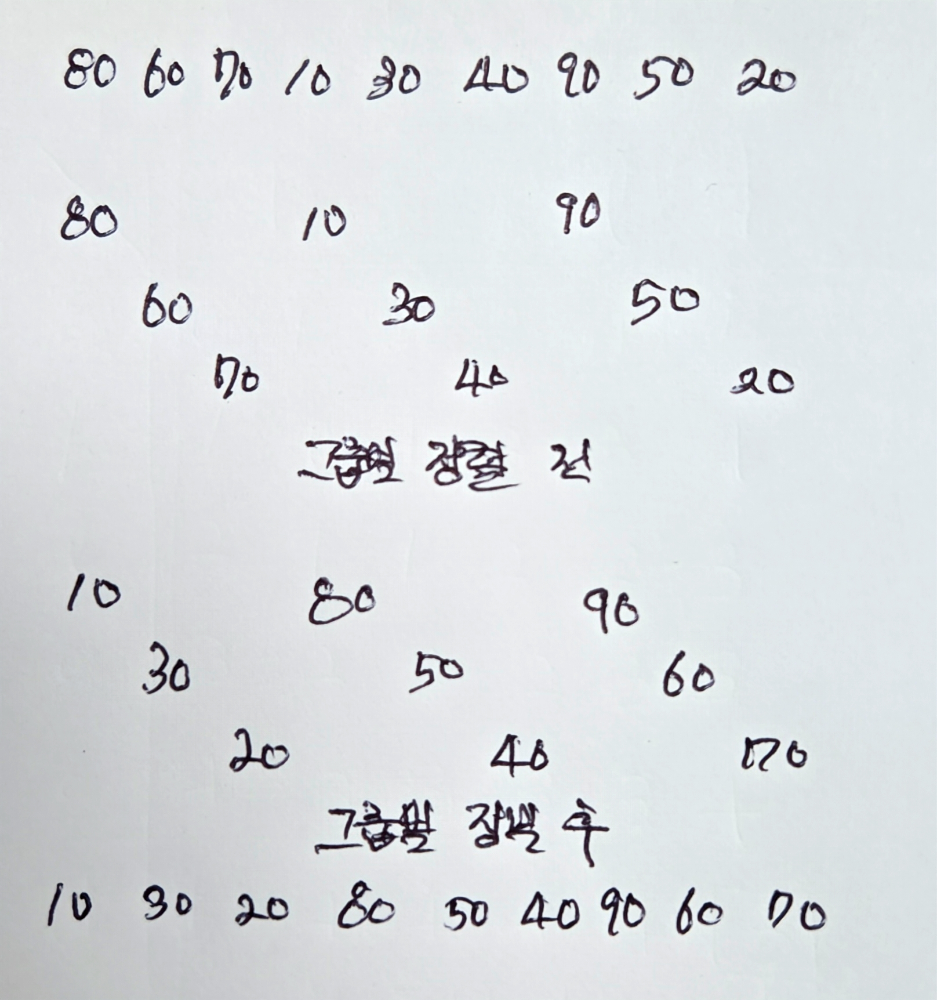
        
        | 10 30 20 80 50 40 90 60 70 |
        | --- |
9. 다음 중 힙 정렬에 대해 맞는 것은?
    1. min 힙을 사용하여 정렬한다.
    2. 힙 정렬의 최선 경우 시간복잡도는 $O(n)$이다.
    3. 캐시 메모리의 페이지 부재를 많이 야기하여 대용량의 입력엔 사용되지 않는다.
    4. 안정적인 정렬이다.
    5. 답 없음.
    - c. 배열에서 멀리 떨어져 있는 노드를 빈번히 이동시켜 페이지 부재를 야기한다.
        - max 힙을 사용해 정렬한다.
        - 힙 정렬의 경우 일관된 시간복잡도를 가지는데, $O(n\log{n})$이다.
        - 이동이 빈번히 일어나는 불안정한 정렬이다.
10. 힙 정렬의 최악 경우 시간복잡도는?
    - $O(n\log{n})$.
11. 다음의 입력에 대해 힙 정렬의 for-루프를 3회 수행한 결과는?
    
    
    | 90 60 80 50 30 40 70 10 20 |
    | --- |
    
    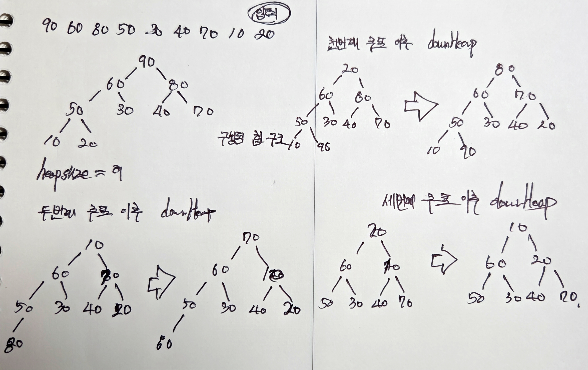
    
    - 답 없음.
12. 버블 정렬, 선택 정렬, 삽입 정렬 중에서 입력에 [3, 4, 7, 1, 2]일 떄 어떤 정렬 알고리즘의 맨 바깥의 for-루프를 3회 수행시킨 결과가 [1, 2, 3, 7, 4]이었다. 세 개의 정렬 알고리즘 중에서 어떤 알고리즘인가?
    - 선택 정렬이다.
        - 버블 정렬의 수행 과정은 다음과 같다.
            - **초기 상태**: `[3, 4, 7, 1, 2]`
            - **1회 수행**: `[3, 4, 1, 2, 7]`
            - **2회 수행**: `[3, 1, 2, 4, 7]`
            - **3회 수행**: `[1, 2, 3, 4, 7]`
        - 삽입 정렬의 수행 과정은 다음과 같다.
            - **초기 상태**: `[3, 4, 7, 1, 2]`
            - **1회 수행**: `[3, 4, 7, 1, 2]`
            - **2회 수행**: `[3, 4, 7, 1, 2]`
            - **3회 수행**: `[1, 3, 4, 7, 2]`
13. 버블 정렬, 선택 정렬, 삽입 정렬 중에서 입력이 [3, 4, 7, 1, 2]일 때 어떤 정렬 알고리즘이 가장 빨리 정렬할까?
    - 풀이 및 답은 다음과 같다:
    
    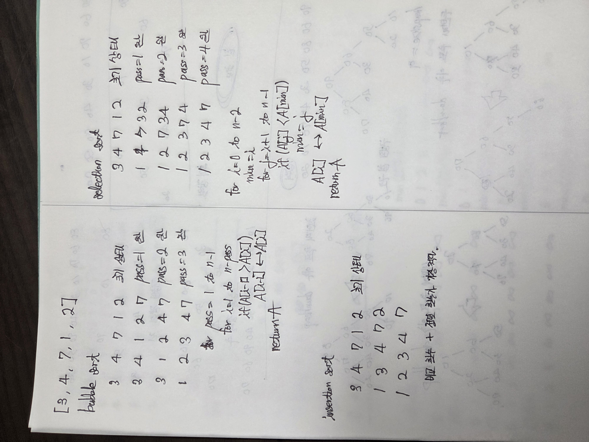
    
    - 삽입 정렬.
14. 다음 중 어떤 알고리즘이 최악 경우 시간복잡도가 $\theta(n\log n)$이면서 안정적인가?
    1. 버블 정렬
    2. 합병 정렬
    3. 퀵 정렬
    4. 삽입 정렬
    5. 힙 정렬
    - 합병 정렬이 위 시간복잡도이면서 안정적이다.
        - 버블, 삽입 정렬의 경우 $O(n^2)$의 시간복잡도를 가진다.
        - 퀵 정렬의 경우 최악 경우 $O(n^2)$ 시간복잡도를 가지고 불안정 정렬이다.
15. 다음 중 어떤 알고리즘이 최악 경우 시간복잡도가 $\theta(n\log n)$이면서 보조 배열을 사용하지 않는가?
    1. 버블 정렬
    2. 합병 정렬
    3. 퀵 정렬
    4. 삽입 정렬
    5. 힙 정렬
    - 힙 정렬이 위 시간복잡도이면서 보조 배열을 사용하지 않는다.
        - 버블 정렬, 삽입 정렬의 경우 $O(n^2)$의 시간복잡도를 가진다.
        - 합병 정렬의 경우 보조 배열을 필요로 한다.
        - 퀵 정렬의 경우 최악 경우 $O(n^2)$ 시간복잡도를 가지고 불안정 정렬이다.
16. 다음 중 정렬이 안정적이면서, 보조 배열을 사용하지 않는 알고리즘만 모아 놓은 것은?
    1. 버블 정렬, 삽입 정렬
    2. 합병 정렬, 힙 정렬
    3. 퀵 정렬, 버블 정렬
    4. 삽입 정렬, 선택 정렬
    5. 답 없음
    - a.
        - 같은 값끼리는 정렬된 순서가 바뀌지 않는 것이 안정적인 정렬이다.
        - 버블 정렬과 삽입 정렬은 안정적인 정렬이며 보조 배열을 사용하지 않는다.
        - 합병 정렬은 보조 배열을 사용한다.
        - 선택 정렬, 퀵 정렬, 힙 정렬은 안정적이지 않은 배열이다.
17. 다음은 정렬 알고리즘에 대한 설명이다. 다음 중 틀린 것은?
    1. 선택 정렬과 힙 정렬은 각각의 정렬 수행 과정에서 이미 부분적으로 정렬되어 있는 원소들을 다시 검색하지 않는다.
    2. 퀵 정렬과 쉘 정렬은 각각의 정렬 수행 단계마다 입력에 있는 모든 원소들을 검색한다.
    3. 힙 정렬과 쉘 정렬은 입력이 배열에 있는 경우보다 연결리스트에 있는 경우에 더 오래 걸린다.
    4. 삽입 정렬과 합병 정렬은 배열의 한 쪽 끝부분부터 정렬되어 가는 동안에는 다른 쪽 끝부분의 원소들을 검색하지 않는다.
    5. 퀵 정렬은 크기가 n인 입력 배열 외에도 정렬 수행하는 동안에 $\log{n}$에서 $n$에 비례하는 메모리가 별도로 필요할 수 있다. 단, $n$은 자연수이다.
    - b.
        - 퀵 정렬은 한 번의 정렬 단계에서 해당 부분 배열의 원소들만 검색한다.
        - 쉘 정렬은 해당 간격의 원소들만 검색한다.
18. 정렬 알고리즘들이 각각의 정렬 수행 과정 중에 입력 이외에 별도로 필요로 하는 메모리를 크기순으로, 즉 적게 사용하는 정렬 알고리즘부터 차례로 나열한 것은?
    1. 삽입 정렬, 퀵 정렬, 합병 정렬
    2. 선택 정렬, 퀵 정렬, 힙 정렬
    3. 힙 정렬, 합병 정렬, 쉘 정렬
    4. 퀵 정렬, 삽입 정렬, 합병 정렬
    5. 선택 정렬, 합병 정렬, 퀵 정렬
    - a.
        - 위 문제는 공간복잡도를 묻는 문제이다.
        - $O(1)<O(n\log{n})<O(n)$
19. 다음 정렬 알고리즘들 중 정렬 수행 과정에서 원소의 자리바꿈으로 인한 데이터의 이동량이 가장 작은 것은? 단, 각각의 정렬 알고리즘이 최악의 경우에 이동하게 되는 데이터 크기를 비교하라.
    1. 합병 정렬
    2. 힙 정렬
    3. 퀵 정렬
    4. 쉘 정렬
    5. 선택 정렬
    - 선택 정렬.
        - 이동이 가장 적게 이루어지는 정렬이다.
20. 거의 정렬되어 있는 입력에 대하여 다음 정렬 알고리즘들 중에서 가장 짧은 수행시간을 갖는 것은?
    1. 합병 정렬
    2. 퀵 정렬
    3. 힙 정렬
    4. 삽입 정렬
    5. 선택 정렬
    - d.
        - 삽입 정렬이 거의 정렬되어 있는 입력에 대해 가장 짧은 수행시간을 갖는다.
21. 비교정렬(comparison-based sort)에 대해 옳은 것은?
    1. $n\log{n}$보다 빠른 최악 경우 시간복잡도를 가진 알고리즘은 없다.
    2. 비교정렬 알고리즘은 모든 입력에 대해 $n\log{n}$보다 빠른 시간에 정렬할 수 없다.
    3. 입력 크기가 $n$인 결정 트리에는 루트로부터 이파리까지의 경로의 길이는 적어도 $n\log{n}$이다.
    4. 입력 크기가 4인 결정 트리에는 루트로부터 이파리까지의 경로 중에 6보다 긴 경로가 있다.
    5. 답 없음
    - a.
        - 비교 정렬은 데이터 간의 상대적 크기 관계만을 이용해 정렬하는 알고리즘이다.
            - 선택 정렬, 버블 정렬, 삽입 정렬, 합병 정렬 등이 이에 해당한다.
        - 비교 정렬은 결정 트리의 높이가 $\log{n}$이 되어야 하므로, 반드시 $O(n\log{n})$이 소요된다.
        - 입력 크기가 $n$인 결정 트리의 루트부터 이파리까지 길이는 다양하게 존재할 수 있다.
        - 입력 크기에 따른 경우의 수는 $4!=24,\ 2^4=16,\ 2^5=32$으로 경로를 단언할 수 없다.
22. 다음 중 랜덤한 입력에 대해 원소 교환 횟수가 최소인 정렬 알고리즘은?
    1. 버블 정렬
    2. 선택 정렬
    3. 삽입 정렬
    4. 퀵 정렬
    5. 힙 정렬
    - b.
        - 선택 정렬이 원소 교환 횟수를 최소로 가진다.
23. 다음 중 입력이 역으로 정렬되었을 때 가장 성능이 좋은 정렬 알고리즘은?
    1. 버블 정렬
    2. 선택 정렬
    3. 삽입 정렬
    4. 합병 정렬
    5. 힙 정렬
    - 합병 정렬.
        - 합병 정렬과 힙 정렬 모두 다섯 중 역순 입력에 대해 좋은 성능을 보여준다.
        - 다만 힙 정렬의 경우 추출 및 재구성 과정이 최악으로 동작한다.
        - 따라서 합병 정렬의 병합 과정이 최적으로 동작한다.
24. 다음 중 안정한 정렬 알고리즘들만 모아 놓은 것은?
    1. 버블 정렬, 힙 정렬, 선택 정렬, 합병 정렬
    2. 선택 정렬, 퀵 정렬, 쉘 정렬, 합병 정렬
    3. 삽입 정렬, 선택 정렬, 합병 정렬, 힙 정렬
    4. 버블 정렬, 합병 정렬, 삽입 정렬, Tim Sort
    5. 힙 정렬, 쉘 정렬, 이중 피벗 퀵 정렬, Time Sort
    - d.
        - 힙 정렬과 선택 정렬은 불안정한 정렬 알고리즘이다.
25. 다음은 기수 정렬에 대한 설명이다. 다음 중 옳지 않은 것은?
    1. 제한적인 범위 내에 있는 숫자(또는 스트링)에 대해서 좋은 성능을 보인다.
    2. 범용 정렬 알고리즘이 아니다.
    3. 선형 크기의 추가 메모리를 필요로 한다.
    4. 입력 크기가 커질수록 캐시 메모리를 비효율적으로 사용하게 되므로 실행시간이 더 길어진다.
    5. 힙 정렬의 단점과 같이 루프 내에 명령어가 적다.
    - d.
        - 선형적이고 예측 가능한 메모리이므로 캐시 효율이 높다.
26. 다음은 MSD 기수 정렬에 대한 설명이다. 다음 중 옳지 않은 설명은?
    1. 키의 앞부분만으로 정렬하는 경우 매우 좋은 성능을 보인다.
    2. 선형 크기의 추가 메모리를 필요로 한다.
    3. LSD 기수 정렬보다 빠른 최악 경우 수행시간을 갖는다.
    4. 최하위 자릿수로 다가갈수록 너무 많은 수의 순환 호출이 발생한다.
    5. 답 없음
    - c.
        - MSD 기수 정렬은 가장 높은 자릿수부터 정렬을 시작하는 기수정렬 방식이다.
        - 최하위 자릿수로 다가갈수록 너무 많은 순환 호출이 발행한다.
        - 따라서 최악의 경우 오버헤드가 커지고, LSD 기수 정렬보다 느리다.
27. 다음의 입력에 대해 버블 정렬이 수행되는 과정을 보이라.
    
    
    | 90 30 50 20 40 10 80 60 70 |
    | --- |
    - 풀이 및 답은 다음과 같다:
        
        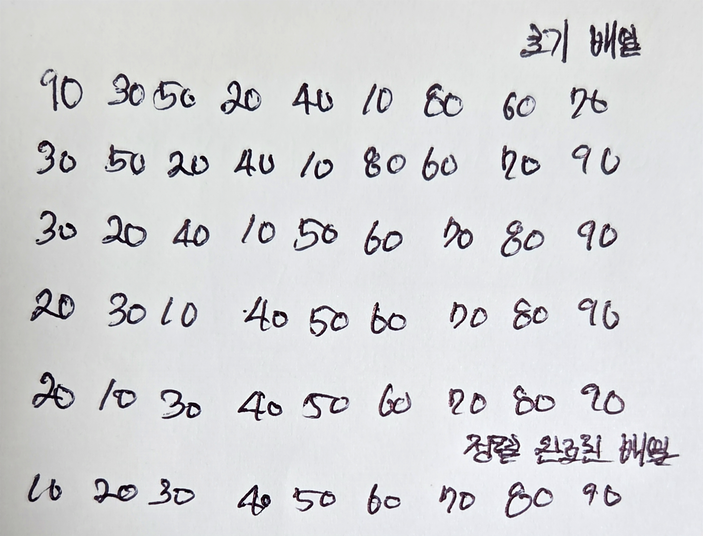
        
28. 만일 버블 정렬을 수행하는 과정에서 이미 정렬이 다 되었으면, $(n-1)$번의 패스를 모두 수행할 필요가 없다. 정렬이 다 되었을 떄 더 이상의 패스를 실행하지 않고 끝내도록 버블 정렬 알고리즘을 수정하라.
    - 답은 다음과 같다:
        
        ```python
        입력: 크기가 n인 배열 A
        출력: 정렬된 배열 A
        for pass = 1 to n-1
        	swapped = false
        	for i = 1 to n-pass
        		if (A[i-1] > A[i])
        			A[i-1] <-> A[i]
        			swapped = true
        	if (!swapped)
        		break
        return 배열 A
        ```
        
29. 버블 정렬 알고리즘에서 각 패스에 대해 정렬을 수행할 때 마지막으로 자리 바꿈이 수행된 곳을 기억하면, 그 다음 패스부터는 마지막으로 자리를 바꾼 원소 이후로는 이미 원소들끼지 정렬되어 있으므로 더 이상 비교하지 않아도 된다. 이를 반영한 버블 정렬 알고리즘을 작성하라.
    - 답은 다음과 같다:
        
        ```python
        입력: 크기가 n인 배열 A
        출력: 정렬된 배열 A
        last = n      # 정렬해야 할 범위를 나타냄 (초기값은 배열 전체 크기)
        while (last > 1)
            last_swap_pos = 1 # 이번 패스에서 교환이 없으면 루프를 종료시키기 위한 값
            for i = 1 to last - 1
                if (A[i-1] > A[i])
                    A[i-1] <-> A[i]
                    last_swap_pos = i + 1 # 교환이 발생한 위치를 기록
            last = last_swap_pos  # 다음 패스의 범위를 마지막 교환 위치로 단축
        return 배열 A
        ```
        
30. 버블 정렬은 $O(n^2)$ 알고리즘으로 실제로 사용되지 않는다. 그러나 버블 정려른 다른 정렬 알고리즘이 수행한 정렬 결과가 맞는지를 검사하기에 매우 유용하게 사용될 수 있다. 버블 정렬의 개념을 이용하여 주어진 배열이 정렬되어 있는지 검사하는 알고리즘을 작성하라.
    - 답은 다음과 같다:
        
        ```python
        입력: 크기가 n인 배열 A
        출력: 정렬된 배열 A
        for pass = 1 to n-1
        	for i = 1 to n-pass
        		if (A[i-1] > A[i])
        			return false
        return true
        ```
        
31. 버블 정렬의 성능을 개선한 두 개의 대표적인 알고리즘인 Cocktail sort과 Comb sort에 대해서 조사하라.
    - 답은 다음과 같다:
        - Cocktail sort은 양방향으로 정렬을 수행한다.
            - 최솟값을 맨 앞으로 이동시키는데 역방향 정렬에서 효율적이다.
        - Comb sort는 넓은 간격으로 비교를 시작해 정렬한다.
32. 선택 정렬은 입력 대열 전체에서 최솟값을 ‘선택’하여 배열 0번 원소와 자리를 바꾸고, 다음에는 0번 원소를 제외한 나머지 원소에서 최솟값을 선택하여 배열의 1번 원소와 자리를 바꾼다. 이와 다르게 최댓값을 선택하여, 마지막 원소(배열의 $(n-1)$번 원소)와 자리를 바꾸고, 나머지 원소 중에서 최댓값을 선택하여 배열의 $(n-2)$번 원소와 자리를 바꾸는 방식으로 정렬을 할 수도 있다. 이러한 최댓값 선택 방식의 선택 정렬 알고리즘을 작성하라.
    - 답은 다음과 같다:
        
        ```python
        입력: 크기가 n인 배열 A
        출력: 정렬된 배열 A
        for i = n-1 down to 1 {
            max_idx = i
            for j = 0 to i-1 {
                if (A[j] > A[max_idx])
                    max_idx = j
            }
            A[i] <-> A[max_idx]
        }
        return 배열 A
        ```
        
33. 다음의 입력에 대해 선택 정렬이 수행되는 과정을 보이라.
    
    
    | 90 30 50 20 40 10 80 60 70 |
    | --- |
    - 풀이 및 답안은 다음과 같다:
        
        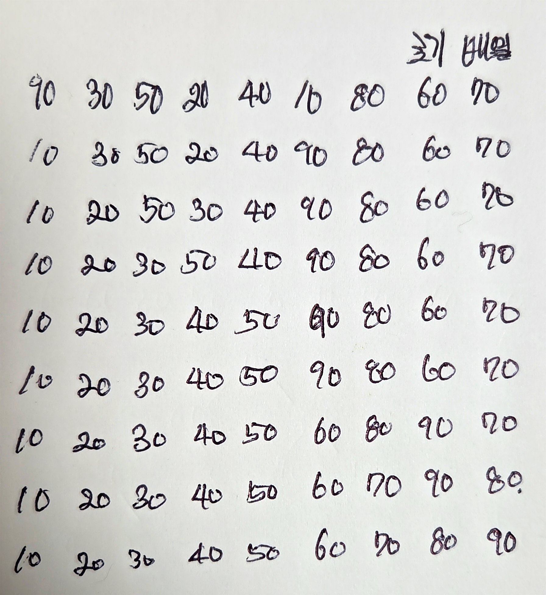
        
34. 선택 정렬의 장점을 설명하고, 다른 정렬 알고리즘들이 가지지 못하는 특성을 설명하라.
    - 답안은 다음과 같다:
        - 선택 정렬은 자료 교환 횟수가 매우 적다는 장점을 가진다.
        - 또한 입력의 초기 상태에 전혀 의존하지 않는 일정한 연산량을 가진다는 특성이 있다.
35. 다음의 입력에 대해 삽입 정렬이 수행되는 과정을 보이라.
    
    
    | 90 30 50 20 40 10 80 60 70 |
    | --- |
    - 답안은 다음과 같다:
        
        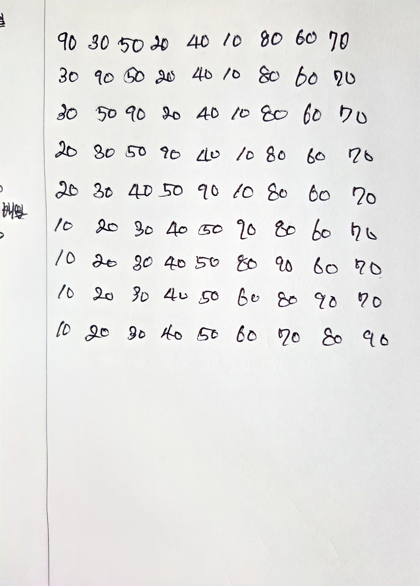
        
36. 입력이 랜덤한 순서로 이루어져 있을 때, 즉 균등분포(uniform distribution)일 때, 삽입 정렬의 평균 시간복잡도를 계산하라.
    - 풀이 및 답안은 다음과 같다:
        - 삽입 정렬의 시간복잡도는 비교 및 이동 횟수에 따라 결정된다.
        - 균등 분포에서 $i$번째 원소는 정렬된 $i-1$개 원소들 사이에 동일한 확률로 들어갈 수 있다.
            - 이는 절반인 $\frac{i-1}{2}$로 위치를 찾아간다는 가정을 따르게 된다.
        - 따라서 전체 시간복잡도는 $\sum^{n}_{i=2}\frac{i-1}{2}=\frac{1}{2}\sum^{n-1}_{i=1}i$이며, 평균 시간복잡도는 $\theta(n^2)$이다.
37. 삽입 정렬은 CurrentElement를 앞부분에 정렬되어 있는 숫자들 사이에 적절히 삽입하기 위해 1개의 원소씩 비교하며 원소들을 이동시킨다. 즉, 순차탐색이 수행된다. CurrentElement를 앞부분에 보다 효율적으로 삽입할 수 있는 방법을 제시하라. 또, 이때의 시간복잡도를 계산하라.
    - 풀이 및 답안은 다음과 같다:
        - 순차 탐색이 아닌 이진 탐색을 수행하더라도 시간복잡도는 $O(n^2)$이다.
38. 다음의 입력에 대해 쉘 정렬이 수행되는 과정을 보이라. 단, 간격은 5, 3, 1이다.
    
    
    | 80 85 5 95 10 35 25 90 30 60 40 75 20 |
    | --- |
    - 풀이 및 답안은 다음과 같다:
        
        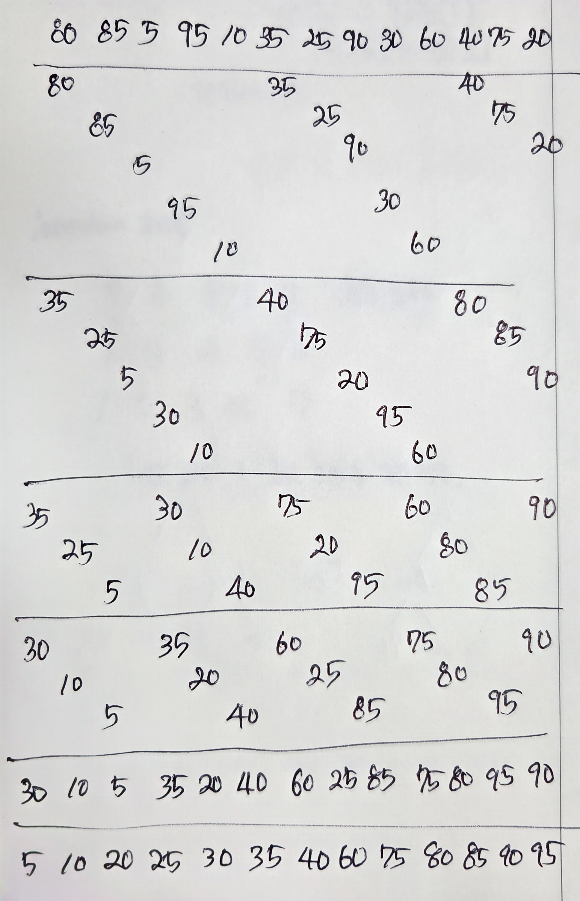
        
39. 쉘 정렬의 h-순서를 $2^k,\ 2^{k-1},\ …,\ 2,\ 1$로 사용하였을 때의 문제점을 서술하라. 단, $k$는 양의 정수이다.
    - 풀이 및 답안은 다음과 같다:
        - 시간복잡도가 $O(n^2)$가 될 수 있는, 비효율적인 쉘 정렬의 h-순서이다.
        - 짝수 인덱스의 원소는 짝수끼리, 홀수 인덱스의 원소는 홀수끼리 교환된다.
        - 따라서 h=1일 때 서로 제자리를 찾아가는 비효율적인 과정을 거치게 한다.
40. 다음의 입력에 대해 힙을 구성한 후, 힙 정렬이 수행되는 과정을 보이라.
    
    
    | 90 30 50 20 40 10 80 60 70 |
    | --- |
    - 풀이 및 답안은 다음과 같다:
        
        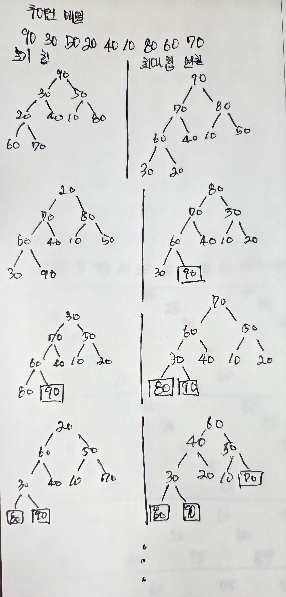
        
41. 힙 정렬은 루프 내의 코드가 길고, 캐시메모리 사용이 비효율적이어서 대용량의 입력에는 적절하지 않다. 입력 크기가 클수록 왜 힙 정렬이 캐시메모리를 비효율적으로 사용하는지를 설명하라.
    - 힙 구성에 입력 $n$에 대하여 높이 $\log{n}$을 가지기 때문이다.
42. $n$개의 이파리(단말 노드)가 있는 이진트리의 높이는 $\log{n}$보다 크다는 것을 증명하라.
    - 이파리 노드 개수에 따른 높이는 $\log_2{n}+1$이다
43. $\log{n!}=O(n\log{n})$임을 Stirling의 근사식을 이용해 보이라.
    - 풀이 및 답안은 다음과 같다:
        
        $$
        스털링\ 근사식은\ n!을\ 다음과\ 같이\ 근사한다:\ n! \approx \sqrt{2\pi n} \left(\frac{n}{e}\right)^n
        $$
        
        - 근사하면 위 식과 같은 시간복잡도가 나온다.
44. 다음의 입력에 대해 LSD 기수 정렬이 수행되는 과정을 보이라.
    
    
    | 097 135 156 032 043 130 091 |
    | --- |
- 풀이 및 답안은 다음과 같다:
    
    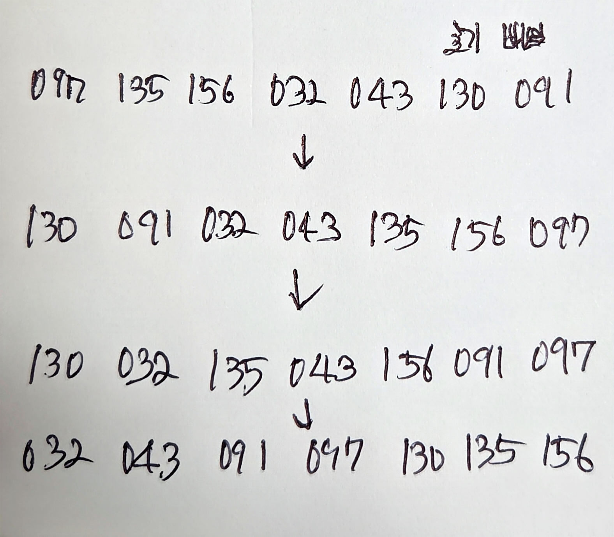
    
1. 입력에 대해 MSD 기수 정렬이 수행되는 과정을 보이라.
    
    
    | 097 135 156 032 043 130 091 |
    | --- |
- 풀이 및 답안은 다음과 같다:
    
    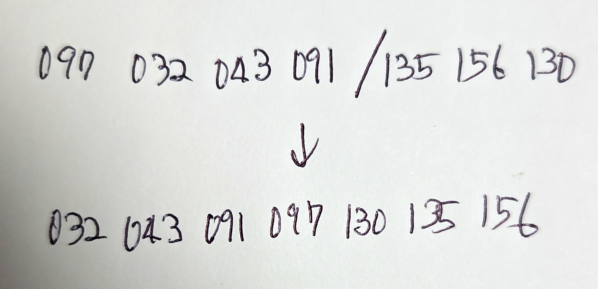
    
1. 기수 정렬이 왜 지역 번호를 기반으로 둔 대용량의 전화번호 정렬에 매우 적절한지를 설명하라.
    - 답안은 다음과 같다:
        - 전화번호는 자릿수가 고정되어 있고, 길이가 일정하다.
        - 기수 정렬은 데이터의 길이가 동일할 떄 최고 성능을 발휘한다.
        - 또한 지역 번호에 따라 데이터를 큰 그룹으로 나눈 후 정렬할 수 있어 효율적이다.
2. 다음 그림에서 $k=4$이면 몇 번째 pass 후에 64GB 블록이 만들어지는가?
    
    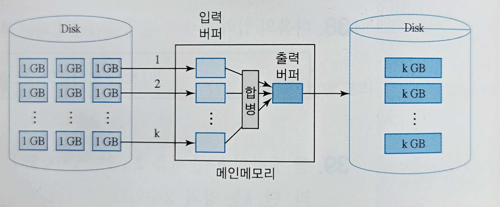
    
    - 3번.
3. 6.8절의 외부정렬 알고리즘보다 효율적인 p-way(Multi-way) 합병과 다단계 합병(Polyphase Merge)을 조사하라.
    - 답은 다음과 같다:
        - p-way 합병
            - p개의 정렬된 블록을 한 번에 합병해 전체 입출력 횟수를 줄이는 알고리즘이다.
        - 다단계 합병
            - 초기 블록을 불균등하게 분배해 매 단계마다 낭비 없이 합병을 수행하는 알고리즘이다.
4. 기수 정렬에 필수적으로 요구되는 것은 안정성(stability)이다. 안정성을 가지고 있는 내부정렬 알고리즘을 나열하라.
    - 버블 정렬, 삽입 정렬, 병합 정렬.
5. 합병 정렬은 다른 내부 정렬에 비해 하나의 큰 단점을 가지고 있다. 그 단점이 무엇인지를 쓰라.
    - 원본 데이터와 같은 크기의 추가 배열이 필요해, 공간복잡도를 $O(n)$으로 가진다.
6. 크기가 $n+f(n)$인 배열에 앞부분 $n$개의 원소들은 이미 정렬되어 있으나, 뒷부분에 있는 $f(n)$개의 원소들은 정렬되어 있지 않다.
    1. 만일 $f(n)=O(1)$이라면, 즉, 정렬 안 된 부분의 크기가 상수 개라면, O(n) 시간에 배열 전체를 정렬하는 방법을 제시하라.
        - 정렬되지 않은 부분의 원소를 선택해 정렬된 부분에 삽입한다.
    2. $f(n)=O(\sqrt{n})$일 때, $O(n)$ 시간에 배열 전체를 정렬하는 방법을 제시하라.
        - 정렬되지 않은 부분을 정렬하고, 선택해 정렬된 부분에 삽입한다.
    3. 전체 배열을 $O(n)$ 시간에 정렬하기 위한 $f(n)$의 최대 크기를 $n$의 함수로 표시하라.
        - 정렬된 앞부분에 삽입하는 시간이 $O(n)$이다.
        - 즉 정렬되지 않은 뒷부분을 정렬하는 시간이 위 시간보다 짧아야 한다.
        - $O(f(n)\log{f(n)}) ≤ (합병 시간) O(n)$에서 $f(n)=O(n\log{n})$이다.
7. 각 원소가 정렬 후 자신의 원래 자리로부터의 거리가 $k$보다 멀리 떨어져 있지 않은 입력 배열의 원소들을 효율적으로 정렬하는 알고리즘을 작성하고, 알고리즘의 수행시간을 분석하라.
    - 풀이 및 답안은 다음과 같다:
        - 거의 정렬된 배열을 정렬하는데 효율적인 알고리즘을 요구하고 있다.
        - 가장 효율적인 최소 힙을 사용해 정렬하는 경우 시간복잡도는 $n\log{k}$가 된다.