# 07 NP-완전 문제

---

# 7.1 문제 분류

- 컴퓨터로 풀 수 있는 모든 문제는 문제를 해결하는 알고리즘의 시간복잡도에 따라 분류될 수 있다.
    - 다항식 시간복잡도를 가진 알고리즘으로 해결되는 P(polynomial) 문제 집합.
    - 다항식보다 큰 시간복잡도를 가진 알고리즘으로 해결되는 문제 집합.
- 7장 이전의 문제들은 P 문제 집합에 속한다.
- 다항식보다 큰 시간복잡도의 문제는 여럿 있으나, 가장 중요한 것은 NP-완전 문제이다.
    - NP-완전 문제는 지수 시간의 시간복잡도를 가진다.
    - 어느 하나의 NP-완전 문제에 대해서 다항식 시간에 해결되면, 모든 다른 NP-완전 문제도 동일하다.

<aside>
💡

NP 알고리즘은 첫 번째 단계에서 주어진 입력에 대해 하나의 해를 ‘추측하고,’

두 번째 단계에서 그 해를 다항식 시간에 확인한 후에, 그 해가 ‘맞다’ 또는 ‘아니다’라고 답한다.

</aside>

- P 문제 집합과 NP-완전 문제 집합을 둘 다 포함하는 집합인 NP 문제 집합이 있다.
    - NP 문제는 비결정적 다항식 시간 알고리즘을 가진 문제이다.
    - NP 알고리즘은 해를 찾는 알고리즘이 아니라 해를 다항식 시간에 확인하는 알고리즘이다.

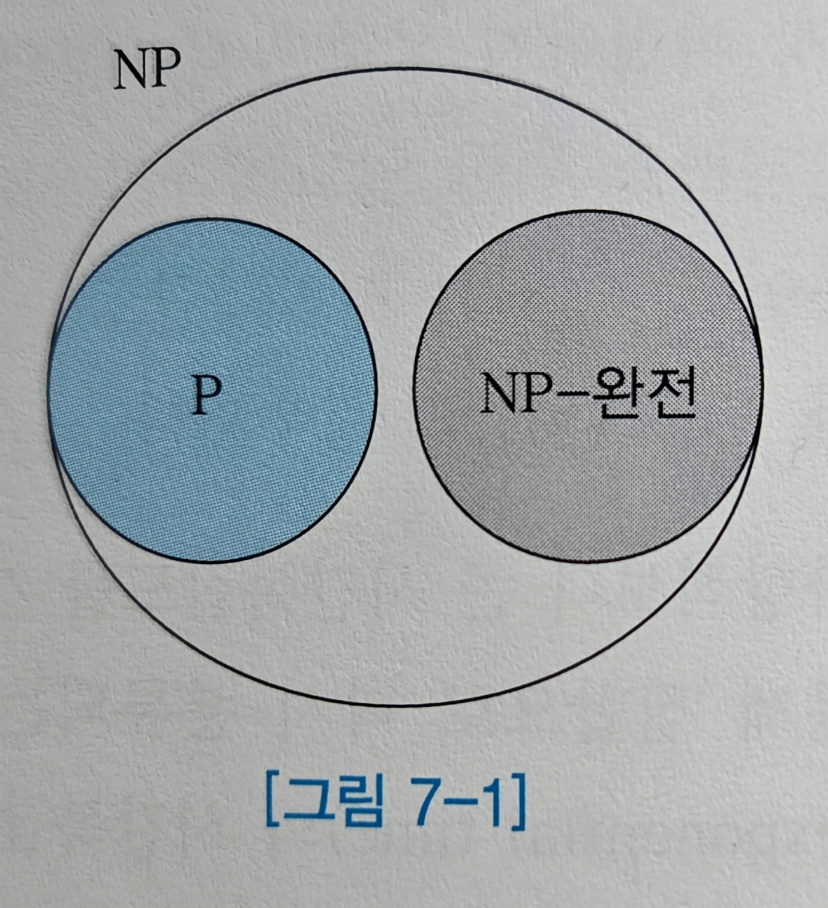

- P 문제를 위한 NP 알고리즘은 해를 추측하는 단계를 생략하고, 해를 다항식 시간에 구하고 ‘맞다’ 답한다.

# 7.2 NP-완전 문제의 특성

- NP-완전 문제의 특성을 알기 위해 다른 문제로 변환 또는 환원하는 과정을 이해해야 한다.

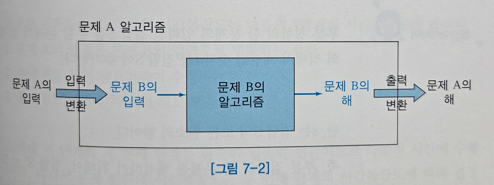

- 문제 A를 부분 집합의 합 문제라 하고, 문제 B를 ‘동일한 크기의’ 분할 문제라고 한다.

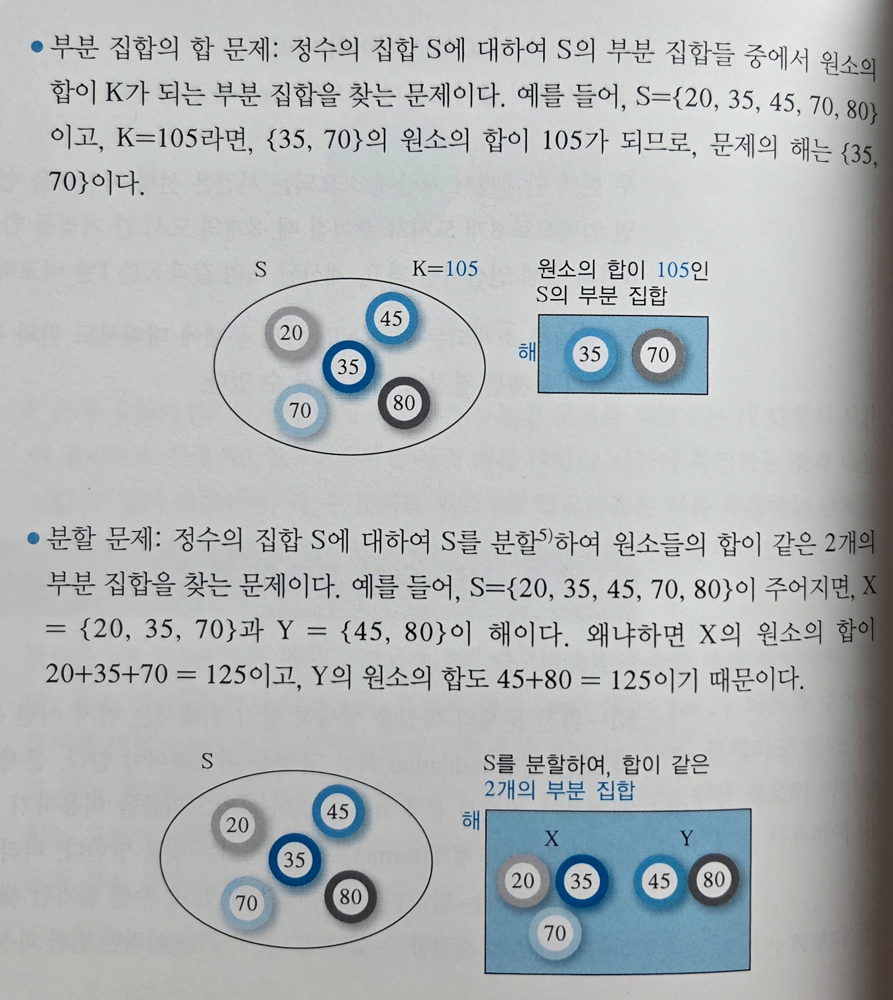

- 부분 집합의 합 문제의 입력인 집합 S를 분할 문제의 입력으로 변환할 때에 t를 S에 추가한다.
    - 단 s는 집합 S의 모든 원소의 합이다.

$$
t=s-2K
$$

- 부분 집합의 합 문제를 해결하기 위해 $S'=S\cup\{t\}$를 입력으로 하는 분할 문제를 위한 알고리즘 활용.
- 분할 문제 알고리즘의 해인 2개의 집합 X와 Y에 대해, 원소의 합이 같으므로, 각각의 합은 $(s-K)$이다.
    - 새 집합 $S'$의 모든 원소의 합이 $s+t=s+(s-2K)=2s-2K$이다.
- 따라서 분할 문제의 해인 X와 Y 중에서 t를 가진 집합에서 t를 제거한 집합이 부분 집합의 합 문제의 해.
    - X에 t가 속해 있는 경우, X에서 t를 제외한 원소 합은 아래와 같아 합 문제의 해는 $X-\{t\}$이다.
    - $(s-K)-t=(s-K)-(s-2K)=s-K-s+2K=K$

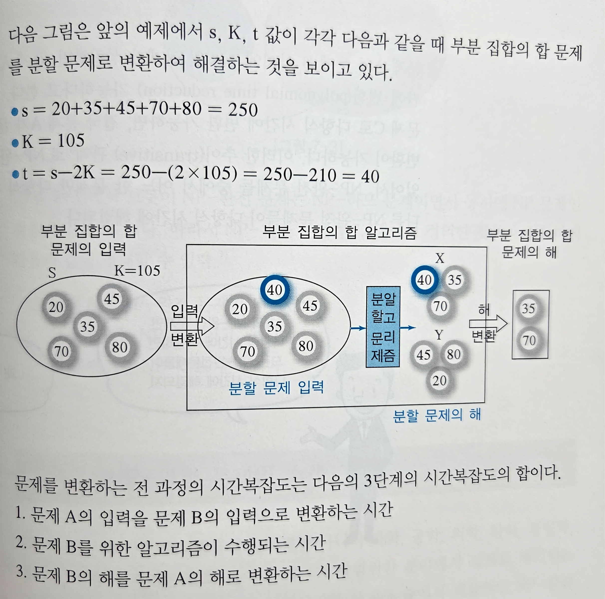

- 첫 번째와 세 번째는 단순 입출력 변환이므로 다항식 시간에 수행된다.
- 두 번째 단계의 시간복잡도에 따라 문제 변환의 시간복잡도가 결정된다.

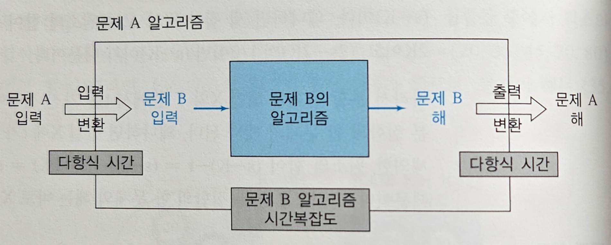

- 문제 A와 문제 B 사이에 이러한 관계가 성립하면, A가 B로 변환(polynomial time reduction) 가능.
- 문제 B가 문제 C로 다항식 시간에 변환 가능하면, 문제 A가 문제 C로 변환 가능하다.
    - 이러한 추이(transitive) 관계로 NP-완전 문제들이 서로 얽여 있어, 하나만 해결되면 다 해결된다.
- NP-하드(hard) 문제 집합을 다음과 같이 정의한다.

<aside>
💡

어느 문제 A에 대해서, 만일 모든 NP 문제가 문제 A로 다항식 시간에 변환이 가능하다면,

문제 A는 NP-하드 문제이다.

</aside>

- 모든 NP 문제가 NP-하드 문제로 다항식 시간에 변환 가능함에도, NP-하드 문제는 NP 문제일 필요 없다.

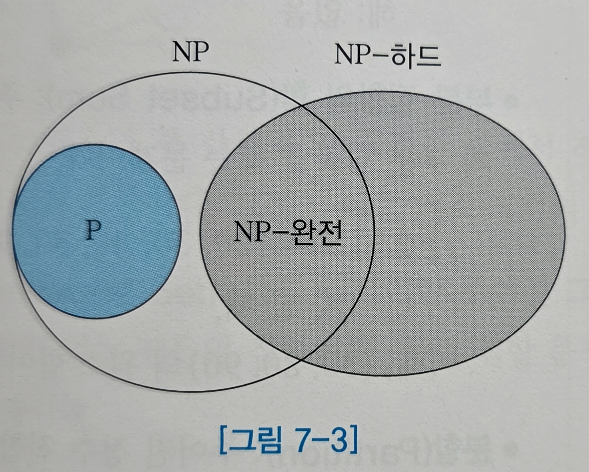

- NP-완전 문제는 NP-하드 문제이면서 동시에 NP 문제이다.
- 따라서 NP-완전 문제는 다음과 같이 더욱 정확히 정의된다.

<aside>
💡

문제 A가 NP-완전 문제가 되려면, A는 NP 문제이고, A는 동시에 NP-하드 문제이다.

</aside>

# 7.3 NP-완전 문제의 소개

- **SAT**(Satisfiability)
    - 부울 변수들이 OR로 표현된 논리식이 여럿 주어질 때, 모두 만족하는 각 값을 찾는 문제.
- **부분 집합의 합**(Subset Sum)
    - 주어진 정수 집합 S의 원소의 합이 K가 되는 S의 부분 집합을 찾는 문제이다.
- **분할**(Partition)
    - 주어진 정수 집합 S를 분할하여 원소의 합이 같은 2개의 부분 집합 X와 Y를 찾는 문제이다.
- **0-1 배낭**(Knapsack)
    - 배낭의 용량 C에서 배낭에 담을 수 있는 물건의 최대 가치를 찾는 문제이다.
- **정점 커버**(Vertex Cover)
    - 그래프에서 각 간선의 양 끝점들 중 적어도 1개의 점을 포함하는 점의 집합을 정점 커버라 한다.
    - 정점 커버 문제는 최소 크기의 정점 커버를 찾는 문제이다.
- **독립 집합**(Independence Set)
    - 그래프에서 서로 연결하는 간선이 없는 점들의 집합을 독립 집합이라 한다.
    - 독집 집합 문제는 최대 크기의 독립 집합을 찾는 문제이다.
- **클리크**(Clique)
    - 그래프에서 모든 점들 사이를 연결하는 간선이 있는 부분 그래프를 클리크라 한다.
    - 클리크 문제는 최대 크기의 클리크를 찾는 문제이다.
- **그래프 색칠하기**(Graph Coloring)
    - 그래프에서 인접한 점들을 서로 다른 색으로 색칠할 때, 가장 적은 수의 색을 사용하는 문제이다.
- **집합 커버**(Set Cover)
    - 주어진 집합 S에 대해 S의 부분 집합들이 주어질 떄, 합하여 S와 같게 되는 부분을 집합 커버라 한다.
    - 집합 커버 문제는 가장 적은 수의 부분 집합으로 이루어진 집합 커버를 찾는 문제이다.
- **최장 경로**(Longest Path)
    - 그래프에서 시작점 s에서 도착점 t까지의 가장 긴 경로를 찾는 문제이다.
    - 간선의 가중치는 양수이고, 찾는 경로에는 반복되는 점이 없어야 한다.
- **여행자**(Traveling Salesman) **문제**
    - 그래프에서 임의의 한 점에서 출발하여 다른 모든 점들은 1번씩만 방문하고, 시작점으로 돌아온다.
    - 위 경로 중 최단 경로를 찾는다.
- **해밀토니안 사이클**(Hamiltonian Cycle)
    - 그래프에서 임의의 한 점에서 출발하여 모든 다른 점들을 1번씩만 방문하고, 시작점으로 돌아온다.
    - 간선의 가중치를 모두 동일하게 하여 여행자 문제의 해를 찾았을 때 해가 해밀토니안 사이클의 해.
- **통 채우기**(Bin Packing)
    - n개의 물건이 주어지고, 통의 용량이 C일 때, 가장 적은 수의 통을 사용하여 모든 통에 채우는 문제.
    - 물건의 크기는 C보다 크지 않다.
- **작업 스케줄링**(job Scheduling)
    - n개의 작업, 작업의 수행 시간 $t_i$, 그리고 m개의 동일 성능 기계가 주어질 때, 빨리 종료되도록 배정.

# 7.4 NP-완전 문제들의 활용

- **SAT 문제**
    - 전자 디자인 자동화
    - 형식 동치 관계 검사
    - 모델 검사
    - 형식 검증
    - 자동 테스트 패턴 생성
    - 지식 컴파일
    - 단상형 추론
    - 소프트웨어 검증
    - 자동 정리 증명
- **부분 집합의 합 문제**
    - 전자 태그 암호 시스템
    - 격자 기반 암호화 시스템
    - 공개 암호 시스템
    - 컴퓨터 패스워드 검사 및 메시지 검증
- **분할 문제**
    - Switching Network에서 채널 그래프 비교
    - 컨테이너의 효율적 배치
    - 네트워크 디자인
    - 인공 지능 신경망 네트워크의 학습
    - 패턴 인식
    - 로봇 동작 계획
    - 회로 및 VSLI 디자인
    - 의학 전문가 시스템
    - 유전자의 군집화
- **0-1 배낭 문제**
    - 금융 포트폴리오 선택
    - 자산 투자의 선택
    - 주식 투자
    - 다차원 경매
    - 암호 생성
    - 스도쿠
- **정점 커버 문제**
    - 부울 논리 최소화
    - 센서 수 최소화
    - 무선 통신
    - 토목 공학
    - 전기 공학
    - 최적 회로 설계
    - 네트워크 플로우
- **집합 커버 문제**
    - 비행기 조종사 스케줄링
    - 조립 라인 균현화
    - 정보 검색
    - 도시 계획
- **독집 집합**
    - 컴퓨터 비전
    - 패턴 인식
    - 정보/코딩 이론
    - 지도 레이블링
    - 분자 생물학
    - 스케줄링
    - 회로 테스트
    - CAD
- **클리크 문제**
    - 유전자 표현 데이터의 군집화
    - 단백질 구조 예측 연구
    - 단백질 특성 연구
- **그래프 색칠하기**
    - 생산 라인, 시간표 등의 스케줄링
    - 무선 네트워크에서 주파수 할당
    - 컴파일러의 프로그램 최적화
    - 패턴 인식
    - 데이터 압축
- **최장 경로 문제, 여행자 문제, 해밀토니안 사이클 문제**
    - 운송 및 택배 사업에서의 차량 운행
    - 가전 수리 및 케이블 회사에서의 서비스콜의 스케줄링
- **통 채우기 문제**
    - 다중 처리 장치 스케줄링
    - 멀티 미디어 저장 장치 시스템
    - 자원 할당
- **작업 스케줄링 문제**
    - 운영 체제의 작업 스케줄링
    - 다중 프로세서 스케줄링
    - 웹 서버에서 사용자 질의 처리
    - 주파수 대역 스케줄링
    - 공장 스케줄링

# 연습문제

1. 다음의 괄호 안에 알맞은 단어를 채워 넣어라.
    1. NP-완전 문제의 특성의 어느 하나의 NP-완전 문제에 대해서 다항식 시간의 알고리즘을 찾아내면, 모든 다른 NP-완전 문제도 (다항식) 시간에 해를 구할 수 있는 것이다.
    2. 다항식 시간복잡도를 가진 알고리즘으로 해결되는 문제의 집합을 (P) 문제 집합이라고 한다.
    3. 어느 문제 A에 대해서, 만일 모든 NP 문제가 문제 A로 다항식 시간에 변환이 가능하다면, 문제 A는 (NP-하드) 문제이다.
    4. 문제 A가 NP-완전 문제가 되려면, 문제 A는 NP 문제이고 동시에 (NP-하드) 문제여야 한다.
2. NP에 대해 옳지 않게 서술한 것은?
    1. Nondeterministic Polynomial의 약어이다.
    2. NP에 속한 문제는 NP 알고리즘을 가진다.
    3. NP 알고리즘은 다항식 시간에 해를 비결정적으로 찾는다.
    4. 다항식 시간에 해결되는 문제는 NP에 속한다.
    5. 답 없음
    - d. 다항식 시간에 해결되는 문제는 P에 속한다.
3. NP-완전 문제에 대해 옳게 설명한 것은?
    1. NP-완전 문제들 중에는 NP에 속하지 않는 문제도 있다.
    2. 모든 NP-하드 문제는 NP-완전 문제이다.
    3. 어느 하나의 NP-완전 문제가 다항식 시간에 해결되더라도 다른 NP-완전 문제를 다항식 시간에 해결할 수 없다.
    4. NP-완전 문제 A는 모든 NP 문제들이 다항식 시간에 A로 변환 가능해야 한다.
    5. 답 없음
    - d. NP-완전 문제는 모든 NP 문제들이 다항식 시간에 A로 변환 가능해야 한다.
4. 다음 중 NP-완전 문제가 아닌 것은?
    1. 그래프 색칠하기 문제
    2. 0-1 배낭 문제
    3. 독집 집합 문제
    4. 정점 커버 문제
    5. 답 없음
    - 답 없음.
5. 다음은 다항식 시간에 해결되는 문제와 NP-완전 문제를 각각 짝지어 놓은 것이다. 다음 중 잘못 짝지어 놓은 것은?
    1. 오일러 사이클, 해밀토니안 사이클
    2. 회단 경로, 최장 경로
    3. 정점 커버, 독립 집합
    4. 최소 신장 트리, 여행자 문제
    5. 답 없음
    - c. 두 문제 모두 NP-완전 문제이다. P 문제 및 NP-완전 문제로 짝지어 지지 않았다.
6. 다음 중 부분 집합의 합 문제와 가장 밀접하게 연관된 문제는 무엇인가?
    1. 0-1 배낭 문제
    2. 여행자 문제
    3. 클리크 문제
    4. 정점 커버 문제
    5. 답 없음
    - 0-1 배낭 문제
7. 다음 중 정점 커버 문제를 직접 다항식 시간에 변화할 수 있는 문제들만 모아 놓은 것은?
    1. 독립 집합, 집합 커버
    2. 클리크, 분할 문제
    3. 부분 집합의 합, 그래프 색칠하기
    4. 통 채우기, SAT
    5. 답 없음
    - a. 정점 커버 문제와 구조적으로 유사하여 다항식 시간 변환이 가능한 문제들이다.
8. 다음 중 0-1 배낭 문제에 대해 잘못 서술한 것은?
    1. 물건들의 무게가 0 또는 1이면 0-1 배낭 문제는 다항식 시간에 최적해를 찾을 수 있다.
    2. 동적 계획 알고리즘으로 최적해를 다항식 시간에 찾는다.
    3. 부분 집합의 합 문제는 0-1 배낭 문제의 특수한 경우의 문제이다.
    4. 분기 한정 기법으로도 0-1 배낭 문제의 최적해를 찾을 수 있다.
    5. 답 없음
    - b. 동적 계획 알고리즘으로 찾는 것은 근사해이다.
9. SAT 문제에 관해 옳지 않게 서술한 것은?
    1. 각 변수가 true 또는 false의 값만을 갖는다.
    2. 변수들의 개수보다 절(clause)의 개수가 많아야 한다.
    3. 각 절 안에 있는 변수들은 or 연산으로 연결되어 있다. 예를 들어, (x v y v z).
    4. 절과 절 사이의 연산은 and이다.
    5. 답 없음
    - b. SAT 문제는 변수의 개수와 절의 개수에 제약이 없다.
10. 다음은 각 절에 최대 2개의 변수만 들어가야 하는 2SAT 문제이다.
    
    $$
    (x\lor y)\land(x\lor \overline{y})\land(\overline{x}\lor y)\land(\overline{x}\lor\overline{y})
    $$
    
    위의 논리식이 true가 되는 x와 y의 값은?
    
    1. x = true, y = ture
    2. x = true, y = false
    3. x = false, y = true
    4. x = false, y = false
    5. 답 없음
    - 답 없음.
11. 다음은 각 절에 최대 2개의 변수만 들어가는 2SAT 문제이다.
    
    $$
    (x_1\lor\overline{x_2})\land(\overline{x_1}\lor\overline{x_3})\land(x_1\lor x_2)\land(x_4\lor\overline{x_3})\land(x_4\lor\overline{x_1})
    $$
    
    위의 논리식이 true가 되는 $x_1,\ x_2,\ x_3$의 값은?
    
    1. $x_1=true,\ x_2=true,\ x_3=false,\ x_4=true$
    2. $x_1=true,\ x_2=false,\ x_3=false,\ x_4=true$
    3. $x_1=false,\ x_2=true,\ x_3=false,\ x_4=true$
    4. $x_1=false,\ x_2=true,\ x_3=true,\ x_4=true$
    5. 답 없음
    - b.
12. 다음은 각 절에 최대 3개의 변수만 들어가야 하는 3SAT 문제이다.
    
    $$
    (x\lor y\lor z)\land(x\lor\overline{y})\land(y\lor\overline{z})\land(z\lor\overline{x})\land(\overline{x}\lor\overline{y}\lor\overline{z})
    $$
    
    위의 논리식이 true가 되는 x, y, z의 값은?
    
    1. $x=true,\ y=true,\ z=true$
    2. $x=true,\ y=false,\ z=false$
    3. $x=false,\ y=true,\ z=true$
    4. $x=false,\ y=false,\ z=false$
    5. 답 없음
    - e. 답 없음.
13. 다음은 각 절에 최대 3개의 변수만 들어가야 하는 3SAT 문제이다.
    
    $$
    (x\lor y \lor z)\land(x\lor y\lor\overline{z})\land(x\lor \overline{y}\lor z)\land(x\lor \overline{y}\lor\overline{z})\\\land(\overline{x}\lor y \lor z)\land(\overline{x}\lor y \lor \overline{z})\land(\overline{x}\lor\overline{y}\lor z)\land(\overline{x}\lor\overline{y}\lor\overline{z})
    $$
    
    위의 논리식이 true가 되는 x, y, z의 값은?
    
    1. $x=true,\ y=true,\ z=true$
    2. $x=true,\ y=false,\ z=false$
    3. $x=false,\ y=true,\ z=true$
    4. $x=false,\ y=false,\ z=false$
    5. 답 없음
    - e. 답 없음.
14. 다음 그래프에서 최소 크기의 정점 커버와 색칠할 때 필요한 최소 색의 수는?
    
    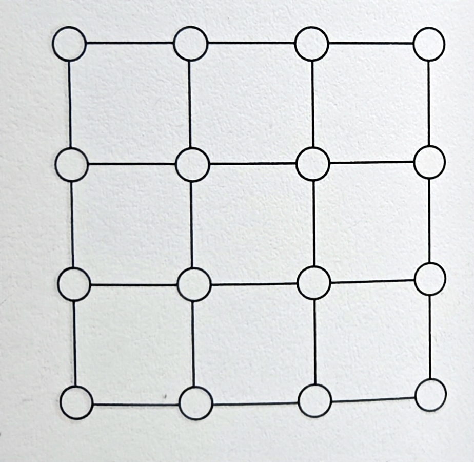
    
    1. 7개, 2색
    2. 8개, 2색
    3. 9개, 3색
    4. 10개, 4색
    5. 답 없음
    - b.
15. 다음 그래프를 색칠하는데 필요한 최소 색의 종류는?
    
    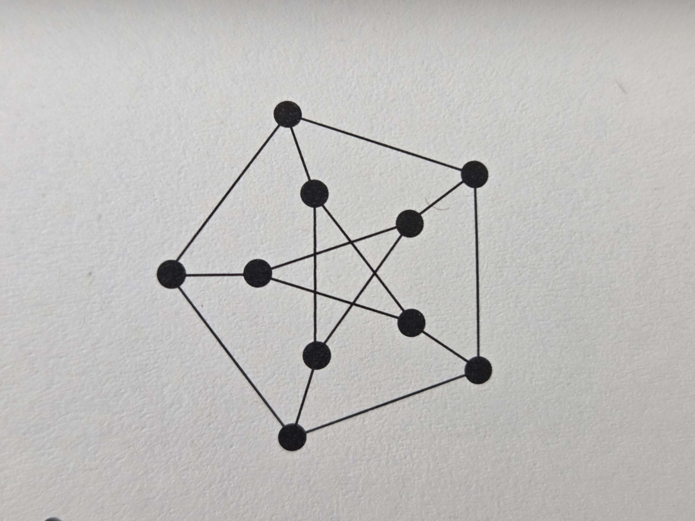
    
    1. 2개
    2. 3개
    3. 4개
    4. 5개
    5. 답 없음
    - b.
16. 다음 그래프에 해밀토니언 사이클이 몇 개 있는가?
    
    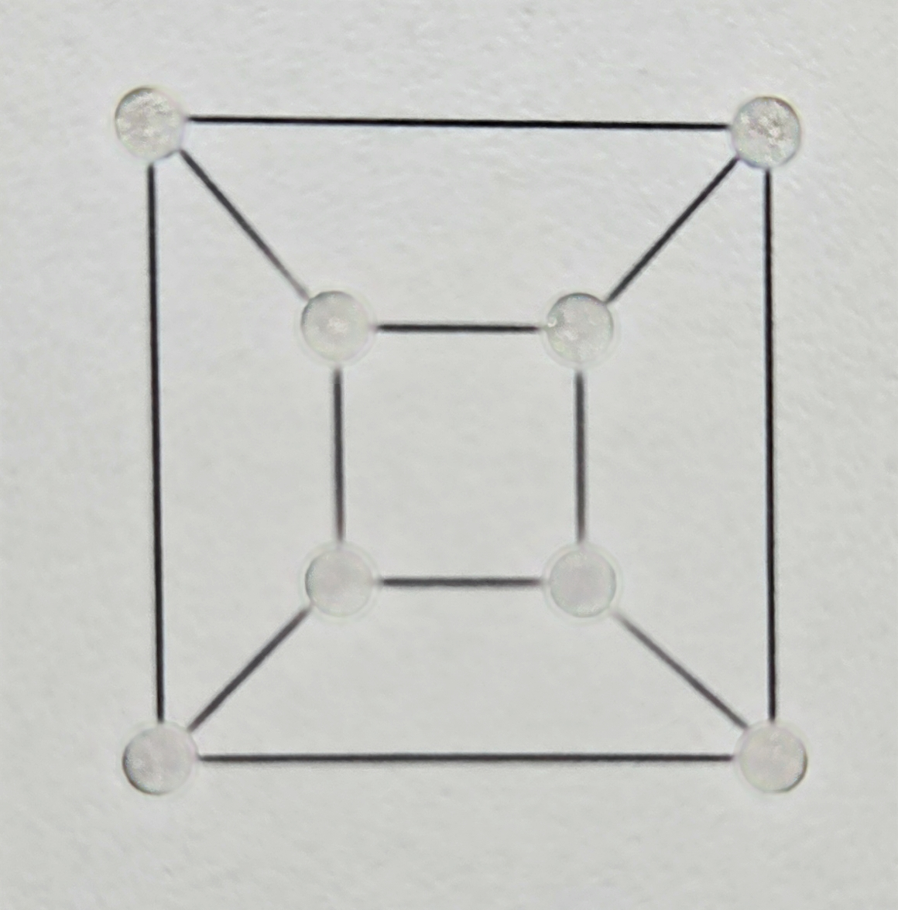
    
    1. 1개
    2. 2개
    3. 4개
    4. 6개
    5. 답 없음
    - d. 6개이다.
17. 다음 그래프에서 여행자 문제의 해를 찾았을 때 그 경로의 길이는?
    
    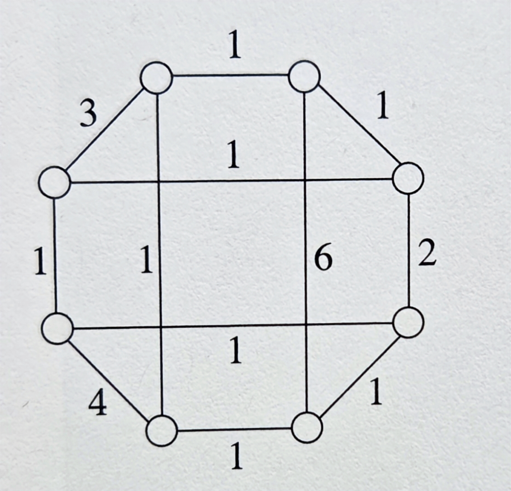
    
    1. 8
    2. 9
    3. 10
    4. 12
    5. 답 없음
    - c.
        - 최소 비용의 해밀토니언 사이클을 찾는 문제이다.
18. 다음은 통에 채울 물건들의 크기이다. 이 물건들을 모두 통에 채우려면 최소 몇 개의 통이 필요한가? 단, 통 1개의 크기는 10이다.
    
    
    | 5, 7, 5, 2, 4, 2, 5, 1, 6 |
    | --- |
    - 풀이 및 답은 다음과 같다:
        - 우선 직관적으로 물건 크기의 총합이 37이므로 필요한 통의 최소 수는 4라 어림할 수 있다.
        - 물건을 크기가 큰 순서대로 정렬하여 통에 채운다.
        - 그리하여 4개의 통에 전부 담을 수 있다.
19. 다음 7개의 작업을 3대의 기계에서 수행하려 한다. 가장 빨리 모든 작업을 끝낼 수 있는 시간은?
    
    
    | 1 | 2 | 3 | 4 | 5 | 6 | 7 |
    | --- | --- | --- | --- | --- | --- | --- |
    | 10 | 8 | 6 | 5 | 4 | 4 | 3 |
    1. 12
    2. 13
    3. 14
    4. 15
    5. 답 없음
    - 풀이 및 답은 다음과 같다:
        - 풀이는 18번과 같이 긴 작업 순으로 정렬하고 통에 담듯이 배정한다.
        - LPT 알고리즘으로 구한 답은 c. 14이다.
20. NP 문제이면서, NP-완전 문제나 P 문제 집합에 속하지 않는 문제들을 조사하라.
    - 풀이 및 답안은 다음과 같다:
        - NP 문제이면서 NP-완전 문제나 P 문제 집합에 속하지 않는 문제는 NP-중간 문제로 불린다.
        - NP-중간 문제의 후보는 다음과 같다:
            - 정수 소인수분해 문제
            - 그래프 동형 문제
            - 이산 로그 문제
21. 0-1 배낭 문제를 결정 문제로 변환시키고, 이에 대한 NP 알고리즘을 작성하라.
    - 풀이 및 답은 다음과 같다:
22. 아래의 SAT 문제의 답을 각각 구하라.
    1. $(x\lor y)\land (\overline{x}\lor\overline{y})\land\overline{x}$
        - $x=false,\ y=true$
    2. $(x\lor y)\land(x\lor\overline{y})\land\overline{x}$
        - 답 없음.
23. 집합 S의 원소의 합이 100이 되는 S의 부분 집합을 찾고, 그 과정을 보이라.
    
    $$
    S=\{20,\ 30,\ 40,\ 80,\ 90\}
    $$
    
    - 풀이 밎 답안은 다음과 같다:
        - 큰 값부터 담고 100이 되는 애를 찾는다.
        - $\{20,\ 80\}$
24. 집합 S를 2개의 부분 집합 X와 Y로 분할하라. 단, X에 속한 원소의 합과 Y에 속한 원소의 합이 동일하여야 한다.
    
    $$
    S=\{10,\ 20,\ 30,\ 50,\ 90,\ 100\}
    $$
    
    - 풀이 및 답안은 다음과 같다:
        - 집합 S의 모든 원소의 합은 300이다.
        - 모든 원소의 합이 동일하기 위해 한 부분 집합의 합은 150이어야 한다.
        - 가장 큰 원소부터 담아 150이 되는 경우를 찾는다.
        - $X=\{50,\ 100\},\ Y=\{10,\ 20,\ 30,\ 90\}$.
25. 다음에 주어진 0-1 배낭 문제에 대하여 해를 구하라. 단, 배낭의 용량은 10이다.
    
    
    | 물건 | 1 | 2 | 3 | 4 |
    | --- | --- | --- | --- | --- |
    | 무게 | 5 | 4 | 6 | 3 |
    | 가치 | 10 | 40 | 30 | 50 |
    - 풀이 및 답안은 다음과 같다:
        - 가치가 높은 순으로 물건을 담는다.
            - 물건 4, 물건 2
26. 다음에 주어진 그래프에 대하여 최소 개수의 정점 커버를 구하라.
    
    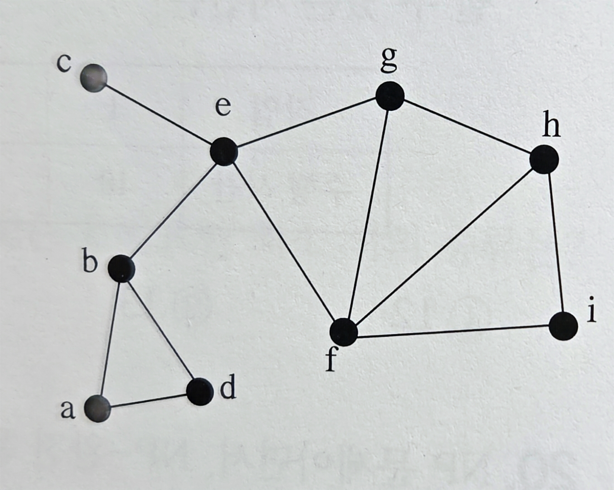
    
    - 풀이 및 답안은 다음과 같다:
        - 정점 커버란 모든 간선이 최소 하나 이상의 정점에 의해 포함되는 정점의 집합이다.
        - 최소 정점 커버는 이러한 집합 중 가장 적은 수의 정점을 가진 집합이다.
        - 최대 독립 집합을 구한다.
            - $I=\{a,\ c,\ g,\ i\}$
        - 최소 정점의 크기는 다음과 같다.
            - $(전체\ 정점의\ 개수)-(최대\ 독립\ 집합의\ 크기)=최소\ 정점의\ 크기$
            - 9 - 4 = 5
        - 최소 정점 커버 집합은 전체 정점 집합에서 최대 독립 집합을 제외한 나머지 원소들이다.
            - $C=\{b,\ d,\ e,\ f,\ h\}$
27. 집합 S = {1, 2, 3, 4, 5, 6, 7, 8}이고, 부분 집합들이 {1,2, 3}, {2, 3, 4, 8}, {3, 5, 7}, {1, 2, 5, 8}, {2, 4, 6, 8}, {1, 3, 5}일 떄, 이 부분 집합들 중에서 최소 개수로서 합집합하여 S가 되는 부분 집합들을 찾으라.
    - 풀이 및 답안은 다음과 같다:
        - 그리디  알고리즘을 통해 해결한다.
            1. {1, 2, 5, 8}
            2. {2, 3, 4, 8}
            3. {3, 5, 7}
            4. {2, 4, 6, 8}
28. 다음에 주어진 그래프에 대하여 최대 크기의 독립 집합을 찾으라.
    
    
    
    - 풀이 및 답은 다음과 같다:
        - 독립 집합은 인접하지 않은 정점으로 이루어진 부분 집합을 의미한다.
        - 최대 크기 독립 집합은 독립 집합 중에서 가장 많은 수의 정점을 가진 집합이다.
        - {a, c, g, i}
29. 다음에 주어진 그래프에서 가장 큰 클리크를 찾으라.
    
    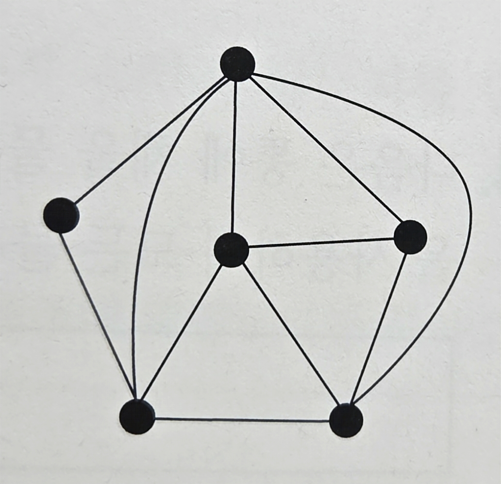
    
    - 풀이 및 답안은 다음과 같다:
        - 클리크는 완전 그래프를 이루는 정점들의 그룹이다.
        - 중앙, 위, 오른쪽, 오른쪽 아래.
30. 다음에 주어진 그래프에서 가장 적은 수의 색으로 점을 색칠하라.
    
    
    
    - 풀이 및 답안은 다음과 같다:
        - 클리크를 다른 색으로 칠한다.
        - 남은 두 점을 칠한다.
        - 4가지 색.
31. 다음에 주어진 그래프에서 a에서 h까지 가장 긴 경로를 찾으라.
    
    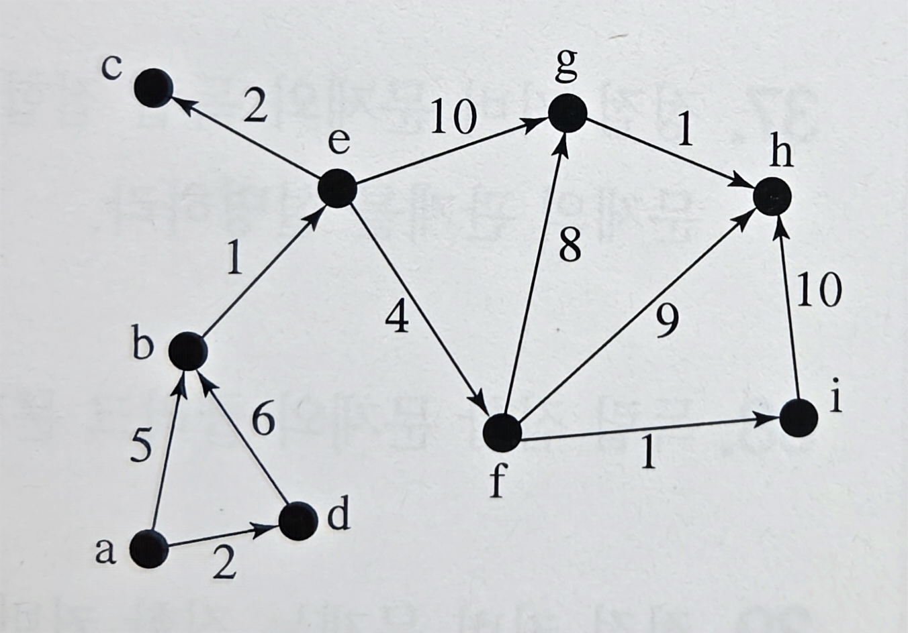
    
    - a→d→b→e→f→i→h
32. 최장 경로 문제가 동적 계획 알고리즘으로 해결될 수 없는 반례를 제시하라.
    - 양수 가중치를 가진 순환이 포함된 그래프는 동적 계획 알고리즘으로 해결할 수 없다.
33. 다음의 그래프에 해밀토니안 사이클이 있는지 없는지를 조사하라.
    
    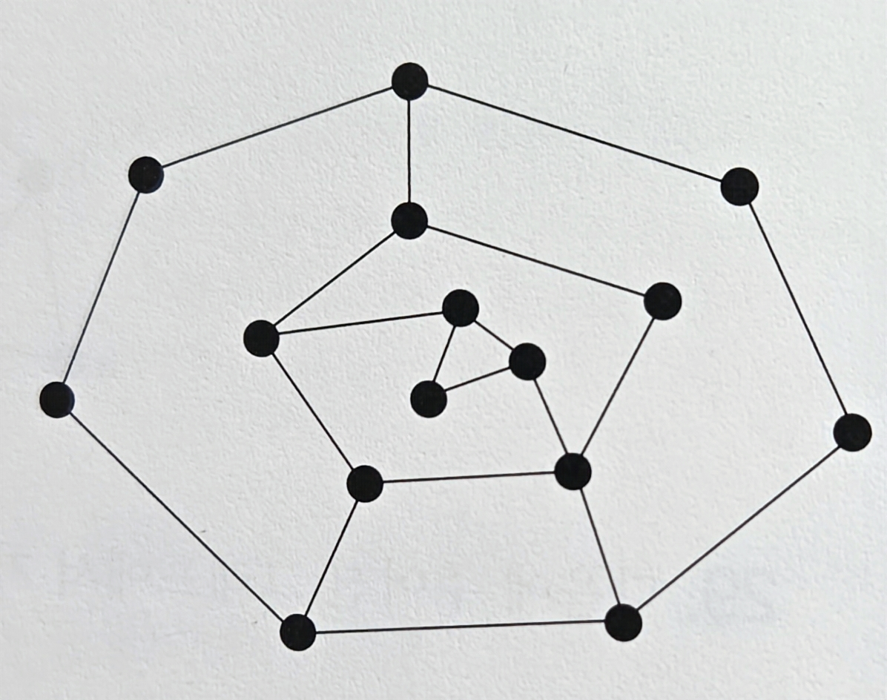
    
    - 풀이 및 답안은 다음과 같다:
        - 해밀토니안 사이클은 모든 정점을 한 번씩 방문하고 처음 출발했던 정점으로 돌아오는 사이클.
        - 해밀토니안 사이클이 존재하지 않는다.
34. 다음은 통에 채울 물건의 크기이다. 통의 크기가 10일 때 가장 적은 수의 통을 사용하여 모든 물건을 채우라.
    
    
    | 물건: 1, 2, 3, 3, 3, 4, 4, 4, 5, 5, 6 |
    | --- |
    - 풀이 및 답안은 다음과 같다:
        - 물건을 크기가 큰 순서대로 정렬한다. 이후 순서대로 통에 채운다.
        - 모든 물건의 크기 합은 40이고 통 하나의 크기는 10이므로, 이론적으로 통 4개가 필요하다.
        - 그리고 순서대로 담았을 때 통이 4개가 된다.
35. 다음은 통에 채울 물건의 크기이다. 통의 크기가 10일 때 주어진 순서에 따라 물건을 채울 때 필요한 통의 수를 찾으라.
    
    
    | 물건 채울 순서: 1, 2, 3, 3, 3, 4, 4, 4, 5, 5, 6 |
    | --- |
    - 통 5개가 필요하다.
36. 부분 집합의 합 문제는 배낭 문제의 특수한 경우의 문제이다. 이 두 문제의 관계를 위해 배낭 문제의 입력을 변환시켜 부분 집합의 합 문제의 입력으로 만들라.
    - 풀이 및 답안은 다음과 같다;
        - 부분 집합의 합 문제는 0-1 배낭 문제의 특수한 경우로 볼 수 있다.
            - 부분 집합의 합 재의 경우 정수 집합과 목표 합계가 존재한다.
            - 0-1 배낭 문제의 경우 물건의 부분 집합을 선택해 무게를 넘지 않으며 총가치가 이상이 된다.
        - 각 물건의 무게와 가치를 동일하게 설정하면 배낭 문제의 입력으로 만들 수 있다.
37. 정점 커버 문제는 독립 집합 문제는 매우 밀접한 관계를 가지고 있다. 이 두 문제의 관계를 설명하라.
    - 풀이 및 답안은 다음과 같다:
        - 그래프에서 한 정점들의 집합이 정점 커버이면, 그 여집합은 반드시 독립 집합이 된다.
38. 독립 집합 문제와 클리크 문제가 서로 어떻게 변환될 수 있는지를 설명하라.
    - 어떤 그래프의 독립 집합은 그 그래프의 보그래프에서의 클리크와 같다.
        - 보그래프는 간선이 반대인 그래프이다.
39. 정점 커버 문제는 집합 커버 문제의 특별한 경우이다. 즉, 집합 커버 문제가 더 일반적인 문제이다. 정점 커버 문제의 입력을 변환시켜 집합 커버 문제의 입력으로 만들라.
    - 풀이 및 답안은 다음과 같다:
        - 정점 커버 문제는 그래프의 모든 간선이 양 끝점 중 하나를 포함하도록 하는 가장 작은 정점 부분.
        - 집합 커버는 부분 집합 중 가장 적은 개수들 중 적은 개수를 선택해 전체 집합을 만든다.
        - 그래프의 간선을 덮어야 할 전체 원소로, 정점들을 원소를 덮는 부분 집합으로 생각한다.
            1. 전체 집합 U를 그래프의 모든 간선의 집합으로 만든다.
            2. 그래프의 각 정점에 대해 그 정점에 연결된 모든 간선들을 원소로 가지는 부분 집합을 만든다.
40. 그래프 색칠하기 문제와 클리크 문제의 관계를 가장 적은 수의 색과 가장 큰 클리크의 정점의 수의 관계를 통해서 설명하라.
    - 풀이 및 답안은 다음과 같다:
        - 그래프 색칠하기 문제는 인접한 두 정점이 같은 색을 가지지 않도록 색칠하는 문제이다.
        - 클리크는 완전 그래프 형태의 부분 그룹을 의미한다.
        - 즉, 클리크 내부에서는 각기 다른 색을 사용해야 한다.
        - 색칠 수는 클리크 크기보다 크거나 가타.
41. 다음 문제가 NP에 속하는지 속하지 않는지를 답하라. 그리고 이유를 설명하라.
    
    주어진 SAT를 위한 논리식을 만족시키기 위한 해는 없는가?
    
    - 풀이 및 답안은 다음과 같다:
        - NP 문제는 문제 답안이 예일 때 그 답을 뒷받침하는 증거를 다항 시간 안에 검증 가능해야 한다.
        - UNSAT 문제: 논리식을 만족시키는 해가 없는 경우의 다항식 시간 안에 검증할 수 있는 방법이 없다.
        - 따라서 NP에 속한다.
42. 다음 문제가 NP에 속하는지 속하지 않는지를 답하라. 그리고 이유를 설명하라.
    
    주어진 그래프에 해밀토니언 사이클이 없는가?
    
    - 풀이 및 답안은 다음과 같다:
        - 해밀토니안 사이클 문제의 역이다. HC에서 co-HC인 것이다.
        - 사이클이 없다는 것을 증명하기 위해서는 가능한 모든 경우를 보여야 한다.
        - 따라서 위 문제는 NP에 속한다.
43. 다음 문제가 다항식 시간에 해결될 수 있으면 해결할 알고리즘을 제시하고, 다항식 시간에 해결할 수 없으면 그 이유를 설명하라.
    
    각 변수가 1번만 사용되는 SAT 문제
    
    단, 변수 x가 있다면 x 또는 overline x 중 1개만 주어진 논리식에 나타날 수 있다.
    
    - 각 절을 만족시키는 결정은 독립적이며 영향을 주지 않으므로 다항식 시간 안에 해결할 수 있다.