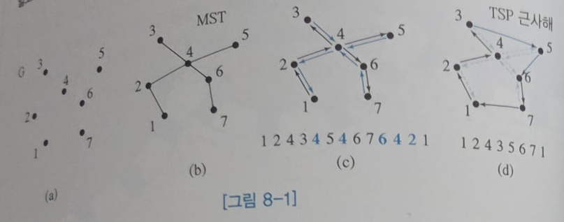
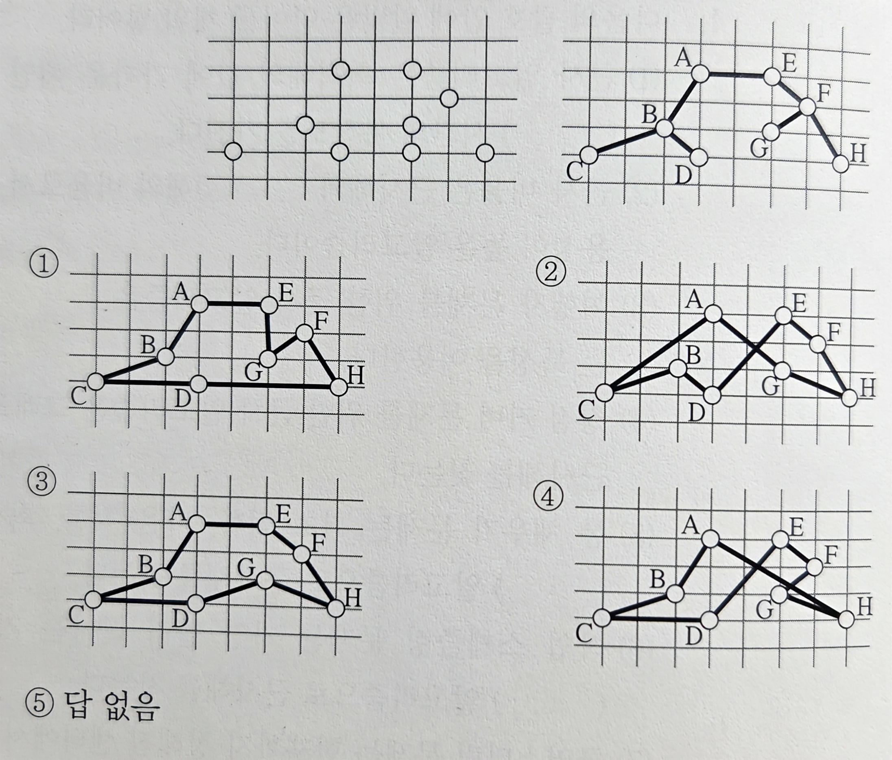
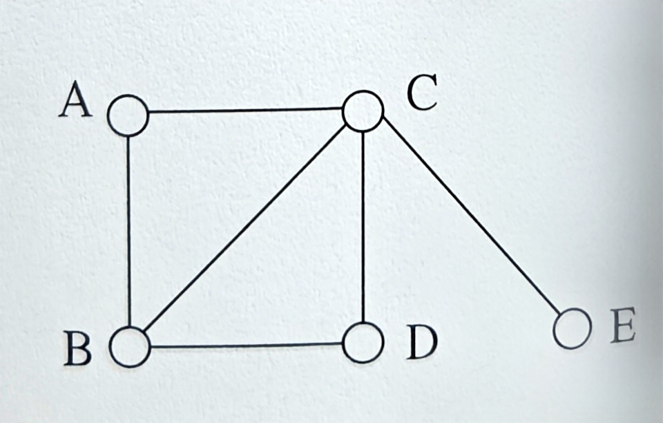
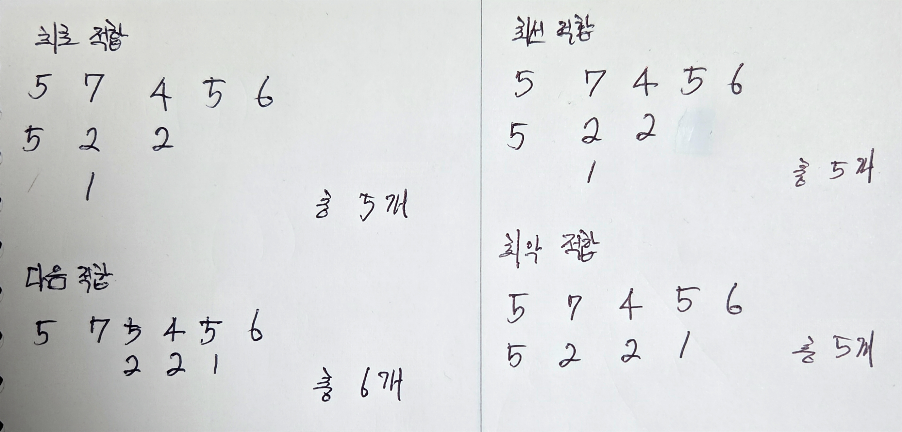
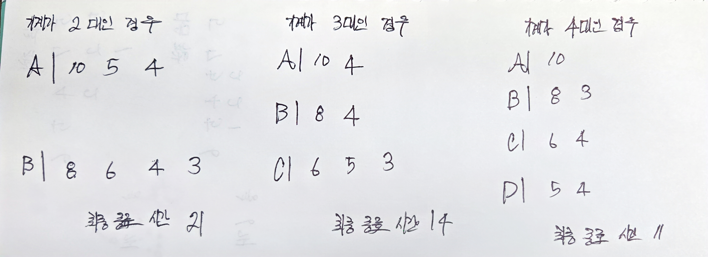
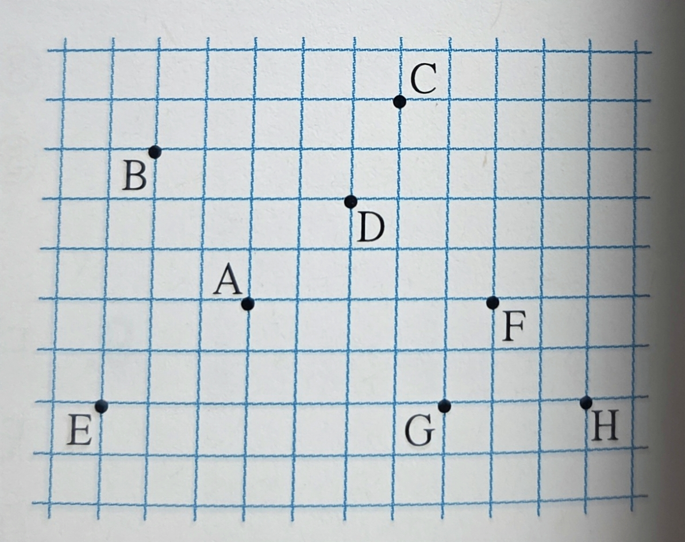
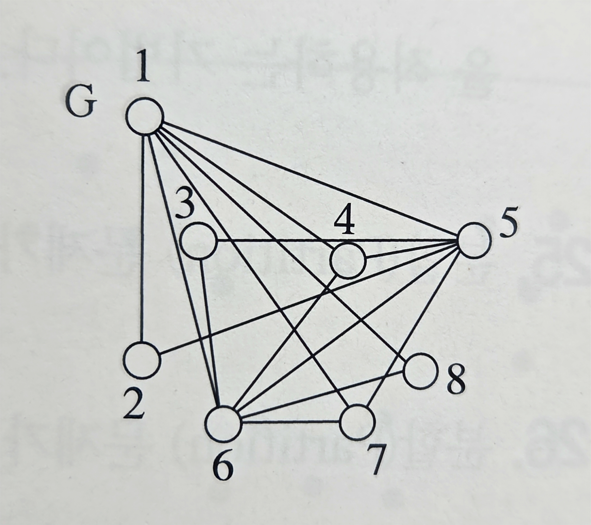
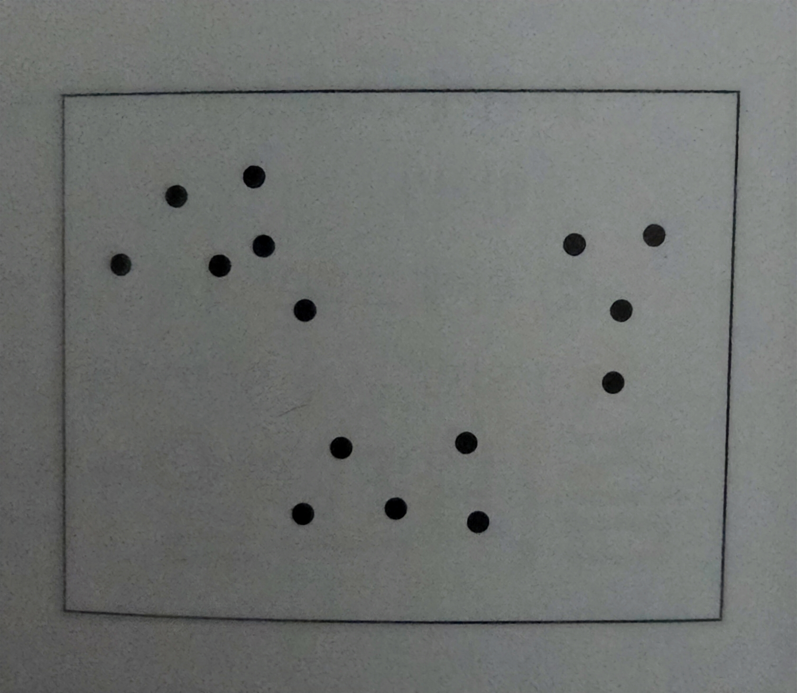
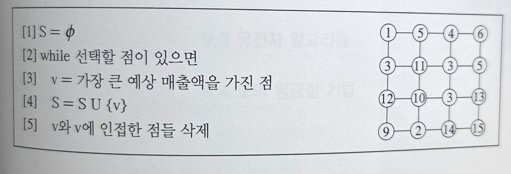

# 08 근사 알고리즘

---

- NP-완전 문제들을 해결하기 위해서는 다음 3가지 중 1가지를 포기해야 한다.
    - 다항식 시간에 해를 찾는 것.
    - 모든 입력에 대해 해를 찾는 것.
    - 최적해를 찾는 것.
- 근사 알고리즘에서는 최적해를 찾는 것을 포기한다.
- 근사 알고리즘은 근사해를 찾는 대신 다항식 시간의 복잡도를 가진다.
    - 최적해에 얼마나 근사한 것인지 나타내는 근사 비율을 알고리즘과 함께 제시하여야 한다.
- 근사 비율을 계산하려면 최적해를 알아야 하는 모순이 발생하는데, ‘간접적인’ 최적해를 찾는다.

# 8.1 여행자 문제

- 여행자 문제는 임의의 한 도시에서 출발해 다른 모든 도시를 방문하고 다시 돌아오는 거리를 최소화.
- 여행자 문제는 주어지는 문제의 조건에 따라 여러 종류가 존재한다.
    - 도시 A에서 도시 B로 가는 거리는 도시 B에서 도시 A로 가는 거리와 같다.
    - 도시 A에서 도시 B로 가는 거리는 도시 A에서 다른 도시 C를 경유하여 도시 B로 가는 거리보다 짧다.
- TSP와 유사한 특성을 가진 문제는 최소 신장 트리 문제이다.
    - 최소 신장 트리는 모든 사이클 없이 연결하는 트리 중 트리 간선의 가중치 합이 최소인 트리이다.
    - 다른 모든 도시를 트리 간선을 따라 1번씩 방문하도록 경로를 찾는다.



1. 크러스컬 또는 프림 알고리즘을 이용해 최소 신장 트리를 찾는다.
2. 임의의 도시에서 출발하여 트리 간선을 따라 모든 도시를 방문하고 돌아오는 도시 방문 순서를 구한다.
3. 이 순서를 따라 방문하되 중복 방문하는 도시를 순서에서 제거해 근사해를 구한다.
    - 단, 도시 순서의 가장 마지막 에 있는 출발 도시 1은 중복되어 나타나지만 제거하지 않는다.


- 중복하여 방문하는 도시를 제거하는 과정에서 삼각형 부등식 원리가 적용된다.

```python
입력: n개의 도시, 각 도시 간의 거리
출력: 출발 도시에서 각 도시를 1번씩만 방문하고 출발 도시로 돌아오는 도시 순서
입력에 대하여 최소 신장 트리를 찾는다.
최소 신장 트리에서 임의의 도시로부터 출발하여 트리의 간선을 따라서 모든 도시를 방문하고
다시 출발했던 도시로 돌아오는 도시 방문 순서를 찾는다.
return 이전 단계에서 찾은 도시 순서에서 중복되어 나타나는 도시를 제거한 도시 순서
(단, 도시 순서의 가장 마지막의 출발 도시는 제거하지 않는다)
```

- 최소 신장 트리를 찾는 데 크러스컬 또는 프림 알고리즘의 시간복잡도만큼 시간이 걸린다.
- 트리 간선을 따라서 도시 방문 순서를 찾는 데 $O(n)$ 시간이 걸린다.
    - 트리 간선 수가 $(n-1)$이기 때문이다.
- 중복된 도시를 제거하는 데 $O(n)$ 시간이 걸린다.
- 따라서 알고리즘의 시간복잡도는 $(크러스컬\ or\ 프림)+O(n)+O(n)$이다.
    - 크러스컬 또는 프림 알고리즘의 시간복잡도와 같다.
- 최적해를 알 수 없으므로, ‘간접적인’ 최적해인 최소 신장 트리 간선의 가중치 합을 이용한다.
    - 실제 최적해 값이 가중치 합인 M보다 항상 크기 때문이다.

# 8.2 정점 커버 문제

- 정점 커버 문제는 주어진 그래프에서 각 간선의 양 끝점들 중에서 적어도 하나의 끝점을 포함하는 점들의 집합들 중에서, 최소 크기의 집합을 찾는 문제이다.
- 그래프의 모든 간선이 정점 커버에 속한 점에 인접해 있다.
- 정점 커버에 속한 점으로서 그래프의 모든 간선을 ‘커버’하는 것이다.


- 위 그래프에 대한 정점 커버 문제의 해는 {1}이다.


- 차수가 가장 높은 점을 우선 선택하면 많은 수의 간선이 커버될 수 있다.
- 또는, 점을 선택하는 대신 간선을 선택하는 것이다. 선택된 양 끝 점에 인접한 간선이 모두 커버된다.
- 따라서 정점 커버는 선택된 각 간선의 양 끝점들로 이루어지는 집합이다.


- 정점 커버를 만들어가는 과정에서, 새 간선은 자신의 양 끝점들이 이미 선택된 간선의 양 끝점들의 집합에 포함되지 않을 때에만 중복을 피하기 위해 선택된다.
- 선택된 간선의 양 끝점이 점선으로 표시된 간선을 모두 커버하는 것을 확인할 수 있다.
- 위 방식으로 간선을 선택하다 더 이상 간선을 추가할 수 없을 때 중단한다.
    - 이렇게 선택된 간선의 집합을 극대 매칭이라고 한다.
    - 매칭이란 각 간선의 양 끝점들이 중복되지 않는 간선의 집합이다.

```python
입력: 그래프 G=(V,E)
출력: 정점 커버
입력 그래프에서 극대 매칭 M을 찾는다.
return 매칭 M의 간선의 양 끝점들의 집합
```

- 다음 그림에서 극대 매칭으로서 간선 a, b, c, d, e, f가 선택되었다.
    - 근사해는 간선 a, b, c, d, e, f의 양 끝점들의 집합이다.
    - 근사해는 총 12개의 점으로 구성되는데, 오른쪽 그림은 최적해 7개 점으로 구성되어 있다.


- 위 알고리즘이 시간복잡도는 주어진 그래프에서 극대 매칭을 찾는 과정의 시간복잡도와 같다.
- 입력 그래프의 간선 수가 m이면 각 간선에 대해 $O(n)$ 시간이 걸리므로, 시간복잡도는 $O(mn)$이다.
- 알고리즘의 근사 비율을 계산하기 위해 극대 매칭을 ‘간접적인’ 최적해로 사용한다.
    - 어떠한 정점 커버라도 극대 매칭에 있는 간선을 커버해야 하기 때문이다.
- 알고리즘은 각 간선의 양 끝점들의 집합을 정점 커버의 근사해로서 리턴하므로, 근사해의 값은 극대 매칭의 간선 수의 2배이다.
    - 근사 비율은 $(극대\ 매칭의\ 간선의\ 양\ 끝점들의\ 수)/(극대\ 매칭의\ 간선\ 수)=2$

# 8.3 통 채우기 문제

- 통 채우기 문제는 n개의 물건이 주어지고, 통의 용량이 C일 떄, 주어진 모든 물건을 가장 적은 수의 통에 채우는 문제이다.
    - 각 물건의 크기는 C보다 크지 않다.
- 그리디 방법으로 넣을 통을 정할 수 있다.
    - 최초 적합(First Fit): 첫 번째 통부터 살펴서, 여유가 있는 통에 새 물건을 넣는다.
    - 다음 적합(Next Fit): 직전에 물건을 넣은 통에 여유가 있으면 새 물건을 넣는다.
    - 최선 적합(Best Fit): 기존의 통 중에서 물건이 들어가면 남는 부분이 가장 적은 통에 새 물건을 넣는다.
    - 최악 적합(Worst Fit): 기존의 통 중에서 물건이 들어가면 남는 부분이 가장 큰 통에 새 물건을 넣는다.


```python
입력: n개의 물건의 각각의 크기
출력: 모든 물건을 넣는 데 사용된 통의 수
B = 0
for i = 1 to n {
	if (물건 i를 넣을 여유가 있는 기존의 통이 있으면)
		그리디 방법에 따라 정해진 통에 물건 i를 넣는다.
	else
		새 토에 물건 i를 넣는다.
		B = B + 1
}
return B
```

- 다음 적합을 제외한 다른 3가지 방법은 새 물건을 넣을 때마다 기존의 통을 살펴보아야 한다.
    - 따라서 통의 수가 n을 넘지 않으므로 수행시간은 $O(n^2)$이다.
    - 다음 적합은 직전에 사용된 통만을 살펴보므로 수행시간은 $O(n)$이다.
- 3가지 방법에서 물건을 넣는 데 사용된 통의 수는 최적해에서 사용된 수의 2배를 넘지 않는다.
    - 각 방법이 사용한 통을 살펴보면 2개 이상의 통이 1/2 이하로 차 있을 수 없기 때문이다.


- 최적해에서 사용된 통의 수를 OPT라 하면, $OPT\geq (모든\ 물건의\ 크기의\ 합)/C$이다.

$$
(모든\ 물건의\ 크기의\ 합)>(OPT'-1)*C/2\\\Rightarrow(모든\ 물건의\ 크기의\ 합)/C>(OPT'-1)/2\\\Rightarrow OPT>(OPT'-1)/2,\ OPT\geq(모든\ 물건의\ 크기의\ 합)/C이므로\\\Rightarrow 2OPT>OPT'-1\\\Rightarrow 2OPT+1>OPT'\\\Rightarrow 2OPT\geq OPT'
$$

- 따라서 3가지 방법의 근사 비율은 2이다.
- 다음 적합은 직전에 사용된 통에 들어 있는 물건의 크기의 합과, 새 물건의 크기의 합이 통의 용량이 클 때에서만, 새 통에 새 물건을 넣는다.


$$
(모든\ 물건의\ 크기의\ 합)>OPT'/2*C\\\Rightarrow(모든\ 물건의\ 크기의\ 합)/C>OPT'/2\\\Rightarrow OPT>OPT'/2,\ OPT\geq (모든\ 물건의\ 크기의\ 합)/C이므로\\\Rightarrow 2OPT>OPT'
$$

- 따라서 다음 적합의 근사 비율도 2이다.

# 8.4 작업 스케줄링 문제

- 작업 스케줄링 문제는 n개의 작업, 작업의 수행 시간, m개의 동일한 기계가 주어질 떄, 빨리 종료되도록.
    - 가장 간단한 해결 방법은 그리디 방법으로 작업을 배정하는 것이다.


```python
입력: n개의 작업, 각 작업 수행 시간 ti, i = 1, 2, ..., n, 기계 Mj, j = 1, 2, ..., m
출력: 모든 작업이 종료된 시간
for j = 1 to m
	L[i] = 0
for i = 1 to n {
	min = 1
	for j = 2 to m
		if (L[j] < L[min]) {
			min = j
		}
	작업 i를 기계 Mmin에 배정한다.
	L[min] = L[min] + ti
}
return 가장 늦은 작업 종료 시간
```


- 모든 기계의 마지막 작업 종료 시간인 L[j]를 살펴보아야 하므로 $O(m)$ 시간이 걸린다.
- 위 알고리즘은 n개의 작업을 배정해야 하고, 배열 L을 탐색해야 하므로, $O(mn)$이다.
- 근사해를 OPT’, 최적해를 OPT라 할 때, 근사해는 최적해의 2배를 넘지 않는다.


$$
\begin{align*}OPT' &= t_i + T \le t_i + T' \quad & \textcircled{1} \\&= t_i + \frac{\left(\sum_{j=1}^{n} t_j\right) - t_i}{m}, \quad \because T' = \frac{\left(\sum_{j=1}^{n} t_j\right) - t_i}{m} \\&= t_i + \frac{\sum_{j=1}^{n} t_j}{m} - \frac{t_i}{m} \\&= \frac{1}{m}\sum_{j=1}^{n} t_j + \left(1-\frac{1}{m}\right)t_i \\&\le OPT + \left(1-\frac{1}{m}\right)OPT \quad & \textcircled{2} \\&= \left(2-\frac{1}{m}\right)OPT \\&\le 2OPT\end{align*}
$$

# 8.5 클러스터링 문제

- 클러스터링 문제는 입력으로 주어진 n개의 점을 k개의 그룹으로 나누고, 각 그룹의 중심이 되는 k개의 점을 선택하는 문제이다.


- n개의 점 중 k개의 센터를 선택할 때, 하나씩 선택하는 것이 쉽다.
- 다음과 같이 첫 번째 센터가 랜덤하게 정해졌다고 가정한다.


- 두 번째 센터가 첫 번째 센터보다 멀리 떨어져 있는 것이 좋다.
    - 가까이 위치하는 경우 클러스터의 직경이 커질 수 있기 때문이다.


```python
입력: 2차 평면상의 n개의 점 xi, i=0, 1, ..., n-1, 그룹의 수 k>1
출력: k개의 클러스터 및 각 클러스터의 센터
C[1] = r, 단, xr은 n개의 점 중에서 랜덤하게 선택된 점이다.
for j = 2 to k {
	for i = 0 to n-1 {
		if (xi ≠ 센터)
			xi와 각 센터까지의 거리를 계산하여, xi와 가장 가까운 센터까지의 거리를 D[i]에 저장한다.
	}
	C[j] = i, 단, i는 배열 D의 가장 큰 원소의 인덱스이고, xi는 센터가 아니다.
}
센터가 아닌 각 점 xi로부터 앞서 찾은 k개의 센터까지 거리를 각각 계산하고 
그 중에 가장 짧은 거리의 센터를 찾는다. 
이때 점 xi는 가장 가까운 센터의 클러스터에 속하게 된다.
return 배열 C와 각 클러스터에 속한 점들의 리스트
```

- 위 알고리즘의 시간복잡도는 $O(k^2n)$이다.
- 각 클러스터의 센터를 중심으로 반경 d 이내에 클러스터에 속하는 모든 점들이 위치한다.
    - 따라서 $OPT'\leq 2d$이다.
- 즉 $OPT/\geq d이고, OPT'\leq2d이므로, 2OPT\ge 2d\ge OPT'이다.$
    - 따라서 알고리즘의 근사 비율은 2를 넘지 않는다.

# 연습문제

1. 다음의 괄호 안에 알맞은 단어를 채워 넣어라.
    1. 근사 알고리즘은 최적해의 값에 가까운 해인 (근사)해를 찾는 대신에 (다항식) 시간의 복잡도를 가진다.
    2. 근사 비율은 근사해와 (최적)해의 비율로서, (1.0)에 가까울수록 실용성이 높은 알고리즘이다.
    3. 여행자 문제를 위한 근사 알고리즘은 (최소 신장) 트리의 모든 점을 연결하는 특성을 이용한다.
    4. 정점 커버 문제를 위한 근사 알고리즘은 그래프에서 (극대 매칭)을 이용하여 근사해를 찾는다.
    5. 통 채우기 문제는 최초 적합, 다음 적합, 최선 적합, 최악 적합과 같은 (그리디) 알고리즘으로 근사해를 찾는다.
    6. 작업 스케줄링 문제는 가장 빨리 끝나는 기계에 새 작업을 배정하는 (그리디) 알고리즘으로 근사해를 찾는다.
    7. 클러스터링 문제는 현재까지 정해진 센터에서 (가장 멀리 떨어진) 점을 다음 센터로 정하는 (그리디) 알고리즘으로 근사해를 구한다.
2. 다음은 근사 알고리즘에 관한 설명이다. 옳지 않은 것은?
    1. NP-완전 문제들 중에서 최적해를 찾는 문제들을 위한 알고리즘이다.
    2. 근사 비율을 계산할 때 대부분의 경우 최적해 대신에 간접적인 수치를 이용한다.
    3. 근사 알고리즘은 최적해를 찾지 못한다.
    4. 대부분의 근사 알고리즘들은 다항식 시간에 근사해를 찾는다.
    5. 답 없음
    - c. 근사 알고리즘은 근사해를 찾으나, 문제 특성에 따라 구한 근사해가 최적해와 일치할 수 있다.
3. 다음은 Approx_MST_TSP 알고리즘에 관한 설명이다. 옳지 않은 것은?
    1. 최소 신장 트리를 이용한다.
    2. 반드시 삼각형 부등식 원리가 적용되어야만 한다.
    3. 근사 비율은 2.0을 넘지 않는다.
    4. 최적해의 값을 최소 신장 트리의 가중치로 삼는다.
    5. 답 없음
    - d. 최적해 값을 구하지 못하므로 근사해를 구한다. 알고리즘 성능을 판단하기 위해 최적해가 사용된다.
4. 다음의 왼쪽 그래프에서 Approx_MST_TSP 알고리즘으로 오른쪽 그림의 최소 신장 트리를 찾았다. 이 최소 신장 트리에서 여행자 경로를 찾기 위해 트리를 알파벳 순으로 방문하여 얻은 근사해는?
    
    
    
    - b.
5. 다음은 정점 커버 문제를 위한 Approx_Matching_VC 알고리즘에 관한 설명이다. 옳지 않은 것은?
    1. 최적해의 값을 극대 매칭의 간선 수로 삼는다.
    2. 그리디 방법으로 정점 커버의 근사해를 찾을 수 있다.
    3. 근사 비율은 2.0을 넘지 않는다.
    4. 시간복잡도는 선형 시간이다.
    5. 답 없음
    - a.
        - 위 알고리즘의 과정 상 최적해의 값을 극대 매칭의 간선 수로 삼는 과정은 포함되어 있지 않다.
        - 그래프에서 극대 매칭을 먼저 찾고, 그 매칭에 포함된 간선들의 양 끝 정점을 정점 커버의 근사해로 취한다.
6. 다음 그래프에서 Approx_Matching_VC 알고리즘으로 정점 커버를 찾으려고 한다. 이 그래프에서 극대 매칭의 간선 수가 몇 개일 때 근사해의 정점 수와 최적해의 정점 수가 같은가?
    
    
    
    1. 1개
    2. 2개
    3. 3개
    4. 4개
    5. 답 없음
    - a.
        - 정점 커버는 그래프의 모든 간선이 적어도 하나의 끝점에서 만나는 정점들의 집합이다.
        - 정점 $\{B,\ C\}$를 선택하는 경우 B, C가 커버하는 간선이 그래프의 모든 간선이다.
            - 따라서 정점 커버이며 크기는 2이다.
            - 극대 매칭이며, 간선 수가 1개라 할 수 있다.
        - 이때 근사해의 크기는 최적해 간선 수의 2배이므로, 정점 수가 같기 위한 조건을 충족한다.
7. 다음은 통 채우기 문제를 위한 근사 알고리즘에 관한 설명이다. 옳지 않은 것은?
    1. 최적해의 값을 (알아볼 수 없음)로 삼는다.
    2. 대표적인 그리디 방법에는 최초 적합, 다음 적합, 최선 적합, 최악 적합이 있다.
    3. 최악 적합의 근사 비율은 2.0을 넘지 않는다.
    4. 다음 적합의 시간복잡도는 $O(n^2)$이다. 단, $n$은 물건의 수이다.
    5. 답 없음
    - d.
        - 다음 적합은 이전에 물건을 넣은 통만을 살피므로 시간복잡도는 $O(n)$이다.
8. 다음은 물건의 크기이다. 통의 크기가 10일 때 다음 중 어떤 그리디 방법이 가장 많은 수의 통을 사용하는가?
    
    
    | 5 7 5 2 4 2 5 1 6 |
    | --- |
    1. 최초 적합
    2. 다음 적합
    3. 최선 적합
    4. 최악 적합
    5. 답 없음.
    - b. 다음 적합.
        
        
        
9. 다음은 Approx_JobScheduling 알고리즘에 관한 설명이다. 옳지 않은 것은? 단, n은 작업의 수이고, m은 기계의 수이다.
    1. 최적해의 값을 (알아볼 수 없음)으로 삼는다.
    2. 가장 일찍 끝난 기계에 다음 작업을 할당한다.
    3. 알고리즘의 근사 비유 2.0을 넘지 않는다.
    4. 알고리즘의 시간복잡도는 $O(n\log{n})$이다.
    5. 답 없음
    - d.
        - $O(mn)$ 시간복잡도이다.
10. 다음의 7개 작업에 대해 기계가 2, 3, 4대일 때 Approx_JobScheduling 알고리즘을 수행했을 때 각각의 최종 종료 시간은?
    
    
    | 작업 | 1 | 2 | 3 | 4 | 5 | 6 | 7 |
    | --- | --- | --- | --- | --- | --- | --- | --- |
    | 수행 시간 | 10 | 8 | 6 | 5 | 4 | 4 | 3 |
    1. 20,13, 12
    2. 20, 14, 11
    3. 21, 13, 12
    4. 21, 14, 11
    5. 답 없음
    - d. 풀이 및 답안은 다음과 같다;
        
        
        
11. 다음은 Approx_k_Clusters 알고리즘에 관한 설명이다. 옳지 않은 것은? 단, n은 정점의 수이고, k는 클러스터의 수이다.
    1. 첫 번째 센터를 어떤 점으로 정하여도 클러스터링 결과는 비슷하다.
    2. 현재까지 찾아 놓은 센터에서 가장 먼 점을 다음 센터로 정한다.
    3. 알고리즘의 근사 비율은 2.0을 넘지 않는다.
    4. 알고리즘의 시간복잡도는 $O(k^2n)$이다.
    5. 답 없음
    - a.
12. 다음 그림에서 정점 A를 첫 번째 센터로 정했을 때 Approx_k_Clusters 알고리즘이 선택하는 두 번째와 세 번째 센터는?
    
    
    
    1. H, G
    2. E, C
    3. B, H
    4. H, C
    5. 답 없음
    - d.
        - 위 알고리즘은 선택된 센터에서 가장 멀리 떨어진 점을 다음 센터로 선택한다.
13. 여행자 문제의 최적해의 값이 동일한 입력에서 찾은 최소 신장 트리의 간선의 가중치의 합보다 항상 큰 이유를 설명하라.
    - 풀이 및 답안은 다음과 같다:
        - TSP 문제의 최적해는 MST의 모든 조건을 포함하면서 순환해야 한다.
        - 어떤 TSP 경로에서 가중치가 가장 큰 간선 하나를 제거하면, 신장 트리가 된다.
            - 이러한 신장 트리는 TSP 경로보다 작으며, 단 MST보다는 가중치가 크다.
        - 따라서 최적해의 합이 MST의 가중치의 합보다 항상 크다.
14. 여행자 문제의 근사 알고리즘인 Approx_MST_TSP의 line 2에서는 트리의 간선을 따라서 도시 방문 순서를 찾는다. 이 순서를 찾는데 $O(n)$ 시간이 소요됨을 설명하라.
    - 풀이 및 답안은 다음과 같다:
        - DFS를 수행하면 모든 정점과 모든 간선을 정확히 한 번씩만 방문하게 된다.
        - 알고리즘은 각 정점을 방문할 때마다 순서 목록에 해당 도시를 추가하는데, 상수 시간이 소요된다.
        - 결과적으로 n개의 정점을 모두 목록에 추가하는 데 걸리는 총 정점 수 n에 정비례한다.
15. 근사 비율이 1.5인 여행자 문제를 위한 근사 알고리즘을 조사하라.
    - 풀이 및 답안은 다음과 같다:
        - 크리스토피데스-세르듀코프 알고리즘이다. 알고리즘은 다음과 같다:
            1. G의 MST T를 구한다.
            2. T의 홀수 차수 점들의 집합을 O라고 정의하면, O는 짝수 개의 원소를 가지게 된다.
            3. O에 의해 형성된 유도 부분 그래프에서 최소 비용의 완벽 부합 M을 찾는다.
            4. M과 T의 변들을 합쳐 모든 점들이 짝수 차수를 갖는 다중 그래프 H를 형성한다.
            5. H에서 오일러 회로를 구성한다.
            6. 구성한 오일러 회로에서 반복되는 점들을 제거하여 해밀턴 회로로 변경한다.
            
            
            
            
            
16. 다음의 그림에서 Approx_Matching_VC 알고리즘을 이용하여 정점 커버의 근사해를 찾으라.
    
    
    
    - 풀이 및 답안은 다음과 같다:
        - 정점 커버는 그래프의 모든 간선의 양 끝점 중 적어도 하나를 포함하는 정점들의 집합이다.
            1. 그래프 간선 중 임의로 (1, 2)를 선택한다.
            2. (1, 2)를 포함하지 않는 간선의 정점에서 (3, 6)을 선택한다.
            3. (4, 5)를 선택한다.
            4. 7과 8 사이에는 간선이 없어, 현재까지 선택된 정점들은 극대 매칭이다.
            5. 근사해는 {1, 2, 3, 4, 5, 6}이다.
17. 문제 16의 그림에서 차수가 가장 큰 점을 선택하는 그리디 알고리즘으로 정점 커버의 근사해를 찾으라.
    - 풀이 및 답안은 다음과 같다:
        1. 차수 6을 가지는 1을 선택한다. 이후 1을 포함하는 간선을 그래프에서 제거하고, 차수를 계산.
        2. 차수 5를 가지는 정점 5를 선택한다. 이후 같은 과정을 반복한다.
        3. 차수 4를 가지는 정점 6을 선택한다.
        4. 근사해는 {1, 5, 6}이다.
    - Approx_Matching_VC와는 달리 일정한 근사 비율을 보장하지는 않는다.
18. 통의 용량 C=10이고, 물건의 크기가 각각 4, 8, 5, 1, 7, 6, 1, 4, 2, 2일 때, 최초 적합을 이용하여 모든 물건을 통에 채우라.
    - 답안은 다음과 같다:
        
        
        | 통 1 | 통 2 | 통 3 | 통 4 | 통 5 |
        | --- | --- | --- | --- | --- |
        | 4, 5, 1 | 8, 1 | 7, 2 | 6, 4 | 2 |
19. 통의 용량 C=10이고, 물건의 크기가 각각 4, 8, 5, 1, 7, 6, 1, 4, 2, 2일 때, 다음 적합을 이용하여 모든 물건을 통에 채우라.
    - 답안은 다음과 같다:
        
        
        | 통 1 | 통 2 | 통 3 | 통 4 | 통 5 | 통 6 |
        | --- | --- | --- | --- | --- | --- |
        | 4 | 8 | 5, 1 | 7 | 6, 1 | 4, 2, 2 |
20. 통의 용량 C=10이고, 물건의 크기가 각각 4, 8, 5, 1, 7, 6, 1, 4, 2, 2일 때, 최선 적합을 이용하여 모든 물건을 통에 채우라.
    - 답안은 다음과 같다:
        
        
        | 통 1 | 통 2 | 통 3 | 통 4 | 통 5 |
        | --- | --- | --- | --- | --- |
        | 4, 5, 1 | 8, 1 | 7, 2 | 6, 4 | 2 |
21. 통의 용량 C=10이고, 물건의 크기가 각각 4, 8, 5, 1, 7, 6, 1, 4, 2, 2일 때, 최악 적합을 이용하여 모든 물건을 통에 채우라.
    - 답안은 다음과 같다:
        
        
        | 통 1 | 통 2 | 통 3 | 통 4 | 통 5 |
        | --- | --- | --- | --- | --- |
        | 4, 5, | 8, 1 | 7, | 6, 1 | 4, 2, 2 |
22. 통의 용량 C=10이고, 물건의 크기가 각각 4, 8, 5, 1, 7, 6, 1, 4, 2, 2일 때, 최적해를 구하라.
    - 답안은 다음과 같다:
        
        
        | 통 1 | 통 2 | 통 3 | 통 4 |
        | --- | --- | --- | --- |
        | 4, 6 | 8, 2 | 7, 2, 1 | 5, 4, 1 |
23. 통의 용량 C=10이고, 물건의 크기가 각각 4, 8, 5, 1, 7, 6, 1, 4, 2, 2일 때, 감소순 최초 적합을 이용하여 모든 물건을 통에 채우라. 단, 감소순 최초 적합이란 물건을 크기 감소 순서로 정렬한 후에 최초 적합을 적용하는 기법이다.
    - 답안은 다음과 같다:
        
        
        | 통 1 | 통 2 | 통 3 | 통 4 |
        | --- | --- | --- | --- |
        | 8, 2 | 7, 2, 1 | 6, 4 | 5, 4, 1 |
24. 통의 용량 C=10이고, 물건의 크기가 각각 4, 8, 5, 1, 7, 6, 1, 4, 2, 2일 때, 감소순 최선 적합을 이용하여 모든 물건을 통에 채우라. 단, 감소순 최선 적합이란 물건을 크기 감소 순서로 정렬한 후에 최선 적합을 적용하는 기법이다.
    - 답안은 다음과 같다:
        
        
        | 통 1 | 통 2 | 통 3 | 통 4 |
        | --- | --- | --- | --- |
        | 8, 2 | 7, 2, 1 | 6, 4 | 5, 4, 1 |
25. 분할 문제가 통 채우기 문제로 다항식 시간에 변환됨을 보이라.
    - 풀이 및 답안은 다음과 같다:
        - 분할 문제는 주어진 양의 정수 집합을 합이 같은 두 개의 부분 집합으로 분할하는 문제.
        - 집합 S의 모든 숫자의 총합을 계산하고, 통이 2개일 때 다음과 같은 통 채우기 문제로 변환.
            - 물건들의 크기: 집합 S 내 숫자들.
            - 통의 용량: $T/2$
            - 통의 수: 2개.
26. 분할 문제가 작업 스케줄링 문제로 다항식 시간에 변환됨을 보이라.
    - 풀이 및 답안은 다음과 같다:
        - 분할 문제는 주어진 양의 정수 집합을 합이 같은 두 개의 부분 집합으로 분할하는 문제.
        - 집합 S의 모든 숫자의 총합을 계산하고, 작업 스케줄링 문제로 변환할 수 있다.
            - 작업의 개수: n개.
            - 각 작업의 수행 시간: 집합 S의 각 요소.
            - 기계의 수: 2대.
            - 전체 마감 시간: $T/2$.
27. 다음과 같이 변형된 작업 스케줄링 문제가 통 채우기 문제로 다항식 시간에 변환됨을 보이라. 단, n과 d는 양수이다.
    
    멀티프로세서 스케줄링 문제는 n개의 작업과 그들의 수행시간이 각각 주어질 때, 모든 작업을 d까지 마치기 위해 필요한 최소의 기계의 수를 구하는 것이다.
    
    참고로 8.4절의 작업 스케줄링 문제는 입력으로 기계의 수가 주어지고, 작업의 마감 시간은 없다.
    
    - 풀이 및 답안은 다음과 같다:
        1. 각 작업의 수행 시간을 각각의 물건 크기로 설정한다.
        2. 작업의 마감 시간을 통의 용량으로 설정한다.
        - 두 문제의 해가 동일하므로 다항식 시간에 변환된다.
28. 작업의 수행 시간이 각각 4, 6, 5, 1, 7, 6, 3, 9, 2, 2일 때, Approx_JobScheduling 알고리즘이 작업을 배정시킨 결과를 보이라. 단, 기계의 수는 4이다.
    - 답안은 다음과 같다:
        
        
        | 기계 1 | 기계 2 | 기게 3 | 기계 4 |
        | --- | --- | --- | --- |
        | 4, 6 | 6, 9 | 5, 3, 2 | 1,7, 2 |
29. 작업의 수행 시간이 각각 4, 6, 5, 1, 7, 6, 3, 9, 2, 2일 때, 작업을 수행 시간의 감소순으로 정렬한 후에 Approx_JobScheduling 알고리즘이 작업을 배정시킨 결과를 보이라. 단, 기계의 수는 4이다.
    - 답안은 다음과 같다:
        
        
        | 기계 1 | 기계 2 | 기게 3 | 기계 4 |
        | --- | --- | --- | --- |
        | 9, 2 | 7, 3, 2 | 6, 5 | 6, 4, 1 |
30. 8.4절의 Approx_JobScheduling 알고리즘이 각 기계에 배정된 작업 리스트를 출력하도록 알고리즘을 수정하라.
    - 기존 알고리즘은 다음과 같다:
        
        ```python
        입력: n개의 작업, 각 작업 수행 시간 ti, i = 1, 2, ..., n, 기계 Mj, j = 1, 2, ..., m
        출력: 모든 작업이 종료된 시간
        for j = 1 to m
        	L[i] = 0
        for i = 1 to n {
        	min = 1
        	for j = 2 to m
        		if (L[j] < L[min]) {
        			min = j
        		}
        	작업 i를 기계 Mmin에 배정한다.
        	L[min] = L[min] + ti
        }
        return 가장 늦은 작업 종료 시간
        ```
        
    - 답안은 다음과 같다:
        
        ```python
        입력: n개의 작업, 각 작업 수행 시간 ti, i = 1, 2, ..., n, 기계 Mj, j = 1, 2, ..., m
        출력: 모든 작업이 종료된 시간
        for j = 1 to m
        	L[i] = 0
        for i = 1 to n {
        	min = 1
        	for j = 2 to m
        		if (L[j] < L[min]) {
        			min = j
        		}
        	작업 i를 기계 Mmin에 배정한다.
        	Job_assigned[min]에 작업 i를 추가
        	L[min] = L[min] + ti
        }
        return 가장 늦은 작업 종료 시간 및 2차원 배열 Job_assigned
        ```
        
31. 클러스터링 방법 중에서 가장 대표적인 알고리즘은 K-Means Clustering 알고리즘이다. 이에 대해서 조사하고, 8.5절에서 설명한 클러스터링 알고리즘과 비교하여 보아라.
    - 답안은 다음과 같다:
        - K-means의 경우 클러스터 내 분산을 최소화하는 것을 목표로 한다.
            - 또한 센터를 반복적으로 업데이트한다.
        - 8.5절의 알고리즘의 경우 클러스터의 반경을 최소화하는 것을 목표로 한다.
            - 센터를 한 번에 탐욕적으로 선택한다.
        - K-means의 알고리즘 과정은 다음과 같다:
            1. 초기화: 데이터 공간에서 임의의 k개 점을 초기 중심(Centroid)으로 선택합니다.
            2. 할당 단계 (Assignment): 모든 데이터 각각에 대해, k개의 중심 중 가장 가까운 중심을 찾아 해당 클러스터에 할당합니다.
            3. 갱신 단계 (Update): 각 클러스터의 중심을 해당 클러스터에 속한 모든 데이터 점들의 **산술 평균(mean)**으로 다시 계산하여 이동시킵니다.
            4. 반복: 중심의 위치에 더 이상 큰 변화가 없을 때까지 2번과 3번 단계를 반복합니다.
32. 다음의 입력에 대해서 Approz_k_Clusters 알고리즘이 수행한 결과를 보이라. 단, k=3이다.
    
    
    
    - 알고리즘은 다음과 같다:
        
        ```python
        입력: 2차 평면상의 n개의 점 xi, i=0, 1, ..., n-1, 그룹의 수 k>1
        출력: k개의 클러스터 및 각 클러스터의 센터
        C[1] = r, 단, xr은 n개의 점 중에서 랜덤하게 선택된 점이다.
        for j = 2 to k {
        	for i = 0 to n-1 {
        		if (xi ≠ 센터)
        			xi와 각 센터까지의 거리를 계산하여, xi와 가장 가까운 센터까지의 거리를 D[i]에 저장한다.
        	}
        	C[j] = i, 단, i는 배열 D의 가장 큰 원소의 인덱스이고, xi는 센터가 아니다.
        }
        센터가 아닌 각 점 xi로부터 앞서 찾은 k개의 센터까지 거리를 각각 계산하고 
        그 중에 가장 짧은 거리의 센터를 찾는다. 
        이때 점 xi는 가장 가까운 센터의 클러스터에 속하게 된다.
        return 배열 C와 각 클러스터에 속한 점들의 리스트
        ```
        
    - 이거 어떻게 품?
33. 상품권을 가지고 백화점에서 상품을 구입하려고 한다. 다음은 n개의 상품 가격이다.
    
    $$
    \{p_1,\ p_2,\ ...,\ p_n\}
    $$
    
    액면이 W인 백화점 상품권을 가지고 서로 다른 상품을 구매한 후에 남는 돈의 액수를 최소화하려고 한다. 이 문제를 위한 근사 알고리즘을 작성하라. 단, 알고리즘의 수행 시간은 $O(n)$이고, 근사 알고리즘은 잔돈이 W/2를 넘지 않아야 한다. 예를 들어 W=10일 때, {2, 11, 5, 1, 7}이라면, $2+5+1=8\leq W$가 하나의 해가 된다. 물론 최적해는 2+1+7=10이다.
    
    - 풀이 및 답안은 다음과 같다:
        - 일반적인 그리디 알고리즘.
34. 어느 회사에서 신도시에 커피 전문점들을 개업하기 위해 시장조사를 하여 점포를 개업할 수 있는 곳들의 예상 매출액을 산출하였다. 또한 이 회사에서는 두 개의 인접한 곳에 커피 전문점을 개업하지 않는다는 방침을 가지고 있다 이 외사는 최대 예상 매출액을 얻기 위해 어디에 지점을 개업해야 할지를 찾아야 하나 도시가 너무 커서 최대 예상 매출액은 포기하고 다음과 같은 그리디 알고리즘으로 개업해야 할 곳을 찾으려고 한다.
    
    
    
    1. 위에 그래프에서 주어진 근사 알고리즘으로 계산한 예상 매출액은 얼마인가?
        - 38.
    2. 위에 그래프에서 최대 예상 매출액(최적해)는 얼마인가?
    3. 위의 근사 알고리즘으로 산출한 예상 매출액은 적어도 $\frac{1}{4}OPT$보다는 크다는 것을 보이라. 여기서 OPT는 최적해의 예상 매출액이다.