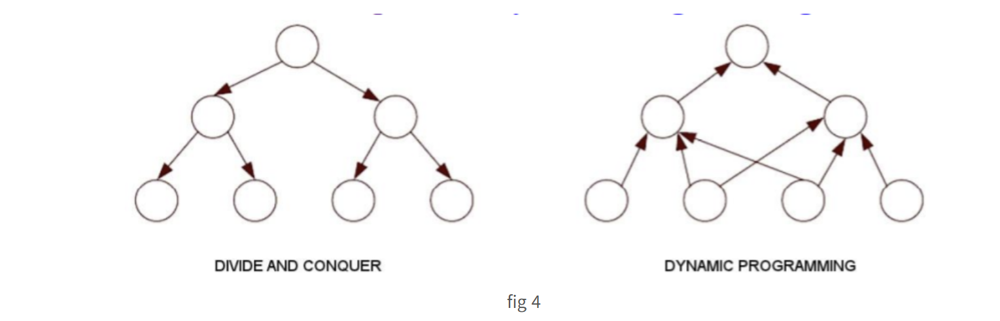
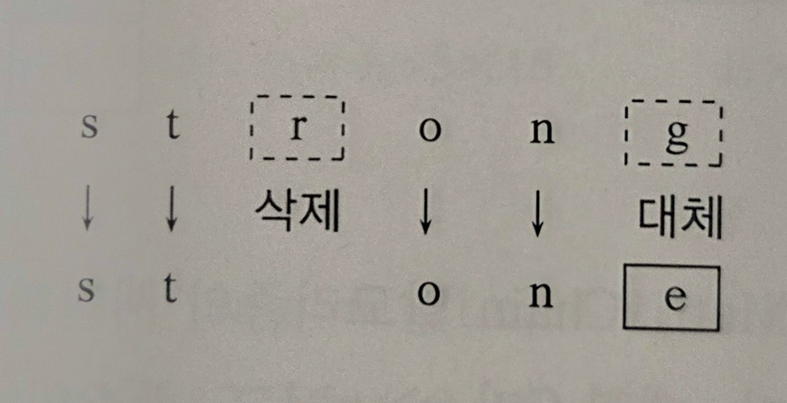
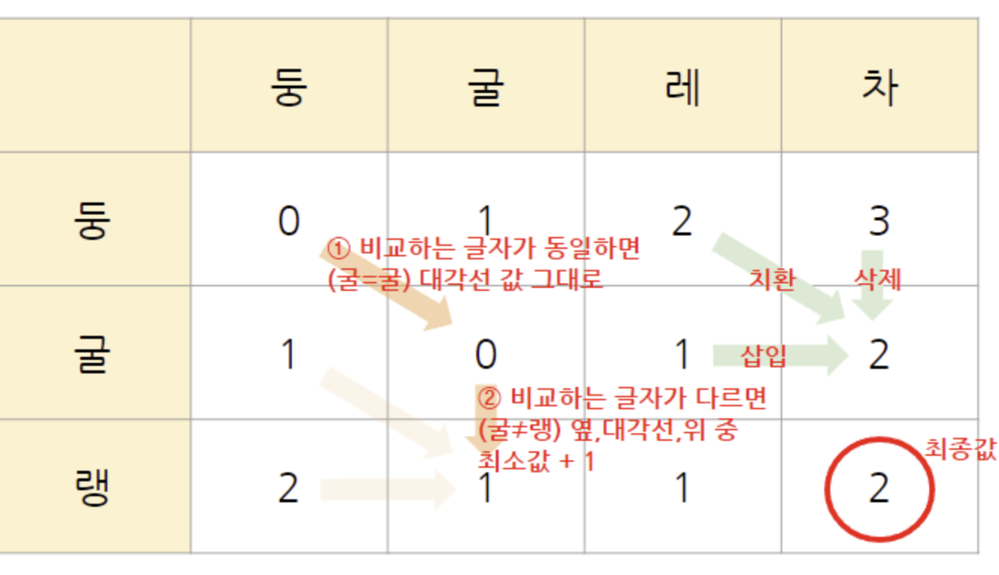

DP 알고리즘은 그리디 처럼 최적화 문제를 해결하는 알고리즘이다.

DP 알고리즘은 입력 크기가 작은 부분 문제들을 모두 해결한 후에 보다 더 큰 크기의 부분 문제들을 해결하여 원래의 문제를 해결하는 형식이다.

그러면 DC랑 같은 알고리즘이 아닌가 하는 의문이 들수 있다. 

DC와 DP 모두

- 둘 다 **큰 문제를 작은 문제로 나누어 해결**
- **재귀적 접근** 또는 **반복적 구조** 사용

이라는 공통점을 가지고 있기 때문이다.

하지만 DP와 DC는 다른 면모가 많다.

| 항목 | 동적 계획법 (DP) | 분할 정복 (Divide & Conquer) |
| --- | --- | --- |
| 부분 문제 관계 | **서로 의존적** 다른 해가 있어야 계산 가능 | **서로 독립적** 병합만 하면 됨 |
| 중복 계산 | 많음 → **메모이제이션** or **탭 테이블** 필요 | 거의 없음 |
| 해 조합 방식 | **저장된 해를 재활용**해 구성 | 분할했던 부분들을 **역순으로 병합** |
| 계산 순서 | **함축적 순서 :** 의존 관계에 따라 자동 결정 | 쪼갠 순서대로 역으로 병합 |



함축적 순서(implict order)이란?

> DP에서 문제를 푸는 순서는 명시하지 않아도, **부분 문제 간의 의존성** 때문에
> 
> 
> **자동으로 순서가 정해지는 것**
> 

예시: 피보나치 수열

- `F(n)`을 구하려면 → `F(n-1)`, `F(n-2)` 필요
- 이 둘을 구하려면 → 그보다 작은 값들이 필요
- 결과적으로 → `F(0)`부터 차례대로 계산됨
- 이 계산 순서가 **함축적으로 정해지는 순서**임

여기서 기억해야 하는 점은 DC는 주어진 문제를 서로 독립적인 부분 문제로 분할 하지만, DP의 경우에는 서로 의존적인(일부 값을 공유하는) -종속적인 부분 문제로 분할 되고, 그 의존 규칙 함축적 순서에 따라 합쳐 진다는 것이다.

---

# 5.1. 모든 쌍 최단 경로(All Pairs Shortest Paths)

## 5.1.1. 문제 정의

각 쌍의 점 사이로 최단 경로를 찾는 문제 이다. 
→ 중간에 다른 정점 경유 가능

## 5.1.2. 핵심 아이디어

중간 정점을 하나씩 추가하며 시도하고, 갱신한다

- k = 0 ~ n-1까지 반복하면서,
    
    정점 0부터 k번까지의 정점만 경유 가능하도록 제한
    
- 이때:
    - i → j 기존 경로 그대로 쓸지
    - i → k → j 새 경로가 더 짧은지
    - 둘을 비교하여 더 짧은 쪽으로 갱신

---

오른쪽 코드의 마지막 줄이 모든 쌍 최단 경로 문제 해결을 위한 

`함축적 순서`를 보여주고 있다.

→ D[i][j]의 해결을 위해서는 D[i][k], D[k][j]가 미리 계산 되어 있어야 한다.

<aside>
💡

음수 사이클(negative cycle)은 없어야 한다.

→ 사이클 내 간선들의 가중치의 합이 음수인 사이클을 말함

</aside>

```c
AllPairsShortest

입력:
	- 2차원 배열 `D`
	- `D[i][j]`: 간선 (i, j)의 가중치  
	- 간선이 없으면 `D[i][j] = ∞`  
	- 모든 i에 대해 `D[i][i] = 0`
출력:
	- 모든 쌍 최단 경로 거리로 갱신된 2차원 배열 `D`

for k = 1 to n:   //경유 가능점 n까지 확장
    for i = 1 to n:     (단, i ≠ k)
        for j = 1 to n: (단, j ≠ k and i ≠ j)
            D[i][j] = min(D[i][j], D[i][k] + D[k][j])
            
//두세번째 for문은 1-1,1-2...1-n,2-1..,n-n 모든 점의 쌍을 고려하기 위함임
```

## 5.1.3. 시간 복잡도

각 k에 대해서 모든 i,j 쌍에 대해 계산 되므로 $n * n * n = n^3$ 회 계산이 걸린다.

각 계산은 O(1)의 시간 복잡도를 가진다.

최종 결론 : $O(n^3)$

참고로 **다익스트라 알고리즘**을 모든 정점에 대해 반복 수행해도

전체 시간 복잡도는 O(n³) 이다.

하지만 플로이드 알고리즘이 더 유리한 경우가 많다. 그 이유는 다음과 같다:

- 플로이드는 2차원 배열을 사용하여 모든 정점 쌍을 한 번에 동시에 처리한다.
- 반면, 다익스트라는 한 정점에서 출발할 때마다 1차원 배열을 반복적으로 갱신해야 하므로 실제 구현과 실행 면에서 더 복잡하고 느릴 수 있다.

→ 결론 같은 시간 복잡도, 구현 난이도 차이로 플로이드 승!

---

# 5.2. 연속 행렬 곱셈(Chained Matrix Multiplications)

## 5.2.1. 문제 정의

연속된 행렬들의 곱셈에서 **전체 곱셈 연산 횟수를 최소화하는 문제**이다.

결과는 같지만, 괄호를 묶는 순서에 따라 곱셈 연산의 **총 횟수가 달라질 수 있다.**

---

**예시**

행렬 A: 10 × 20

행렬 B: 20 × 5

행렬 C: 5 × 15

### 경우 1: (A × B) × C

- A × B: 10 × 20 × 5 = **1,000**
- 결과 크기: 10 × 5
- (A × B) × C: 10 × 5 × 15 = **750**
- 총 연산 횟수: **1,000 + 750 = 1,750**

### 경우 2: A × (B × C)

- B × C: 20 × 5 × 15 = **1,500**
- 결과 크기: 20 × 15
- A × (B × C): 10 × 20 × 15 = **3,000**
- 총 연산 횟수: **1,500 + 3,000 = 4,500**

> 같은 결과지만, 괄호 묶는 순서에 따라 곱셈 횟수 차이가 크다.
> 
> 
> 이 문제는 곱셈 순서를 최적으로 결정해
> 
>  **총 곱셈 횟수를 최소화**하는 것이 목표이다.
> 

---

## 5.2.2. 핵심 아이디어

- 행렬 곱셈 특징
    - 행렬 곱셈에서 A(p × q) × B(q × r)는 가능하지만,
    A(p × q) × B(r × s)에서 **q ≠ r이면 곱셈 불가능**하다.
    - 즉, **두 행렬의 곱이 가능하려면 앞 행렬의 열 수와 뒤 행렬의 행 수가 같아야 한다.**

연속된 행렬 곱의 조건

- 주어진 행렬들이 연속적으로 곱해지는 구조일 때, 행렬의 곱셈 순서는 이웃한 행렬들끼리만 곱하는 방식으로 진행된다.
    
    예: 행렬 A, B, C, D, E → 가능한 곱셈 범위: AB, BC, CD, DE
    

- 이를 기반으로, 부분 문제도 항상 연속된 구간으로 나눌 수 있다.
- 예를 들어 (A × B × C × D × E) 전체 문제는,
    - (A × B) 와 (C × D × E)
    - 혹은 (A × B × C) 와 (D × E) 같은 방식으로 나뉠 수 있다.

> 연속된 행렬 곱셈 문제는 이웃한 구간 단위로만 부분 문제를 정의할 수 있으므로,
> 
> 
> DP의 분할 범위도 항상 연속된 인덱스 구간 (i~j)가 된다.
> 

```c
MatrixChain 

입력: 연속된 행렬 A_1 x A_2 x ... x A_n
     각 A_i는 d[i-1] x d[i] 크기를 가짐

출력: 전체 행렬 곱셈에 필요한 최소 곱셈 횟수

1. for i = 1 to n:
2.     C[i,i] = 0

3. for L = 1 to n - 1:             // L은 부분 문제의 크기
4.     for i = 1 to n - L:
5.         j = i + L
6.         C[i,j] = ∞
7.         for k = i to j - 1:
8.             temp = C[i,k] + C[k+1,j] + d_{i-1} * d_k * d_j
9.             if temp < C[i,j]:
10.                C[i,j] = temp

11. return C[1,n]

```

Line 1~2 : 초기화

C[i,j]는 A_i x A_j의 곱셈 횟수를 말함

→ C[i,i] 는 곱셈 대상이 하나만 있기 때문에 곱겜 횟수를 0으로 초기화 한다.

Line 3~4 : 부분 문제 크기

- L은 부분 문제 길이 (예: L = 1이면 A₁×A₂, L = 2면 A₁×A₂×A₃)
- i는 시작 행렬의 인덱스
- j = i + L: 부분 문제의 끝 지점
    

Line 5~6 : 초기값 설정

C[i, j]에 큰 값(무한대)을 넣어두고, 이후 최소값으로 갱신할 준비를 한다.

Line 8 : 곱셈 횟수 계산

 Aᵢ~Aⱼ 구간을 k에서 나눌 때 드는 총 곱셈 횟수 계산

→ 왼쪽 + 오른쪽 + 마지막 곱셈(d[i-1] * d[k] * d[j])

Line 9~10 : 곱셈 횟수 최소값 갱신

현재 C[i, j]보다 계산된 temp가 더 작으면 갱신함.

## 5.2.3. 시간 복잡도

- 결과 배열 C[i, j]의 크기는 n × n이다.
- 하지만 C[i, j]는 i ≤ j인 구간만 의미 있으므로, 약 절반 (n²/2 개) 정도의 원소만 실제 계산된다.
- 각 원소 C[i, j]를 계산하려면
    
    Line 7의 k 루프가 최대 n-1번 수행된다.
    

결론 : O(n²) 개의 원소 × O(n)번의 시도 = O(n³)

---

# 5.3. 편집 거리 문제

## 5.3.1. 문제 정의

문서 편집기에서 문자열 s를 수정하여 문자열 t로 바꾸려 할 때,

다음 세 가지 연산을 사용할 수 있다:

- 삽입 (insert)
- 삭제 (delete)
- 대체 (substitute)

이러한 연산들을 이용해 문자열 s를 문자열 t로 변환하는 데 필요한

최소 연산 횟수를 편집 거리(Edit Distance)라고 한다.

예시 strong→ stone



편집 거리 : 2

## 5.3.2. 핵심 아이디어

부분 문제 정의를 위해서 string s, t의 길이를 각각 m,n이라고 하자 

E[i, j] table을 생성한다. → 크기는 m x n

각 E[i ,j]원소는 s의 앞 i번째 글짜까지의 prefix를 T의 앞 j까지 바꾸는데 필요한 최소 편집 연산 횟수를 말한다.

DP이기 때문에 미리 계산한 부분 문제의 조합으로 상위 부분 문제를 해결할 수 있다. 이경우 주변 3개의 글자를 고려하면 된다.



```c
EditDistance

입력: 스트링 S, T, 단, S와 T의 길이는 각각 m과 n이다.
출력: S를 T로 변환하는 편집 거리, E[m,n]
1 for i=0 to m E[i,0]=i //0번 열의 초기화
2 for j=0 to n E[0,j]=j //0번 행의 초기화
3 for i=1 to m
4    for j=1 to n
5        E[i,j] = min{E[i,j-1]+1, E[i-1,j]+1, E[i-1,j-1]+ α}
6 return E[m,n]
```

**Line 1~2 :초기화**:

S를 빈 문자열로 바꾸려면 **i번 삭제**해야 함 → 편집 거리 = i

빈 문자열을 T로 만들려면 **j번 삽입**해야 함 → 편집 거리 = j

Line 3~4

- DP 테이블을 **위에서 아래로, 왼쪽에서 오른쪽으로** 채워나감
- E[i][j]는 S[1..i], T[1..j]를 고려한 최소 편집 거리

Line 5

- E[i][j-1] + 1: T에 있는 글자를 **삽입**
- E[i-1][j] + 1: S에 있는 글자를 **삭제**
- E[i-1][j-1] + α:
    - 같으면 **α = 0** (아무 작업 안 해도 됨)
    - 다르면 **α = 1** (대체 작업 수행)

## 5.3.3. 시간 복잡도

총 부분 문제의 수가 결과 행렬의 크기인 m x n이다.

각 부분 문제를 계산하기 위해서 주변 3개의 부분 문제들의 해를 참조해서 최소 값을 찾는다.

→각 O(1)

결과 : O(nm)

---

# 5.4. 배낭(Knapsack) 문제

## 5.4.1. 문제 정의

- n개의 물건이 주어지고, 각 물건 i는 무게 w_i와 가치 v_i를 가진다.
- 배낭의 최대 용량은 c이다.
- 각 물건은 1개씩만 사용할 수 있다 → 같은 물건을 여러 번 담을 수 없음
- 총 무게는 배낭 용량 c를 초과할 수 없음

> 배낭에 담을 수 있는 물건들을 골라, 총 무게가 c를 초과하지 않도록 하면서,
> 
> 
> 담긴 물건들의 가치 합을 최대화하는 것.
> 

## 5.4.2. 핵심 아이디어

- K[i][w]는
    
    물건 1번부터 i번까지 고려했을 때, 배낭의 남은 용량이 w일 때 넣을 수 있는 최대 가치를 의미한다.
    
- 테이블 크기: (n + 1) × (C + 1)
    - 행(i): 0 ~ n → 고려한 물건 개수
    - 열(w): 0 ~ C → 임시 배낭 용량

점화식 구조

K[i][w]는 다음 두 경우 중 더 큰 값을 선택한다:

1. 물건 i를 담지 않는 경우
    
    → K[i][w] = K[i-1][w]
    
2. 물건 i를 담는 경우 (w[i] ≤ w일 때만)
    
    → K[i][w] = K[i-1][w - w[i]] + v[i]
    

```c
0-1 Knapsack

입력:  
- 배낭의 용량 `C`  
- `n`개의 물건  
- 각 물건 `i`의 무게 `w[i]`와 가치 `v[i]` (i = 1, 2, ..., n)

출력:  
- 담을 수 있는 최대 가치 K[n][C]

1. for i = 0 to n:
2.     K[i][0] = 0           // 배낭 용량이 0일 때, 담을 수 있는 가치 = 0

3. for w = 0 to C:
4.     K[0][w] = 0       // 물건 0개를 고려할 때, 어떤 용량에서도 가치 = 0

5. for i = 1 to n:         // i번째 물건까지 고려
6.     for w = 1 to C:     // 임시 배낭 용량 w
7.         if w[i] > w:
8.             K[i][w] = K[i-1][w]      // 담을 수 없으니 이전 값 복사
9.         else:
10.            K[i][w] = max(K[i-1][w], K[i-1][w - w[i]] + v[i])  
											// 담을지 말지 선택

11. return K[n][C]
```

Line 1~2 : 초기화

- K[i][0] = 0
- 배낭 용량이 0이면 어떤 물건도 담을 수 없으므로 최대 가치는 항상 0이다.

Line 3~4 : 초기화

- K[0][w] = 0
- 물건이 0개일 때는 어떤 배낭 용량이든 담을 수 없으므로 최대 가치도 0이다.

Line 5~6 : 반복 시작

- 각 물건 i에 대해, 배낭 용량 w를 1부터 C까지 순차적으로 고려한다.

Line 7~8 : 물건을 담을 수 없는 경우

- 만약 현재 물건의 무게 w[i]가 현재 배낭 용량 w를 초과한다면,
    
    → 담을 수 없으므로 이전 결과 K[i-1][w]를 그대로 사용한다.
    

Line 9~10 : 물건을 담을 수 있는 경우

- 물건을 담지 않는 경우: K[i-1][w]
- 물건을 담는 경우: K[i-1][w - w[i]] + v[i]
- 두 경우 중 최대 값을 선택해 K[i][w]에 저장한다.

## 5.4.3. 시간 복잡도

1. 부분 문제 수 k x C
2. 계산 과정 시간 복잡도 O(1)

결과 : O(nC)

---

# 5.5. 동전 거스름돈 문제

## 5.5.1. 문제 정의

4절의 그리디 알고리즘과 같은 문제이다. 

단 항상 최적화 된 답을 이끌어 내야 한다.

## 5.5.2. 핵심 아이디어

C[j] = 금액 j원을 만들기 위한 최소 동전 개수

- 테이블 크기: C[0..n]
- C[0] = 0 (0원을 만들기 위한 동전 개수는 0)

 점화식 구조

각 금액 j에 대해, 모든 동전 단위 d[i]를 시도하며 다음 점화식을 적용: C[j] = min(C[j], C[j - d[i]] + 1)    단, d[i] ≤ j

- C[j - d[i]]: 현재 동전을 하나 쓰고 남은 금액
- +1: 해당 동전을 하나 사용한 것
- → 그 결과가 현재 저장된 C[j]보다 작다면 갱신

```c
 DPCoinChange

입력: 거스름돈 n원, k개의 동전 액면가  
단, 동전 단위는 d₁ > d₂ > ... > d_k = 1

출력: 거스름돈 n원을 만들기 위한 최소 동전 개수 C[n]

1. for i = 1 to n:
2.     C[i] = ∞

3. C[0] = 0

4. for j = 1 to n:               // j는 1원부터 n원까지
5.     for i = 1 to k:           // 각 동전 단위 d_i (큰 단위부터 1원까지)
6.         if d[i] ≤ j and C[j - d[i]] + 1 < C[j]:
7.             C[j] = C[j - d[i]] + 1

8. return C[n]

```

Line 1~2 : 초기화

- C[i] = ∞ , i원을 만들기 위한 최소 동전 개수를 일단 무한대로 설정

Line 3 : 기저 조건

- C[0] = 0 ,0원을 만들기 위해 필요한 동전 수는 0개

Line 4 : 메인 반복 (거스름돈 액수 j)

- j는 현재 만들고자 하는 액수 (1원부터 n원까지 순차적으로 계산)

Line 5 : 동전 종류별 반복

- 각 동전 단위 d[i]에 대해 시도 (큰 금액부터 1원까지 순회)

Line 6 : 동전 사용 가능 여부 확인 및 비교

- 만약 현재 동전 d[i]가 j보다 작거나 같다면, 그리고 C[j - d[i]] + 1 (즉, 이 동전을 하나 쓰고 남은 액수까지의 최소 동전 수)이 현재 C[j]보다 작다면 → 더 나은 방법이므로 갱신

Line 7 : 최소 동전 개수 갱신

- C[j] = C[j - d[i]] + 1
- 동전 하나 추가해서 최소 동전 수를 갱신

## 5.5.3. 시간 복잡도

O(nk) 

거스름돈 j가 1원부터 n원 까지 변하고 각각의 j에 대해서 최악의 경우 모든 동전 즉 k개를 1번씩 고려하기 때문임
