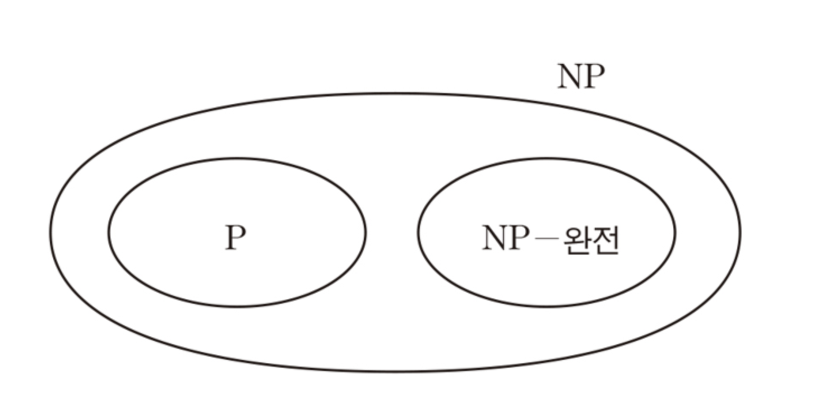
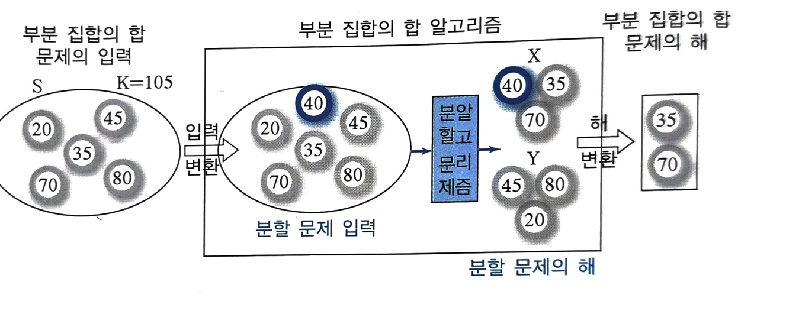
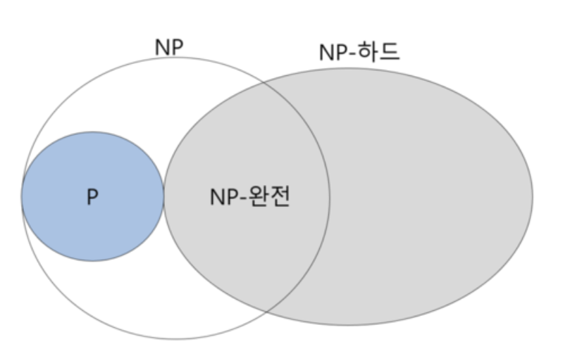

# 7.1. 문제 분류

### 1. P 문제 (Polynomial Time Problems)

- 정의: 다항식 시간 내에 해결 가능한 문제들.
- 특징:
    - 해결 시간은 입력 크기 n에 대해 O(nk)O(n^k) 형태로 증가한다.
    - P 문제는 결정 가능한 문제(Decidable)이다.
    - 주어진 해를 검증하는 데도 다항식 시간이 걸린다.

### 2. NP 문제 (Non-deterministic Polynomial Time Problems)

- 정의: 주어진 해가 맞는지 검증하는 데 다항식 시간이 걸리는 문제들.
- 특징:
    - 일반적으로 비결정적 다항식 시간 알고리즘을 일컫는다.
    - 해답을 검증하는 데 다항식 시간이 걸리지만, 해를 찾는 데는 지수 시간 이상이 걸릴 수 있다.
    - "추측-검증" 방식: 첫 번째 단계에서 가능한 해를 추측하고, 두 번째 단계에서 그 해가 맞는지 다항식 시간 내에 검증한다. 이를 반복해서 문제를 해결한다.

### 3. NP-완전 문제 (NP-Complete Problems)

- 정의:  NP문제에 속하는 문제 중, 다른 모든 NP 문제를 다항 시간 내에 변환할 수 있는 문제
    - 변환이 가능하다는 것은, 하나의 NP-완전 문제를 다른 NP 문제로 다항 시간 내에 변환할 수 있다는 의미이다. 즉, 한 NP-완전 문제를 해결하는 방법을 다른 NP 문제에도 적용할 수 있다는 뜻이다. **→ 7.2에서 더 깊은 설명을 하겠다.**
- 특징:
    - NP-완전 문제는 다른 NP 문제들에 비해 더 복잡하고, 보통 지수 시간이 걸린다.
- 예시: 외판원 문제, 배낭 문제(Knapsack Problem) 등

NP 문제 :

1단계 : 입력 → 추측 ( 비결정적, 여러가지 해 중 1개 선택)

2단계 : 추측 → YES, NO 판단 ( 다항식 시간 내에 판단 이뤄짐)

P 문제는 1단계와 2단계 모두 다항식 시간 내에 해결되므로, NP 문제의 일종이다.

NP-완전 문제는 1단계는 지수 시간이 걸릴 수 있지만, 2단계는 다항식 시간이 걸린다.

EXPTIME (Exponential Time) 문제 집합은 NP-완전 문제와 다르게 2 단계에서도 지수 시간이 걸려 NP-완전 문제라고 할 수 없다.

# 7.2. NP-완전 문제의 특성

NP-완전 문제 설명에 앞어 환원(reduction)하는 과정을 설명하겠다.

"문제 A의 입력을 문제 B의 입력 형태로 변환한 후,

문제 B의 알고리즘을 사용해 문제를 해결하고,

그 결과를 출력 변환을 통해 문제 A의 해답으로 바꾸는 과정이다.

**즉, 문제 A를 문제 B의 알고리즘을 통해 해결하는 방식을 환원이라고 한다."**

***환원 과정을 통한 시간 복잡도***

***입출력 변환은 다항식 시간이 걸리기에, 문제 B의 시간복잡도를 따라간다.***

---

### 예시

문제 A : Subset Sum 문제

문제 B : 동일한 크기의 Partition문제

A의 목표 Sum 값을 K라고 할때

t= s- 2K라고 한다. (s는 모든 원소의 합)

format 과정을 거칠때, t값을 새로운 원소로 포함한다.

분할알고리즘으로 분할하고, t를 포함한 해에서 t값을 제거한다.

→ 문제 A의 해가 나옴

---

### **문제 A와 B의 환원 과정**

1. **환원의 시간 복잡도**:
    - 문제 A의 입력을 문제 B의 입력 형태로 변환한 후, **문제 B를 해결하기 위한 알고리즘**이 수행된다.
    - 문제 A의 시간 복잡도는 **문제 B를 해결하는 알고리즘**의 시간 복잡도에 따라 결정된다.
2. **다항식 시간 내 해결**:
    - 만약 문제 B를 해결하는 두 번째 단계가 **다항식 시간** 내에 이루어진다면, 문제 A도 **다항식 시간 내에 해결**될 수 있다.
3. **다항식 시간 변환 (Polynomial Time Reduction)**:
    - 이런 관계가 성립하면, **문제 A는 문제 B로 다항식 시간 내에 변환**할 수 있다고 한다.
4. **NP-완전 문제들의 얽힘**:
    - **추이적 관계**가 성립한다. 즉, **NP-완전 문제들**은 서로 얽혀 있어서, **하나의 NP-완전 문제**가 **다항식 시간 내에 해결 가능**하다면, 다른 모든 **NP-완전 문제들**도 다항식 시간 내에 해결될 수 있다.

### 문제 A가 NP-완전 문제가 될려면

1. 문제 A는 NP문제이다.
2. 문제 A는 NP-하드 문제 이다.

NP-하드란?

어느 문제 A에 대해서 , 만일 모든 NP문제가 문제 A로 다항식 시간에 변환이 가능하다면, 문제 A는 NP하드 문제이다.

→ NP-하드문제는 NP문제일 필요는 없다.

# 7.3. NP-완전 문제의 소개

- SAT(Satistiablility)
    - 부울 변수들이 or로 표현된 논리식이 여러개 주어질 때, 이 논리식들을 모두 만족시키는 각 부울 변수의 값을 찾는 문제이다.
- 부분 집합의 합 (Subset Sum)
    - 주어진 정수 집합 S의 원소의 합이 K가 되는 S의 부분집합을 찾는 문제이다.
- 분할(Partition)
    - 주어진 정수 집합 S를 분할하여 원소의 합이 같은 2개의 부분 집합 X,Y를 찾는 문제이다.
- 0-1 배낭(Knapsack)
    - 배낭의 용량이 C이고, n개의 물건을 각가의 무게와 가치가 w_i, v_i일때 (단, i=1,2,3..n) 배낭에 담을 수 있는 물건의 최대 가치를 찾는 문제이다.

      단, 담을 물건의 무게의 합이 배낭의 용량을 초과하지는 말아야 한다.

- 정점 커버 (Vertex Cover)
    - 주어진 그래프 G=(V,E)에서 각 간선의 양 끝점들 중에서 적어도 1개의 점을 포함하는 점의 집합니다. 정접 커버 문제는 최소 크기의 정점 커버를 찾는 문제이다.
- 독립집합 (Independence Set)
    - 주어진 그래프 G=(V,E)에서 서로 연결하는 간선이 없는 점들의 집합이다. 독립 집합 문제는 최대 크기의 독립집합을 찾는 문제이다.
- 클리크 (Clique)
    - 주어진 그래프에서 모든 점들 사이를 연결하는 간선이 있는 부분 그래프를 말하는데, 클리크 문제는 최대 크기의 클리크를 찾는 문제이다.
- 그래프 색칠하기(Graph Coloring)
    - 가장 적은 수의 색을 사용하여 주어진 그래프에서 인접한 점들을 서로 다른 색으로 색칠하는 문제이다.
- 집합 커버 (Set Cover)
    - 주어진 집합 S에 대해서 S의 부분 집합이 주어질때, 이 부분 집합들 중에서 합집합 하여 S와 같게되는 부분 집합들을 집합 커버라고 한다. 집합 커버 문제는 가장 적은 수의 부분 집합으로 이뤄진 집합 커버를 탖는 문제이다.
- 최장 경로(Longest Path)
    - 주어진 가중치 그래프에서 시작점 s에서 도착점 t까지의 가장 긴 경로를 찾는 문제이다. 단 간선의 가중치는 양수이고, 경로에서 반복되는 점이 없어야 한다.
- 여행자(Traveling Salesmas) 문제
    - 주어진 가중치 그래프에서 임의의 한 점에서 출발하여, 다른 모든 점들을 1번씩만 방문하고, 다시 시작점으로 돌아오는 경로 중에서 최단 경로를 찾는 문제이다.
- 해밀토니안 사이클(Hamiltonian Cycle)
    - 주어진 그래프에서 임의의 한 점에서 출발하여 모든 다른 점들을 1번씩만 방문하고 다시 시작점으로 돌아오는 경로를 찾는 문제이다. 간선의 가중치가 동일하게 만들고 여행자 문제의 해를 찾았을때, 그 해가 해밀토니안 사이클 문제의 해이다.
- 통 채우기 (Bin Packing) :
    - n개의 물건이 주어지고, 통(bin)의 용량이 C일때, 가장 적은 수의 통을 사용하여 모든 물건을 통에 채우는 문제이다. 단, 각 물건의 크기는 C보다 크지 않다.
- 작업 스케쥴링(Jop Scheduling) :
    - n개의 작업, 각 작업의 수행시간 그리고 m개의 동일한 성능의 기계가 주어질때 모든 작업이 가장 빨리 종료되도록 작업을 기계에 배정하는 문제