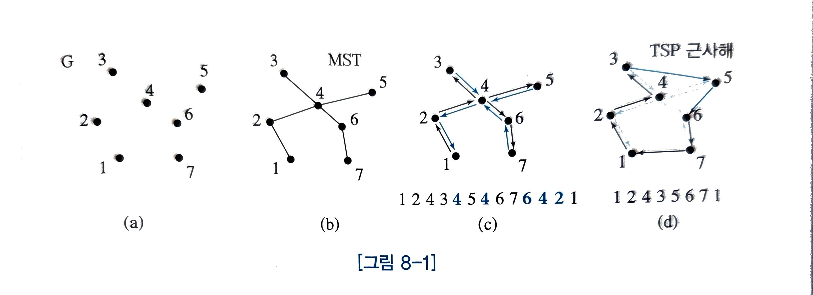
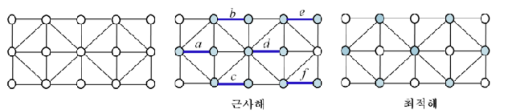
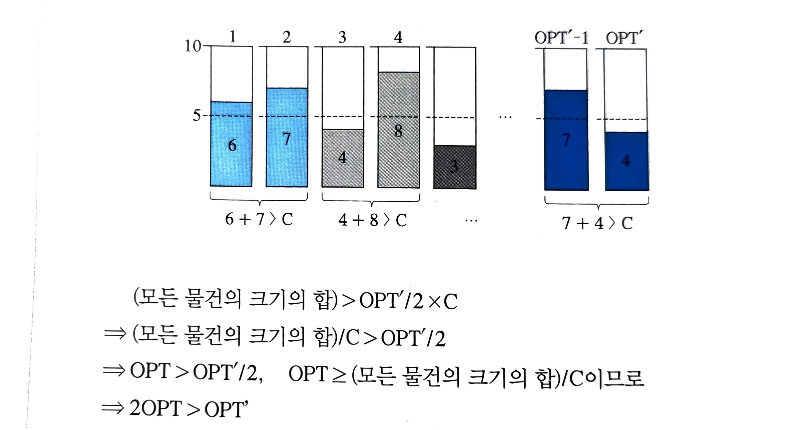

[7. NP-완전문제](https://www.notion.so/7-NP-24abd19b0d2b8042bee9e351b4776553?pvs=21) 에서 알아본 np완전 문제들은 현재까지 다항시간 안에 문제를 푸는 알고리즘이 존재하지 않는다.

NP완전 문제들을 해결하려면

- 다항식 시간에 해를 찾는 것
- 모든 입력에 대해 해를 찾는 것
- 최적해를 찾는것

3가지중 1개를 포기해야하만 한다.

이번에는 근사 알고리즘으로 근사해 즉, 최적해를 찾는 것을 포기한 알고리즘을 알아 보겠다.

# 8.1. 여행자 문제

## 8.1.1. 문제정의

여행자 문제(TSP)는 여행자가 임의의 한 도시에서 출발하여 다른 모든 도시를 1번씩만 방문하고 다시 출발했던 도시로 돌아오는 여행 경로를 최소화 하는 문제이다.

여기서 다루는 문제의 조건은 다음과 같다.

- 도시 A에서 B로 가는 거리는 도시B에서 도시A로 가는 거리와 같다.(대칭성)
- 도시 A에서 도시B로 가는 거리는 도시 A에서 다른 도시 C를 경유하여 도시 B로 가는 거리보다 짧다.(삼각 부등식 특성)
    - A,B,C가 삼각형의 변의 길이일때 A+B>C

## 8.1.2. 핵심 아이디어

다항식 시간 알고리즘을 가지면서 유사한 특성을가진문제를 찾아 활용

→ 최소 신장 트리(MST)



### 그림 단계별 설명

1. **(a) 원래 그래프**
    - 여러 도시(정점)와 거리(간선)가 주어진 그래프. (대칭성, 삼각부등식 특성)
    - 이 문제에서 최적 TSP 순회를 찾는 것은 어렵다.
2. **(b) MST 생성**
    - 프림(Prim) 또는 크루스칼(Kruskal) 알고리즘으로 최소 신장 트리를 만든다.
    - MST의 가중치는 항상 TSP 최적해보다 작거나 같다.
3. **(c) 오일러 순환(간선 2배) → 순회 순서**
    - MST의 간선을 두 번씩 지나도록 하여 모든 정점 차수를 짝수로 만든다.
    - 이렇게 하면 오일러 순환이 존재하고, DFS 전위순회(preorder)와 동일한 순서를 얻을 수 있다.
        - 트리에서 간선을 두번씩 쓰는 오일러 순환=루트에서 DFS로 들어갔다가 나오는 순서
    - 예시: 1 → 2 → 4 → 3 → 5 → 6 → 7 → 6 → 4 → 2 → 1
4. **(d) 중복 제거**
    - 이미 방문한 정점은 건너뛰고, 다음 미방문 정점으로 직행한다.
    - 삼각부등식이 성립하기 때문에 길이가 늘지 않는다.
        - A→B→C일때, A→C로 바꾸는 작업 이는 삼각 부등식 특성으로 항상 더 짧은 길이 된다.
    - 최종 순서 예시: 1 → 2 → 4 → 3 → 5 → 6 → 7 → 1
    - 이것이 TSP의 근사해

## 8.1.3. 시간 복잡도

1. **MST 구성**
    - Prim 또는 Kruskal로 구함.
    - 시간복잡도는 그리디 알고리즘에서 이미 다룬 것과 동일.
2. **방문 순서 찾기**
    - MST 간선 수가 n-1개이므로 DFS 전위순회는 O(n) 시간.
3. **중복 제거(쇼트컷)**
    - 순서를 따라가면서 이미 방문한 도시를 skip → O(n) 시간.

**결론**

- 전체 시간 = MST + O(n) + O(n)
- 따라서 MST를 구하는 시간복잡도와 동일.


## 8.1.4. 근사 비율

- MST의 값을 M이라고 하자.
- 항상 M≤TSP의 근사해 가 성립한다.
- MST 간선을 두 번 사용하면 오일러 순환의 길이는 2M이 된다.
- 오일러 순환에서 중복 방문을 제거하면 길이는 줄거나 같으므로, 근사해의 값은 근사해≤2M
- **결론:** 이 알고리즘의 근사 비율은 **2 이하**이다.

# 8.2. 정점 커버 문제

## 8.2.1. 문제 정의

정점 커버 (Vertex Cover) 문제는 주어진 그래프 G=(V,E)에서 각 간선의 양 끝점들 중에서 적어도 하나의 끝점을 포함하는 점들의 집합들 중에서 최소 크기의 집합을 찾는 문제이다. 정접 커버를 살펴보면, 그래프의 모든 간선이 정점 커버에 속한 점에 인접해 있다. 즉, 정점 커버에 속한 점으로서 그래프의 모든 간선을 ‘커버’하는 것이다.

## 8.2.2. 핵심 아이디어

- **간선 중심 선택 방식**
    - 아직 커버되지 않은 간선을 하나 고른다.
    - 그 간선의 양 끝점을 모두 정점 커버 집합에 포함한다.
- **매칭 기반 접근**
    - matching이란 각 간선의 양 끝점들이 중복되지 않는 집합을 일컫는다.
    - 더 이상 간선을 추가할 수 없을 때까지 반복하면 극대 매칭(maximal matching)이 완성된다.




→최적해는 7개의 점, 근사해는 12개의 점을 가지게 된것을 알 수 있다.

## 8.2.3. 시간 복잡도

1. **알고리즘 절차**
    - 그래프의 간선 집합 E에서 간선 e=(u,v)를 하나 선택한다.
    - 만약 u나 v가 이미 매칭된 정점이면 e는 버린다.
    - 그렇지 않으면 e를 매칭에 추가하고, u,v와 인접한 모든 간선을 그래프에서 제거한다.
    - 이 과정을 간선이 소진될 때까지 반복한다.
2. **시간 복잡도 분석**
    - 정점 수를 n, 간선 수를 m이라 하자.
    - 매칭 여부 확인은 각 정점의 상태(0=미매칭, 1=매칭됨)를 기록해 두면 된다.
    - 따라서 간선 하나를 처리할 때,
        - 두 끝점의 상태 확인: O(1)
        - 끝점이 매칭되었다면 인접한 간선들을 제거하는 데 최악의 경우 O(n) 시간 필요.
    - 결국 간선 하나를 다루는 데 O(n) 시간이 걸린다.
3. **총 수행 시간**
    - 모든 간선 m개를 차례로 고려해야 하므로,

      $O(n)×m=O(nm)O(n)$

    - 따라서 극대 매칭을 찾는 과정의 시간 복잡도는 **O(nm)** 이다.

## 8.2.4. 근사비율

- 극대 매칭(maximal matching)은 정점 커버 근사 비율 분석의 **기준점**으로 사용된다.
    - 이유: 어떤 정점 커버라도 매칭에 포함된 모든 간선을 반드시 포함해야 하므로, 최적 정점 커버의 크기는 최소한 매칭의 크기 |M| 이상이다.
- 근사 알고리즘은 매칭의 각 간선에 대해 양 끝점을 모두 선택하므로, 근사해의 크기는 2|M|이 된다.
- 따라서,

  $\frac{\text{근사해}}{\text{최적해}} = \frac{2|M|}{|M|} = 2$

- **결론:** 이 알고리즘의 근사 비율은 **2** 이다.

# 8.3. 통 채우기 문제

## 8.3.1. 문제 정의

통 채우기(Bin Packing)문제는 n개의 물건이 주어지고, 통(bin)의 용량이 C일때, 주어진 모든 물건을 가장 적은 수의 통에 채우는 문제이다. 단 각 물건의 크기는 C보다 크지 않다.

## 8.3.2. 핵심 아이디어

그리디(greedy) 방식을 이용한다.

- **최초 적합(First Fit)** : 첫 번째 통부터 차례로 확인하여, 가장 먼저 여유가 있는 통에 새 물건을 넣는다.
- **다음 적합(Next Fit)** : 직전에 사용한 통에 여유가 있으면 그 통에 넣고, 없으면 새로운 통을 연다.
- **최선 적합(Best Fit)** : 새 물건이 들어갈 수 있는 통 중에서 **남는 공간이 가장 적은 통**에 넣는다.
- **최악 적합(Worst Fit)** : 새 물건이 들어갈 수 있는 통 중에서 **남는 공간이 가장 많은 통**에 넣는다.

공통적으로, 기존의 어떤 통에도 새 물건이 들어가지 않으면 새로운 통을 사용한다.

## 8.3.3. 시간 복잡도

- **다음 적합(Next Fit)을 제외한 세 가지 방법**(First Fit, Best Fit, Worst Fit)은 새 물건이 들어올 때마다 기존의 통들을 모두 확인해야 한다.
    - 통의 수는 최대 n개이므로, 전체 수행 시간은 O(n^2).
- 다음 적합(Next Fit)은 새 물건을 직전에 사용된 통에만 넣어보면 되므로, 전체 수행 시간은 O(n).

## 8.3.4. 근사 비율

- **First Fit, Best Fit, Worst Fit**
    - 어떤 방법으로 통을 채워도, 2개 이상의 통이 절반 이하만 채워진 상태로 남을 수는 없다.
    - 따라서 이들 방법이 사용하는 통의 수는 최적해(OPT)에서 사용한 통의 수의 두 배를 넘지 않는다.
    - 즉, 근사 비율은 2이다.

- **Next Fit**
    - 직전에 사용한 통에 새 물건이 들어가지 않을 때만 새로운 통을 연다.
    - 이 경우 역시, 결과적으로 사용하는 통의 수는 최적해의 두 배를 넘지 않는다.
    - 따라서 Next Fit의 근사 비율도 2이다.




# 8.4. 작업 스케줄링 문제

## 8.4.1. 문제 정의

작업 스케쥴링(Job Scheduling)문제는 n개의 작업, 각 작업의 수행시간 t_i, i=1,2,3, … , n 그리고 m개의 동일한 기계가 주어질때, 모든 작업이 가장 빨리 종료 되도록 작업을 기계에 배정하는 문제이다. 단, 한작업은 배정된 기계에서 연속적으로 수행되어야 한다. 또한 기계는 한 번에 하나의 작업만을 수행한다.

## 8.4.2. 핵심 아이디어

그리디 방식 사용

가장 빨리 끝나는 기계에 작업을 배정


## 8.4.3. 시간 복잡도

```c
입력: n개의 작업, 각 작업 수행 시간 ti, i = 1, 2, ..., n, 기계 Mj, j = 1, 2, ..., m
출력: 모든 작업이 종료된 시간
for j = 1 to m
	L[i] = 0
for i = 1 to n {
	min = 1
	for j = 2 to m
		if (L[j] < L[min]) {
			min = j
		}
	작업 i를 기계 Mmin에 배정한다.
	L[min] = L[min] + ti
}
return 가장 늦은 작업 종료 시간
```

- 모든 기계의 마지막 작업 종료 시간인 L[j]를 살펴보아야 한다.
    - O(m) 시간→ for루프가 (m-1)번 반복됨
- n개의 작업을 반복

O(mn) 시간 복잡도가 걸림

→단 가장 일찍 끈나는 기계 번호를 찾기 위해 heap구조를 이용하면 O(logm)시간이 걸려 총 시간 복잡도가 O(nlogm)이 걸리게 된다.

## 8.4.4. 근사 비율

- **전제**
    - OPTOPT: 최적 Makespan (최적해)
    - OPT′: 근사 알고리즘의 Makespan (근사해)
    - t_i: 특정 작업 i의 실행 시간
    - T: 작업 i와 같은 기계에 배정된, 다른 작업들의 실행 시간 합
    - T′: 작업 ii를 제외한 모든 작업 시간을 평균적으로 m대 기계에 분배했을 때의 평균 작업 종료 시간

      $T′ = \frac{\sum_{j=1}^n t_j - t_i}{m}$

    - 따라서 **항상 T≤T**

  $$
  ⁍
  $$
    
  ---

  $$
  OPT′ = t_i + T \le t_i + T′

  $$

    - 근사해의 한 기계의 종료시간는 작업 t_i + 다른 작업의 합 T.
    - T≤T′  이므로 OPT′≤t_i+T’

    ---

  $$
  = t_i + \frac{\sum_{j=1}^n t_j - t_i}{m}

  $$

    - T′의 정의를 대입한 것.

    ---

  $$
  = t_i + \frac{1}{m}\sum_{j=1}^n t_j - \frac{t_i}{m}

  $$

    - 분수 항을 분리하여 정리.

    ---

  $$
  = \frac{1}{m}\sum_{j=1}^n t_j + \left(1 - \frac{1}{m}\right)t_i

  $$

    - t_i 항을 묶어서 표현.

    ---

  $$
  \le OPT + \left(1 - \frac{1}{m}\right)OPT

  $$

    - 이유:
        1. $\tfrac{1}{m}\sum t_j \le OPT$ (평균 부하 ≤ 최적 Makespan)
        2. $t_i \le OPT$ (한 작업 크기 ≤ 최적 Makespan)

    ---

  $$
  = \left(2 - \frac{1}{m}\right)OPT \le 2 \cdot OPT

  $$

    - 따라서 근사해 OPT′는 항상 최적해의 두 배 이내.
    - **근사 비율 = 2**.

    ---


# 8.5. 클러스터링 문제

## 8.5.1. 문제 정의

n개의 점이 2차원(2차원보다 커도 무방) 평면에 주어질때 이 점들 간의 거리를 고려하여 k개의 그룹으로 나누고자 한다. 클러스터링(Clustering)문제는 입력으로 주어진 n개의 점을 k개의 그룹으로 나누고, 각 그룹의 중심이 되는 k개의 점을 선택하는 문제이다. 단, 가장 큰 반경을 가진 그룹의 직경이 최소가 되도록 k개의 점이 선택되어야 한다.

## 8.5.2. 핵심 아이디어

- 목표: n개의 점 중 k개의 점을 센터(center*로 선택한다.
- 첫 번째 센터: 무작위로 하나 선택.
- 이후 센터: 이미 선택된 센터들과 **가장 멀리 떨어진 점**을 차례로 선택.

  즉, 먼 점을 우선적으로 센터로 뽑아 분산을 최대화한다


## 8.5.3. 시간 복잡도

```c
입력: 2차 평면상의 n개의 점 xi, i=0, 1, ..., n-1, 그룹의 수 k>1
출력: k개의 클러스터 및 각 클러스터의 센터
C[1] = r, 단, xr은 n개의 점 중에서 랜덤하게 선택된 점이다.
for j = 2 to k {
	for i = 0 to n-1 {
		if (xi ≠ 센터)
			xi와 각 센터까지의 거리를 계산하여, xi와 가장 가까운 센터까지의 거리를 D[i]에 저장한다.
	}
	C[j] = i, 단, i는 배열 D의 가장 큰 원소의 인덱스이고, xi는 센터가 아니다.
}
센터가 아닌 각 점 xi로부터 앞서 찾은 k개의 센터까지 거리를 각각 계산하고 
그 중에 가장 짧은 거리의 센터를 찾는다. 
이때 점 xi는 가장 가까운 센터의 클러스터에 속하게 된다.
return 배열 C와 각 클러스터에 속한 점들의 리스트
```

- **첫 번째 센터 선택**:
    - 무작위 선택 → O(1)
- **다음 센터 선택**:
    - 각 점에서 센터까지의 거리 계산: O(kn)
    - 그 중 최댓값 찾기: O(n)
    - 이 과정은 k-1번 반복
    - 따라서: $O((k-1)(kn + n)) = O(k^2 n)$
- **모든 점 분류**:
    - 각 점이 k개의 센터까지의 거리를 계산 → $O(kn)$
- **총합**: $O(1)+O(k^2n)+O(kn)=O(k^2n)$

## 8.5.4. 근사 비율

- 각 클러스터의 중심(센터)을 기준으로 반경 d이내에 클러스터에 속하는 모든 점들이 포함된다.
    - 즉, 근사 알고리즘으로 선택된 센터는 반경 d 안에서 해당 클러스터의 모든 점을 커버한다.
- 따라서 근사해의 값은

  $$
  OPT′ \le 2d
  $$

  가 된다.

  (두 점이 같은 클러스터에 속할 때, 그 최대 거리는 센터 반경 d의 두 배를 넘을 수 없다.)

- 한편, 최적해 OPT는 반경 d보다 작아질 수 없으므로

  $$
  OPT \ge d
  $$

- 이 두 식을 결합하면,   $OPT′≤2d≤2OPT$
- 따라서, $\frac{OPT′}{OPT} \le 2$
- **결론:** 이 알고리즘의 근사 비율은 항상 **2 이하**이다.