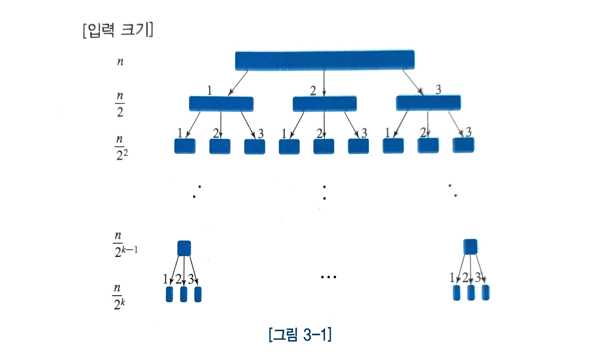
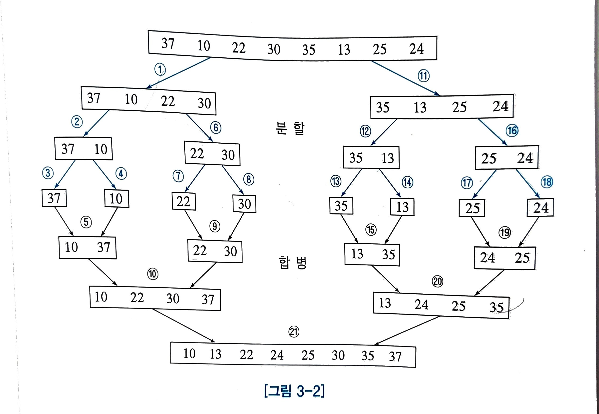
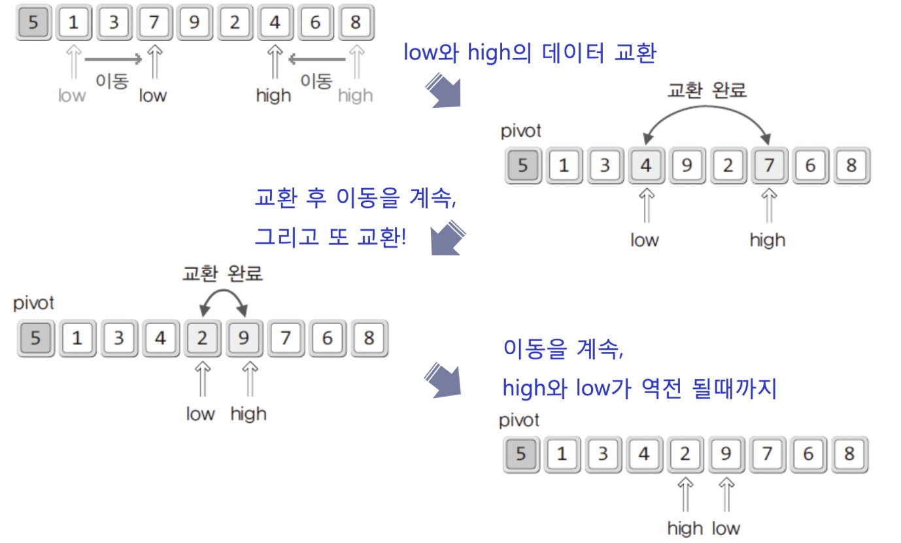

# 분할 정복(Divide-and-Conquer) 알고리즘

## 분할 정복 알고리즘의 과정

### **1. 분할 (Divide)**

- 문제를 더 이상 나눌 수 없을 때까지 작게 분할하여 부분 문제(Subproblem)로 나눈다.

### **2. 정복 (Conquer)**

- 각 부분 문제를 해결한다.

### **3. 결합/합병 (Combine)** 

- 부분 문제들의 해답을 결합하여 원래 문제의 해답을 얻는다.



## 분할 정복 알고리즘의 분류

| 분류 기준 | 예시 |
| --- | --- |
| 문제가 `a`개로 분할되고, 각 부분 문제의 크기가 `1/b`로 감소 | - 합병 정렬- 최근접 점의 쌍 찾기- 공제선 문제 |
| 문제가 2개로 분할되며, 크기가 **일정하지 않게** 감소 | - 퀵 정렬 |
| 문제가 2개로 분할되지만, **1개만 처리**하며 크기가 `1/2`로 감소 | - 이진 탐색 |
| 문제 크기가 매번 1개 또는 2개씩 감소 | - 삽입 정렬- 피보나치 수열 계산 |

# 3.1.합병 정렬(Merge Sort)

```c
void MergeSort(int arr[], int left, int right)
{
	int mid;

	if(left < right)
	{
		// 중간 지점을 계산한다.
		mid = (left+right) / 2;

		// 둘로 나눠서 각각을 정렬한다.
		MergeSort(arr, left, mid);//merge안에서 또 호출됨 재귀 호출
		MergeSort(arr, mid+1, right);

		// 정렬된 두 배열을 병합한다.
		MergeTwoArea(arr, left, mid, right);
	}
}
```



## 3.1.1. 합병 정렬 시간 복잡도, 공간 복잡도

### 1. 분할(Divide)

- 배열의 **중간 인덱스를 계산하고**, **두 번의 재귀 호출**을 수행한다.
- 이는 모두 **상수 시간 연산**(`O(1)`)이므로, **전체 입력 크기 `n`에 비해 미미**하여 시간 복잡도 계산에서 **무시**된다.

### 2.합병(Merge)

- merge 정렬의 합병 과정은   $log₂(n)$ 단계(층)로 나뉜다.

  → 입력 배열이 매번 절반으로 분할되기 때문이다.

- 정렬된 두 배열 `a`, `b`를 병합할 때,

  → 배열의 크기를 각각 `n`, `m`이라 하면,  **최대 비교 횟수는 `n + m - 1`회**이다.

  > 마지막 원소는 비교 없이 삽입되기 때문에,
  >
  >
  > 총 비교 횟수는 `n + m`이 아닌 `n + m - 1`이면 충분하다.
>

- 이 비교/삽입 작업은 각 단계마다 전체 원소(`n`)를 대상으로 일어나므로,

  → 합병 단계의 시간 복잡도는 `O(n)`이다.


### 시간 복잡도

- 단계 수: `log₂(n)`
- 각 단계당 연산량: `O(n)`

> 시간 복잡도 : $O(nlogn)$
>

### 공간 복잡도

- 병합 시, 결과를 저장할 새로운 배열 `c`가 필요하다.

  → **입력 크기 `n`에 비례하는 추가 공간** 요구


> 공간 복잡도 : $O(n)$
>

# 3.2. 퀵 정렬(Quick Sort)

## 3.2.1. 퀵정렬 방식




### 목표:

- 피벗(pivot)을 기준으로:
    - **왼쪽**엔 pivot보다 작은 값
    - **오른쪽**엔 pivot보다 큰 값

  ### 기본 흐름

    1. **초기 상태**:
        - `pivot`은 보통 `arr[low]` 또는 `arr[mid]`
        - `low`는 왼쪽에서 오른쪽으로 진행 → pivot보다 **큰 값** 찾기
        - `high`는 오른쪽에서 왼쪽으로 진행 → pivot보다 **작은 값** 찾기
    2. **조건 만족 시 교환**:
        - low가 가리키는 값 > pivot
        - high가 가리키는 값 < pivot

          → 두 값을 **교환**

    3. **포인터가 만날 때까지 반복**
    4. **low ≥ high가 되면** → high 위치와 **pivot을 교환**

  ### 퀵 정렬 코드

    ```c
    #include <stdio.h>
    
    void Swap(int arr[], int a, int b) {
        int temp = arr[a];
        arr[a] = arr[b];
        arr[b] = temp;
    }
    
    int Partition(int arr[], int left, int right)
    {
        int pivot = arr[left];    // 피벗을 가장 왼쪽 값으로 설정
        int low = left + 1;
        int high = right;
    
        while (low <= high)  // 포인터가 교차되지 않는 동안 반복
        {
            while (low <= right && pivot >= arr[low]) // pivot과 같은 값도 넘어감
                low++;
    
            while (high >=(left + 1) && pivot <= arr[high]) // pivot과 같은 값도 넘어감
                high--;
    
            if (low <= high)  // 아직 교차되지 않았다면 스왑
                Swap(arr, low, high);
        }
    
        Swap(arr, left, high);  // 피벗을 최종적으로 제자리로 이동
        return high;  // 피벗의 최종 위치 반환
    }
    
    void QuickSort(int arr[], int left, int right)
    {
        if (left < right) {
            int pivotIdx = Partition(arr, left, right);  // 피벗을 기준으로 분할
            QuickSort(arr, left, pivotIdx - 1);  // 왼쪽 영역 정렬
            QuickSort(arr, pivotIdx + 1, right); // 오른쪽 영역 정렬
        }
    }
    
    ```


### 3.2.1.1. 퀵정렬 피봇 선정 방법

- 랜덤하게 선정
- **Median of Three** : 가장 왼쪽 숫자, 가장 오른쪽 숫자, 중간 숫자 중 중앙값을 피봇으로 사용한다.
- **Median of Medians** : 입력을 3등분 하여 각 부분에서 e숫자의 중앙 값을 찾아서 3개의 중앙값에서 중앙값을 피벗으로 삼는다.

## 3.2.2. 퀵정렬 시간 복잡도

| 경우 | 시간 복잡도 | 계산 방식 | 발생 상황 |
| --- | --- | --- | --- |
| 🔴 **최악** | $O(n^2)$ | 분할이 한쪽으로만 일어남 → $(n-1) + (n-2) + \dots + 1$ | 피벗이 최댓값 또는 최솟값일 경우  |
| 🟢 **최선** | $O(n \log n)$ | 이상적인 이진 분할 → 각 단계 $O(n)$× $\log_2 n$ 단계 | 항상 입력의 중앙값이 피벗일 경우 |
| 🟡 **평균** | $O(n \log n)$ | 대부분의 경우에서 비교적 균형 있게 분할됨 | 무작위 입력, 랜덤 피벗 선택 시 |

<aside>
💡

작은 입력에서는 삽입 정렬이 더 효율적인 경우가 많아, 퀵정렬을 사용하다가 입력의 크기가 작아지면 삽입 정렬을 사용하는 경우도 있다.

Python의 `sort()`, Java의 `Arrays.sort()`, C++의 `std::sort()` 등은 실제로 **퀵정렬 + 삽입정렬 + 힙정렬** 등을 조합한 **하이브리드 정렬 이다.**

</aside>

# 3.3. 선택(Selection) 문제

선택 문제는 n개의 숫자들 중에서 k번째로 작은 숫자를 찾는 문제이다.

- 최소 숫자 k번 찾기 ⇒최악시간 복잡도: O(kn)
- 숫자 정렬후 k찾기⇒최악 시간 복잡도 : O(nlogn)

→분할 정복 개념 사용하기

```c
Selection(A, left, right, k):
    입력: 배열 A[left] ~ A[right], 정수 k
    출력: A[left] ~ A[right]에서 k번째로 작은 원소

1. 피벗을 A[left] ~ A[right] 중 랜덤하게 선택한다.
   → 피벗을 A[left]와 교환한 뒤,
   → 피벗보다 작은 값은 A[left] ~ A[p-1]로,
      피벗보다 큰 값은 A[p+1] ~ A[right]로 이동
   → 피벗은 A[p]에 위치하게 됨

2. S = (p - 1) - left + 1    # 피벗 기준으로 작은 그룹의 크기

3. if k ≤ S:
       return Selection(A, left, p - 1, k)
       # 작은 그룹에서 탐색

4. else if k == S + 1:
       return A[p]
       # 피벗이 k번째로 작은 원소

5. else:
       return Selection(A, p + 1, right, k - S - 1)
       # 큰 그룹에서 탐색 (k 보정)

```

### 흐름 요약

1. 피벗 기준으로 배열을 나눔
2. `k`가 작은 그룹 안에 있다면 → 그쪽에서 다시 Selection 호출
3. `k == S + 1`이면 → 피벗이 정답
4. `k > S + 1`이면 → 큰 그룹에서 `k - (S + 1)`번째 원소를 탐색

<aside>
💡

중앙 값을 찾는데 유용하게 사용된다.

</aside>

## 3.3.1. 선택 문제의 시간 복잡도

### Good 분할 vs Bad 분할

| 분할 유형 | 설명 |
| --- | --- |
| 🟢 Good 분할 | 피벗을 기준으로 양쪽 그룹이 모두 전체의 **3/4 이하** |
| 🔴 Bad 분할 | 한쪽 그룹이 전체의 **3/4 이상**을 차지 |

### 확률적 분석

- 피벗을 **랜덤하게 선택**하므로→ Good 분할이 일어날 **확률은 약 1/2**이다.
- 즉, **2번 중 1번 정도는 Good 분할이 발생**한다고 기대할 수 있다.

### 시간 복잡도 분석

### 1.  Best Case (Good 분할만 연속적으로 발생):

$T(n)=T(3n/4)+O(n)$ ⇒ $O(n)$

- 한 번의 분할에서 O(n) 비교/이동 발생
- 전체 크기가 3/4씩 줄어들기 때문에 O(n)의 영향이 큼
- **O(n)**

### 2. Average Case (Good 분할 확률 1/2 고려):

- 평균적으로 2번에 한 번은 Good 분할이 발생
- → 전체 예상 시간은 **2 × O(n) = O(n)**
- 따라서 평균 시간 복잡도는 O(n)이다

# 3.4. 최근접 점의 쌍(Closest Pair) 찾기

```c
ClosestPair(S):
    입력: x좌표 오름차순으로 정렬된 점들의 배열 S (길이 i)
    출력: S에 있는 점들 중 최근접 점의 쌍 거리

1. if i ≤ 3:
       return 최근접 점 쌍의 거리 #따로 분할 하지 않고 계산 후 리턴

2. S를 같은 크기의 SL, SR로 나눈다.
   (i가 홀수일 경우, SL의 길이가 SR보다 1 더 크다)

3. CPL = ClosestPair(SL)     # 왼쪽에서 최근접 쌍
4. CPR = ClosestPair(SR)     # 오른쪽에서 최근접 쌍

5. d = min(dist(CPL), dist(CPR))   # 현재까지 가장 가까운 거리

6. 중간 경계선 기준 d 이내에 있는 점들 중  
   서로 다른 쪽(SL, SR)에 속한 점 쌍들 중 거리 d보다 더 작은 쌍을 찾는다.  
   이 쌍을 CPC라 하자.

7. return min(CPL, CPR, CPC)      # 가장 짧은 쌍 반환

```

### 흐름 요약

1. **점의 개수가 3개 이하이면**

   → 모든 점 쌍 간의 거리를 직접 계산하여 최소 거리 반환 (브루트포스)

2. **x좌표 기준으로 정렬된 점들을 절반으로 나눔**

   → 왼쪽 그룹 `Sₗ`, 오른쪽 그룹 `Sᵣ`으로 분할

3. **양쪽 그룹에 대해 각각 재귀적으로 최근접 점의 거리 계산**

   → `dₗ = ClosestPair(Sₗ)`

   → `dᵣ = ClosestPair(Sᵣ)`

4. **현재까지의 최소 거리 `d = min(dₗ, dᵣ)`로 설정**
5. **중앙 경계선을 기준으로 `x좌표 차이 ≤ d`인 점들만 모아 strip 생성**
6. **strip을 y좌표 기준으로 정렬 후**,

   → 각 점에 대해 최대 6개까지만 거리 비교

   → strip 안에서의 최근접 쌍 거리 `d_c` 계산

7. **최종적으로 `min(d, d_c)` 반환**

## ✅ 공통 단계 (비최적화 / 최적화 공통)

---

### **Step 1: 입력 정렬**

- 점 배열 `S`를 **x좌표 기준으로 정렬**
- 정렬은 알고리즘 시작 시 단 한 번만 수행됨

> ⏱ 시간 복잡도: $O(n \log n)$
>

---

### **Step 2: 점 간 거리 계산**

- 점이 2~3개일 경우, 모든 쌍 간 거리를 계산 (브루트포스)
- 거리 계산은 단순 수식으로 이루어짐

> ⏱ 시간 복잡도: $O(1)$
>

---

### **Step 3: 분할**

- x좌표 중간값을 기준으로 배열을 절반으로 나눔
- 왼쪽(`S_L`)과 오른쪽(`S_R`)으로 재귀 호출할 준비

> ⏱ 시간 복잡도: $O(1)$
>

---

### **Step 4: 재귀 호출**

- `ClosestPair(S_L)`과 `ClosestPair(S_R)`를 각각 재귀 호출하여

  최소 거리 `d_L`, `d_R` 중 더 작은 값을 선택 → `d`


---

### **Step 5: 중앙 영역(strip) 생성**

- x좌표 기준 경계선 중심에서 거리 `d` 이내에 있는 점들만 모아 **strip** 생성
- 이 영역에서 **양쪽 그룹 사이**에 있을 수 있는 최근접 쌍을 탐색

> 시간 복잡도: $O(n)$
>

## ❌ 비최적화 버전: x좌표 정렬만 한 경우

---

### **Step 6: strip을 y좌표 기준으로 정렬**

- 매 단계에서 strip을 **y좌표 기준으로 새로 정렬해야 함**

  > 시간 복잡도: 각 층 당 $O(n \log n)$
>

---

### **Step 7: strip 내 비교**

- strip내 점의 개수는 n을 넘지 않기 때문에 시간 복잡도는  $O(n)$

  > 시간 복잡도:  $O(n)$
>

---

### 병합 단계 시간 복잡도

$O(nlog⁡n)$ (Step 5 + 6 합산)

→ y정렬할때가 가장 오래 걸려서 O(nlogn)으로 계산됨

---

### 전체 시간 복잡도

$O(n \log n)$  x $log_2n= \boxed{O(n \log^2 n)}$

---

## ✅ 최적화 버전: y좌표 정렬도 유지한 경우

---

### **Step 6: y좌표 정렬 유지**

- 입력 시y좌표 기준 정렬된 배열(Py)을 함께 유지
- 재귀 호출 시 SL_y, SR_y를 merge처럼 O(n)으로 분할 전달

  > 시간 복잡도: $O(n)$
>

---

### **Step 7: strip 내 비교**

- strip내 점의 개수는 n을 넘지 않기 때문에 시간 복잡도는  $O(n)$

  > 시간 복잡도:  $O(n)$
>

---

### 병합 단계 시간 복잡도

$O(n)($Step 5 + 6 합산)

---

### 전체 시간 복잡도

$O(n) * log_2n=$ $\Rightarrow \boxed{O(n \log n)}$

---

## 최종 비교 요약

| 항목 | 비최적화 버전 | 최적화 버전 |
| --- | --- | --- |
| y좌표 정렬 방식 | 매 단계 strip 새 정렬 | 처음부터 유지 |
| 병합 단계 시간 | $O(n \log n)$ | $O(n)$ |
| 전체 시간 복잡도 | $O(n \log^2 n)$ | $O(n \log n)$ |

# 3.5. 분할 정복을 적용하는데 있어서 주의할 점

| 조건 | 적합 | 부적합 |
| --- | --- | --- |
| 분할 할때 마다 하위 문제 크기 총합 ≤ 원래 문제 | ✅ | ❌ |
| 취합 과정이 간단하고 빠름 | ✅ | ❌ |
| 대표 예시 | 최근접 점의 쌍, 병합 정렬 | 피보나치 수열(재귀) |