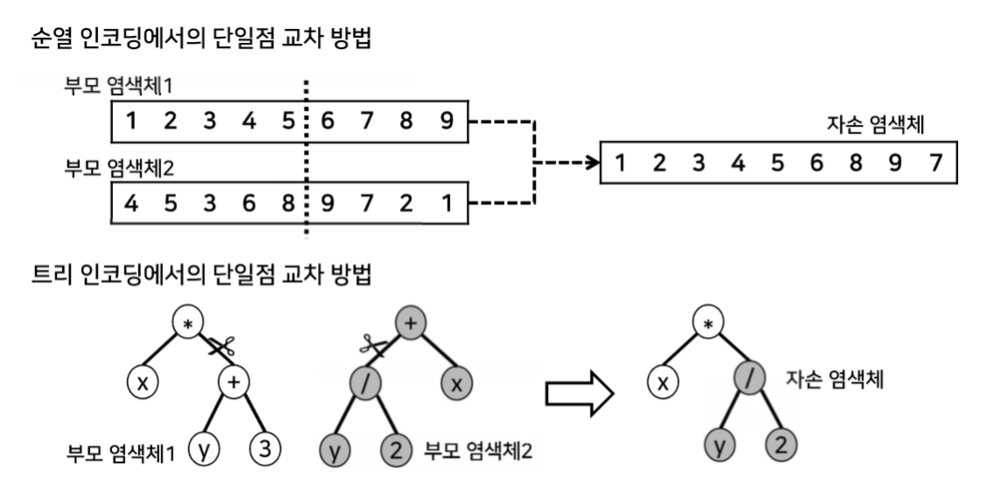
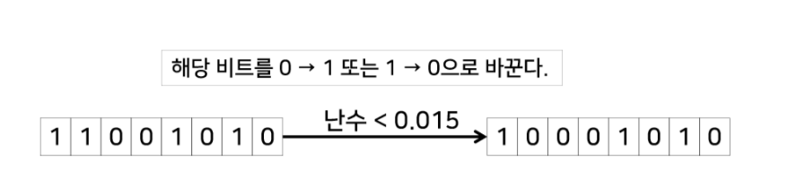
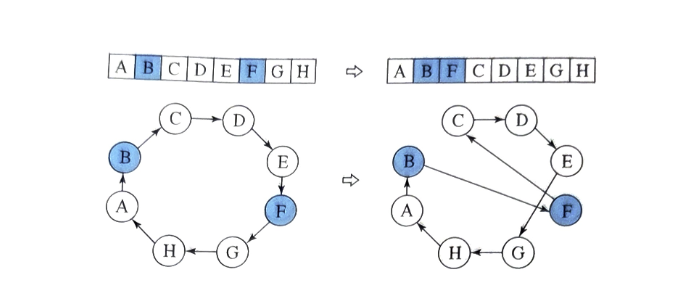
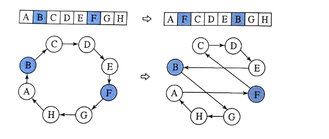
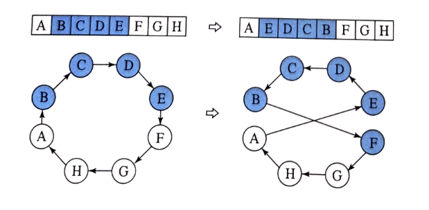

# 9.1 백트래킹 기법

**정의**

백트래킹은 해를 찾는 과정에서 **조건을 만족하지 않는 경우 되돌아가 다른 경로를 탐색하는 기법**이다.

즉, 가능한 해 후보를 단계적으로 탐색하다가 “해가 아님”이 판명되면 탐색을 중단하고 직전 단계로 돌아가 다른 선택지를 탐색한다.

<aside>
💡

백트래킹은 **모든 경우의 수를 트리로 탐색하되, 깊이 들어가며 해가 될 수 없는 경로는 즉시 잘라내고 유망한 경로만 끝까지 탐색하는 기법**이다.

</aside>

**적용 문제 유형**

1. **결정(Decision) 문제**
    - 특정 조건을 만족하는 해가 존재하는가? (Yes / No)
    - 예: Hamiltonian Cycle 문제 (모든 정점을 한 번씩 방문하는 순환 경로 존재 여부)
2. **최적화(Optimization) 문제**
    - 가능한 해들 중 최적의 해(최솟값, 최댓값)를 찾는 문제

## 9.1.1. 알고리즘

아래의 코드는 TSP(여행자문제)를 위한 백트래킹 알고리즘이다.

1. bestSolution : 현제까지 찾은 가장 우수한 해
2. tour은 sequence
3. BestSolution의 tour은 bsetSolution의 거리라고 한다.

```c
  tour = [시작점] // tour는 점의 순서(sequence)
  bestSolution = (∞, ∞) // bestSolution의 거리는 가장 큰 상수로 초기화시킨다.
  BacktrackTSP(tour)

  if (tour가 완전한 해이면)//모든 도시를 한번씩 방문하고 출발점으로 돌아오는 경로일때
1      if (tour의 거리 < bestSolution의 거리) // 더 짧은 해를 찾았으면
2          bestSolution = (tour, tour의 거리)
3  else {//완전한 해가 아닐때
4      for (tour를 확장 가능한 각 점 v에 대해서) {
5          newTour = tour + v // 기존 tour의 뒤에 점 v를 추가한다.
6          if (newTour의 거리 < bestSolution의 거리)
7              BacktrackTSP(newTour)
8    }
9 }
```

- tour + v : 지금까지의 경로(tour)에 새로운 도시 v를 추가한 후보 경로.
- newTour의 거리 < bestSolution의 거리 조건:
    - 만약 newTour가 이미 현재까지의 최적해(bestSolution)보다 길다면 → 앞으로 아무리 도시를 더 이어 붙여도 더 짧아질 수 없음.
    - 따라서 이 경로는 막힌 길(dead end) 이고 더 볼 필요가 없음 → 현재의 bestSoultion이 최종 답으로 확정 됨
- 조건을 만족할 때(newTour의 거리가 BestSoultion보다 짧을때)만 BacktrackTSP(newTour)를 재귀 호출해서 탐색을 이어감.

## 9.1.2. 시간 복잡도

상태 공간 트리(state space tree)의 노드 수에 비례 한다.

상태 공간 트리란 탐색의 시작 상태인 [A]에서 부터 점들을 추가하여 확장시켜 탐색한 모든 상태들로 형성된 트리를 말한다.

최대 크기의 트리는 (n-1)!이다.

→ 하지만 완전탐색과 달리 가지치기를 하므로 완전 탐색의 경우보다 훨씬 효율적이다.

# 9.2. 분기 한정 기법

### 배경

- [백트래킹](https://www.notion.so/9-267bd19b0d2b80edb060d4d525a9e6b8?pvs=21) 기법은 최적해가 **상태 공간 트리의 어디에 있는지 알 수 없기 때문에** 트리의 대부분 노드를 탐색해야 한다.
- 따라서 **입력 크기가 커질수록 탐색량이 급격히 증가**하여 해를 찾기 어렵다.

→ 이러한 단점을 보완하기 위해 **분기 한정(Branch and Bound) 기법**을 사용한다.

### 정의

- 각 노드(상태)에 **한정값(bound value)** 을 부여하고, 이 값을 활용하여 탐색을 수행한다.
- 불필요한 경로를 조기에 배제하면서, **가장 우수한 한정값을 가진 노드를 먼저 탐색**한다.
- 보통 **최선 우선 탐색(Best-First Search)** 전략과 결합하여 사용된다.
- **최적화 문제**를 해결하는 데 특히 적합하다.

### 한정값(bound)이란?

- 상태 공간 트리에서 어떤 노드(부분 해) `S`가 있을 때,

  **그 노드에서 출발해서 만들 수 있는 해의 최적 추정치**를 **한정값(bound)** 이라고 한다.

- 말 그대로 *“이 경로로 갔을 때 최대로 기대할 수 있는 성능(낙관적/비관적 평가)”* 을 수치화한 값
- 목적: 이 값으로 **가지치기 여부를 판단**.
    - 만약 `S`의 한정값 ≥ 현재 `bestValue` (최적해) → 더 좋은 해가 될 가능성 x → 탐색 중단.

## 9.2.1. 핵심 아이디어

1. **한정값 비교를 통한 가지치기**
    - 최적해를 찾은 후, 남은 노드들의 한정값이 그보다 같거나 나쁘다면 더 이상 탐색하지 않는다.
2. **불필요한 노드 배제**
    - 상태 공간 트리의 대부분의 노드는 조건을 만족하지 않아 해가 될 수 없으므로 조기에 제거한다.
3. **유망한 영역 우선 탐색**
    - 최적해가 존재할 가능성이 높은 영역을 먼저 탐색하여 효율성을 높인다.

## 9.2.2. 알고리즘

```java
1 상태 S의 한정값을 계산한다.
2 activeNodes = { S } // 탐색되어야 하는 상태의 집합
3 bestValue = ∞ // 현재까지 탐색된 해 중의 최소값
4 while ( activeNodes ≠ ∅ ) {
5     S_min = activeNodes의 상태 중에서 한정값이 가장 작은 상태
6     S_min을 activeNodes에서 제거한다.
7     S_min의 자식(확장 가능한) 노드 S'1, S'2, …, S'k를 생성하고, 각각의 한정값을 계산한다.
8     for i = 1 to k { // 확장한 각 자식 S'i에 대해서
9         if (S'i의 한정값 ≥ bestValue)
10            S'i를 가지치기한다. // S'i로부터 탐색해도 더 우수한 해가 없기 때문에
11        else if (S'i가 완전한 해이고, S'i의 값 < bestValue)
12            bestValue = S'i의 값
13            bestSolution = S'i
14        else
15            S'i를 activeNodes에 추가한다.
       }
	 }
```

- 백트래킹과 같은 방식
    - 단 bound value를 통해서 가지치기 하는 방식을 추가해 효율을 높임

# 9.3. 유전자 알고리즘(Genetic Algorithm, GA)

## 9.3.1.  알고리즘

```java
1 초기 후보해 집합 G_0를 생성한다.
2 G_0의 각 후보해를 평가한다.
3 t<-0
4 repeat
5     G_t로 부터 G_(t+1)을 생성한다.  //← 선택·교차·돌연변이 연산이 수행되는 단계
6     G_(t+1)의 각 후보해를 평가한다.
7     t<-t+1
8 until(종료 조건이 만족될 때까지)
9 return G_t의 후보해 중에서 가장 우수한 해(후보해중 가장 큰/작은 해)
```

- 후보해는 백트래킹에서 언급한 [완전한 해](https://www.notion.so/9-267bd19b0d2b80edb060d4d525a9e6b8?pvs=21)일 때와 같은 의미 이다.
- 후보해의 평가는 후보해의 값을 통해 이뤄진다.
    - 후보해의 값을 통해 최적해의 값에 근접한 값은 적합도가 높다곶 평가한다.(우수한 해)
- line 5에서는 선택, 교차, 돌연변이 연산이 이뤄져서 다음세대의 후보해가 생성된다.

### 1. 선택 연산

적자 생존 개념을 모방해서 적합도가 상대적으로 높은 우수한 후보해를 선택ㅎ하는 연산이다.

룰렛 휠(roulette wheel)을 통해 간단히 구현될 수 있다.

각 후보해의 적합도에 비례해서 원반의 면적을 할당하고 원반을 회전 시켜서 원반이 멈췄을때 핀이 가리키는후보해를 선택한다. 따라서 면적이 넓은 후보해가 선택될 확률이 높아진다.

### 2. 교차 연산

선택 연산이 수행된 후의 후보해 사이에 수행된다.

염색체가 교차하는 것을 모망한 것이다.

아래는 1-point 교차 연산을 보여 준다.



후보해가 길게 표현되면 교차점의 개수는 여러개가 될 수 있다.

### 3. 돌연변이 연산

교차연산이 수행된 후에 돌연변이 연산을 수행한다.

돌연 변이 연산은 주 작은 확률로 후보해의 일부분을 임의로 변형시키는 것이다. (mutation rate라 부름)




종료조건은 알고리즘을 수행하면서 더 좋은 해가 나오지 않으면 종료한다.(최적해를 보장하지 않기 때문에)

# 9.4. 모의 담금질 기법

모의 담금질(Simulated Annealing)기법은 높은 온도에서 액체 상태인 물질이 온도가 점차 낮아지면서 결정체로 변하는 과정을 모방한 해 탐색 알고리즘이다.

→결정체로 변하는 것처럼, 해를 탐색할때 점점 규칙적인 방식으로 이뤄진다.

## 9.4.1. 알고리즘

```java
1  임의의 후보해 s를 선택한다.
2  초기 T를 정한다.
3  repeat
4      for i = 1 to k_T { // k_T는 T에서의 for-루프 반복 횟수이다.
5          s의 이웃해 중에서 랜덤하게 하나의 해 s'를 선택한다.
6          d = (s'의 값) - (s의 값)
7          if (d < 0) // 이웃해인 s'가 더 우수한 경우
8              s <- s'
9          else // s'가 s보다 우수하지 않은 경우
10             q <- (0,1) 사이에서 랜덤하게 선택한 수
11             if (q < p) s <- s' // p는 자유롭게 탐색할 확률이다.
12     }
13     T <- αT // 1보다 작은 상수 α를 T에 곱하여 새로운 T를 계산한다.
14 until (종료 조건이 만족될 때까지)
15 return s
```

- **탐색 방법**
    - 현재 해 s에서 이웃 해 s'를 하나 선택.
    - s'가 더 좋은 해이면 무조건 이동.
    - s'가 더 나쁜 해라 해도 **확률 p에 따라 이동할 수 있음**.
        - 이렇게 해야 지역 최적해(local optimum)에 갇히지 않고 더 넓은 공간을 탐색할 수 있음.
- **확률 p의 조절**
    - 확률 p는 두 가지 요소에 따라 결정됨:

      ① **온도 T**: 초기엔 T가 크므로 p도 커서 자유롭게 탐색 → 점점 T를 줄이며 규칙적 탐색.

      ② **해 차이 d**: 해가 나빠진 정도. d가 크면 p를 줄이고, 작으면 p를 크게.

    - 수식:

      $$
      p=1/e^{d/T} = e^{-d/T}
      $$

        - T가 크면 → 나쁜 해도 받아들일 확률 ↑
        - T가 작으면 → 나쁜 해를 받아들일 확률 ↓
- **온도 감소**
    - 반복할 때마다 T ← αT (0<α<1)로 줄임.
    - 점점 더 탐색이 보수적으로 바뀜.


### 이웃해를 정의하는 방법→ line 5에서 한가지가 사용된다.

tsp의 경우

1. 삽입 : 2개의 도시를 랜덤하게 선택 후, 두번째 도시를 첫번째 도시 옆으로 옮기고, 두도시 사이의 도시들은 오른쪽으로 1칸씩 이동한다.

   

2. 교환 : 2개의 도시를 랜덤하게 선택하고, 그 도시들의 위치를 서로 바꾼다.



1. 반전 : 2개의 도시를 랜덤하게 선택하고 그 사이의 도시를 역순으로 만든다.

   


***최적해를 보장하지 않는다!!***